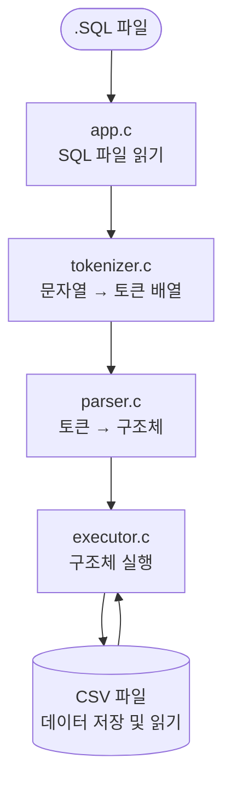

# AGENTS.md

이 문서는 이 저장소에서 작업하는 AI 에이전트를 위한 공용 컨텍스트입니다.
다른 Codex 에이전트가 이 파일 하나만 읽고도 현재 프로젝트 상태, 작업 규칙,
검증 방식, GitHub 워크플로를 바로 이해할 수 있도록 정리했습니다.

## 1. 프로젝트 목적

- 프로젝트 이름: `week6-team5-sql`
- 목표: `C99` 기반 파일형 SQL 처리기 구현
- 목표 저장 방식: `CSV`
- 목표 실행 방식:
  - SQL 파일 실행 모드
  - interactive 모드
  - benchmark 모드

## 2. 구현 필요 기능

- `INSERT`
- `SELECT`
- CSV 헤더 자동 생성
- 스토리지 인터페이스



## 3. 지원 필요 SQL 구문 (예시)

```sql
INSERT INTO users VALUES (1, 'kim', 20);
INSERT INTO users (id, name, age) VALUES (2, 'lee', 30);
SELECT * FROM users;
SELECT name, age FROM users;
```

## 4. 지원 범위와 제한

### 지원 범위

- 단일 테이블
- 문자열 최대 길이 `63`

### 구현하지 않을 내용

- `WHERE`
- `AND`
- `OR`
- `JOIN`
- `ORDER BY`
- `UPDATE`
- `DELETE`
- `CREATE TABLE`
- `CREATE INDEX`
- 복합 인덱스
- 통계 기반 옵티마이저
- Primary KEY

## 5. 스키마와 데이터 형식

### 스키마 파일

- 경로: `schemas/<table>.schema`
- 예시:

```text
id:int,name:string,age:int
```

규칙:

- 컬럼 순서가 CSV 헤더 순서가 됩니다.
- 타입은 `int`, `string`만 허용합니다.

### 데이터 파일

- 경로: `data/<table>.csv`
- 첫 줄은 항상 헤더입니다.
- 첫 `INSERT` 시 파일이 없으면 헤더를 자동 생성합니다.

## 6. 주요 파일과 책임

- [include/sqlproc.h](/Users/donghyunkim/Downloads/test_sql/week6-team5-sql/include/sqlproc.h)
  공개 상수, 스키마 구조체, 함수 선언
- [src/app.c](/Users/donghyunkim/Downloads/test_sql/week6-team5-sql/src/app.c)
  인자 파싱, SQL 파일 실행
- [src/benchmark.c](/Users/donghyunkim/Documents/week7-02-sql-index/src/benchmark.c)
  benchmark 프롬프트, 더미 데이터/SQL 생성, PK vs non-PK 시간 측정
- [src/main.c](/Users/donghyunkim/Downloads/test_sql/week6-team5-sql/src/main.c)
  CLI 진입점
- [src/tokenizer.c](/Users/donghyunkim/Downloads/test_sql/week6-team5-sql/src/tokenizer.c)
  SQL 토큰화
- [src/parser.c](/Users/donghyunkim/Downloads/test_sql/week6-team5-sql/src/parser.c)
  수동 파서
- [src/schema.c](/Users/donghyunkim/Downloads/test_sql/week6-team5-sql/src/schema.c)
  `.schema` 로딩, 타입 해석
- [src/executor.c](/Users/donghyunkim/Downloads/test_sql/week6-team5-sql/src/executor.c)
  CSV 저장/조회
- [tests/test_runner.c](/Users/donghyunkim/Downloads/test_sql/week6-team5-sql/tests/test_runner.c)
  전체 기능 테스트
- [examples/demo.sql](/Users/donghyunkim/Downloads/test_sql/week6-team5-sql/examples/demo.sql)
  배치 실행 예시
- [examples/user_input.sql](/Users/donghyunkim/Downloads/test_sql/week6-team5-sql/examples/user_input.sql)
  사용자 입력 예시

## 7. 코드 스타일 규칙

### 반드시 지킬 것

- `-std=c99 -Wall -Wextra -Werror` 기준을 유지합니다.
- 함수는 짧게 유지하고, 한 함수가 한 책임만 갖도록 나눕니다.
- 어렵거나 꼭 필요한 복잡한 흐름에는 한국어 주석을 붙입니다.
- 테스트 코드도 초심자가 따라가기 쉽게 작성합니다.

### 주석 기준

특히 아래 성격의 함수는 함수 시작부에 한국어 설명을 붙이는 편이 좋습니다.

- 파서의 복잡한 분기
- 타입 비교 함수
- 파일 포인터 사용
- 스토리지 인터페이스

- 주석 예시: 

```c
/* 프로그램 진입점. 커맨드라인 인수를 파싱한 뒤 프로그램을 실행한다.
 *
 * @param argc  커맨드라인 인수 개수
 * @param argv  커맨드라인 인수 배열
 * @return      성공 시 0, 실패 시 1
 */
```

## 8. 작업 전 확인할 것

새 작업을 시작할 때는 보통 아래 순서로 확인합니다.

1. 현재 브랜치와 작업 트리 상태
2. 최신 `README.md`
3. 관련 `docs/session-logs/*.md`
4. 관련 코어 파일
5. 현재 테스트 범위

추천 명령:

```bash
git status --short --branch
git log --oneline --decorate -5
make test
make bench
```

## 9. 구현 후 기본 검증

기본 검증 순서는 아래를 권장합니다.

1. `make`
2. `make test`
3. `make bench` 또는 `./build/sqlproc --benchmark` 한 번 실행
4. 변경된 README 예시나 CLI 예시를 실제로 한 번 실행

배치 예시:

```bash
./build/sqlproc \
  --schema-dir ./examples/schemas \
  --data-dir ./demo-data \
  ./examples/demo.sql
```

## 10. Git 브랜치 전략

이 저장소는 아래 순서를 반드시 지킵니다.

1. `main`
2. `dev`
3. `feature/<기능명>`

규칙:

- 직접 `main`에서 작업하지 않습니다.
- 일반적인 개발 작업은 항상 최신 `dev`에서 기능 브랜치를 따서 진행합니다.
- 기능 완료 후 `feature/* -> dev`로 병합합니다.
- 최종 통합은 `dev -> main`으로 병합합니다.
- merge는 모두 `--no-ff` 기준으로 구분 가능한 이력을 남깁니다.

## 11. merge 전 필수 GitHub 절차

모든 merge 전에 아래 순서를 반드시 따릅니다.

1. 세션 로그를 Markdown으로 기록
2. 멀티 페르소나 코드 리뷰 수행
3. GitHub Issue 생성
4. Issue를 GitHub Project에 추가
5. Issue 코멘트에 한국어 검증 결과 작성
6. PR 생성
7. 테스트 통과 후 merge

### GitHub 정보

- repo: `Jungle-12-303/week6-team5-sql`
- Project URL:
  [6주차 5조 미니 SQL 처리기 보드](https://github.com/orgs/Jungle-12-303/projects/1/views/1)

### Issue 코멘트 필수 항목

- `검증 범위`
- `발견된 문제`
- `수정 여부`
- `남은 리스크`
- `merge 가능 여부`

### 멀티 페르소나 리뷰 역할

- 정확성/버그
- 자료구조 무결성
- 초심자 가독성/C99 난이도

## 12. 세션 로그와 컨텍스트 압축 규칙

세션 로그는 아래 경로에 남깁니다.

- `docs/session-logs/YYYY-MM-DD_HHMM-feature-name.md`

권장 섹션:

- `요청 요약`
- `결정 사항`
- `현재 브랜치 상태`
- `완료한 작업`
- `리뷰 결과`
- `다음 작업`
- `남은 리스크`

중요:

- 자동 컨텍스트 압축 전에 반드시 지금까지의 대화를 Markdown으로
  정리한 뒤 압축합니다.
- merge 직전에는 리뷰 결과와 테스트 결과까지 로그에 반영합니다.

## 13. 커밋 메시지 규칙

커밋 메시지는 한국어 본문을 사용하고, 아래 7가지 규칙을 지킵니다.

1. 제목과 본문을 빈 줄로 구분
2. 제목은 50자 이내
3. 제목 첫 글자는 대문자
4. 제목 끝에 마침표를 쓰지 않음
5. 제목은 명령문 형식
6. 본문은 72자 안팎으로 줄바꿈
7. 본문은 무엇과 왜를 설명

권장 제목 형식:

- `Add 파서 보강`
- `Document README 정리`

## 14. 새 기능을 넣을 때 어디를 고치면 되는가

### SQL 문법 추가

- 토큰이 필요하면 `src/tokenizer.c`
- 문법 파싱은 `src/parser.c`
- 실행은 `src/executor.c`
- 관련 테스트는 `tests/test_runner.c`

### 스키마 규칙 추가

- `src/schema.c`
- 필요하면 `include/sqlproc.h`
- 예제 스키마와 README도 함께 갱신

### CLI 변경

- `src/app.c`
- `src/main.c`
- README의 실행 예시와 테스트도 같이 업데이트


## 15. 에이전트 행동 원칙

- 저장소 규칙과 사용자 워크플로를 우선합니다.
- "간단한 수정"이어도 브랜치, 로그, 리뷰, GitHub 절차를 가능한 한 유지합니다.
- 문서를 바꾸면 예제와 실제 실행 경로를 함께 확인합니다.
- 테스트만 믿지 말고 흐름을 한 번 더 눈으로 검토합니다.

## 16. 7주차 B+ Tree 인덱스 구현 브리프

이번 주 과제는 기존 C99 기반 SQL 처리기에 메모리 기반 B+ Tree 인덱스를 연결하는 것입니다.
핵심 목표는 `WHERE id = ?` 단일 조건 조회에서 B+ Tree를 사용하고, 그 외 조회는 기존 CSV 선형 탐색 흐름을 유지하는 것입니다.

### 구현 필요한 기능

- [ ] `INSERT`하는 경우 PK 값 자동 추가
- [ ] PK에 대해 `SELECT`하는 경우 인덱스 기반 조회
- [ ] 그 외 컬럼에 대해 `SELECT`하는 경우 선형 탐색
- [ ] 인덱스는 B+ Tree 알고리즘으로 구현
- [ ] 인덱스는 디스크 기반이 아닌 메모리 기반 방식으로 구현
- [ ] 대량 데이터 1,000,000개 이상 레코드를 쉽게 `INSERT`할 수 있는 방법 제공

### 중점 포인트

- [ ] `WHERE id = ?` 조건, 즉 단일 PK 조건일 때 B+ Tree를 어떻게 사용할지 명확히 구현
- [ ] 대용량 레코드를 쉽게 생성하고 테스트할 수 있는 벤치마크 또는 데이터 생성 도구 마련
- [ ] 이전 차수에서 만든 SQL 처리기와 자연스럽게 연결

### Codex에게 우선 시킬 일

1. 현재 SQL 처리기의 `INSERT`, `SELECT`, CSV 저장 흐름을 먼저 파악한다.
2. B+ Tree를 독립 모듈로 구현한다.
   - 추천 파일: `include/bptree.h`, `src/bptree.c`
   - 기본 API: 생성, 삽입, 검색, 해제
3. B+ Tree 단위 테스트를 먼저 작성한다.
4. `INSERT` 시 자동 PK를 부여하고, `id -> CSV row offset`을 B+ Tree에 등록한다.
5. `SELECT ... WHERE id = ?` 문법을 파서에 추가한다.
6. 실행부에서 `WHERE id = ?`는 B+ Tree 검색을 사용하고, 그 외 조건은 CSV 선형 탐색을 사용한다.
7. 1,000,000개 이상 레코드 삽입과 검색 성능 비교를 수행한다.
8. README에 실행 방법, 테스트 방법, 성능 비교 결과를 발표용으로 정리한다.

### 테스트 대상

- [ ] B+ Tree 단일 key 삽입 및 검색
- [ ] B+ Tree 다중 key 삽입 및 검색
- [ ] B+ Tree 노드 split 발생 케이스
- [ ] 존재하지 않는 key 검색
- [ ] PK 중복 삽입 방지 또는 중복 처리 정책 확인
- [ ] `INSERT` 시 PK 자동 증가 확인
- [ ] `SELECT * FROM table WHERE id = ?`가 인덱스를 사용하는지 확인
- [ ] `SELECT * FROM table WHERE name = ?`처럼 PK가 아닌 조건은 선형 탐색하는지 확인
- [ ] 기존 `SELECT * FROM table` 전체 조회가 깨지지 않는지 확인
- [ ] 1,000,000개 이상 레코드 삽입 후 성능 측정

### 수정 및 개선 후보

- [ ] 실행 로그에 `[INDEX]` 또는 `[SCAN]`을 출력해 어떤 조회 방식이 사용됐는지 확인 가능하게 만들기
- [ ] 성능 테스트 결과를 README 표로 정리하기
- [ ] 인덱스 재구성 로직 추가: 프로그램 시작 시 CSV를 읽어 메모리 B+ Tree를 다시 만드는 방식 검토

### 고민해 볼 추가 기능

- [ ] CSV 파일 대신 바이너리 파일로 테이블 데이터 읽고 쓰기
- [ ] `WHERE`에 `AND`, `OR`, `BETWEEN` 연산자 추가
- [ ] 메모리 방식에 팀에서 만든 malloc lab 결과물을 적용할지 검토
- [ ] PK에 대해 `WHERE`를 사용하는 경우 인덱스 기반 조회
- [ ] 그 외 컬럼에 대해 `WHERE`를 사용하는 경우 선형 탐색
- [ ] B+ Tree leaf node 연결을 활용한 range scan 구현

### 발표에서 강조할 내용

- `SELECT * FROM table`은 전체 조회이므로 선형 탐색이 자연스럽다.
- `SELECT * FROM table WHERE id = ?`는 특정 PK 하나를 찾는 조회이므로 B+ Tree 인덱스를 사용한다.
- 메모리 기반 인덱스이므로 프로그램 재실행 시 CSV를 읽어 인덱스를 재구성하는 방식이 필요하다.
- 성능 비교는 PK 기반 인덱스 조회와 다른 컬럼 기반 선형 탐색을 나란히 보여준다.
