# sqlproc 코드베이스 입문 가이드

C를 막 배운 사람이 이 프로젝트를 처음 읽을 때 참고하는 문서입니다.  
코드 구조, 데이터 흐름, 핵심 자료구조를 단계별로 설명합니다.

---

## 목차

1. [프로젝트 한 줄 요약](#1-프로젝트-한-줄-요약)
2. [디렉토리 구조](#2-디렉토리-구조)
3. [전체 실행 흐름](#3-전체-실행-흐름)
4. [모듈별 역할](#4-모듈별-역할)
5. [중앙 헤더 sqlproc.h 읽는 법](#5-중앙-헤더-sqlproch-읽는-법)
6. [SQL 처리 3단계: 토큰화 → 파싱 → 실행](#6-sql-처리-3단계-토큰화--파싱--실행)
7. [데이터 저장 방식 (CSV)](#7-데이터-저장-방식-csv)
8. [오류 처리 패턴](#8-오류-처리-패턴)
9. [빌드 및 실행 방법](#9-빌드-및-실행-방법)

> executor.c · storage.c의 상세 함수 흐름은 [docs/storage-executor.md](docs/storage-executor.md)에서 다룹니다.

---

## 1. 프로젝트 한 줄 요약

> **SQL 파일, interactive 입력, benchmark 모드를 실행하면 CSV 파일을 읽고 쓰는 미니 데이터베이스**

지원하는 SQL:

```sql
-- 테이블에 행 삽입 (컬럼 순서 지정)
INSERT INTO users (id, name, age) VALUES (1, 'kim', 20);

-- 테이블에 행 삽입 (스키마 순서 그대로)
INSERT INTO users VALUES (2, 'lee', 30);

-- id:int PK 컬럼이 있으면 자동 PK 발급
INSERT INTO users (name, age) VALUES ('choi', 35);

-- 전체 조회
SELECT * FROM users;

-- 특정 컬럼만 조회
SELECT name, age FROM users;
```

지원하지 않는 SQL (의도적으로 제외):

```sql
-- WHERE, JOIN, ORDER BY, UPDATE, DELETE 등은 미구현
SELECT * FROM users WHERE age >= 20;   -- ✗
```

- 스키마에 `id:int` 컬럼이 있으면 PK로 인식합니다.
- `INSERT`에서 `id`를 빼면 현재 CSV의 최대 `id` + 1을 자동으로 넣습니다.
- 같은 PK를 다시 넣으면 `PK 값이 이미 존재합니다.` 오류를 반환합니다.

---

## 2. 디렉토리 구조

```
week6-team5-sql/
├── include/
│   └── sqlproc.h       ← 모든 .c 파일이 공유하는 "공용 계약"
├── src/
│   ├── main.c          ← 프로그램 시작점 (진입점)
│   ├── app.c           ← 명령줄 인자 파싱, 파일/interactive 실행
│   ├── benchmark.c     ← benchmark 프롬프트, 더미 데이터/SQL 준비, 시간 측정
│   ├── tokenizer.c     ← SQL 문자열 → 토큰 조각
│   ├── parser.c        ← 토큰 → SQL 문장 구조체
│   ├── schema.c        ← 테이블 스키마 파일 읽기
│   ├── executor.c      ← SQL 검증 및 실행 흐름 제어
│   └── storage.c       ← CSV 파일 경로·헤더·행 입출력, PK helper scan
├── tests/
│   └── test_runner.c   ← 통합 테스트
├── examples/
│   ├── schemas/
│   │   └── users.schema
│   ├── demo.sql
│   ├── live.sql
│   └── user_input.sql
└── Makefile
```

### C에서 헤더(.h)와 소스(.c)의 관계

```
sqlproc.h               (설계도 — 구조체, 함수 선언)
    ↑ #include
tokenizer.c  parser.c  executor.c  storage.c ...  (실제 구현체)
```

> **비유**: `.h`는 레스토랑 메뉴판(무슨 요리가 있는지), `.c`는 주방(요리를 실제로 만드는 곳).

---

## 3. 전체 실행 흐름

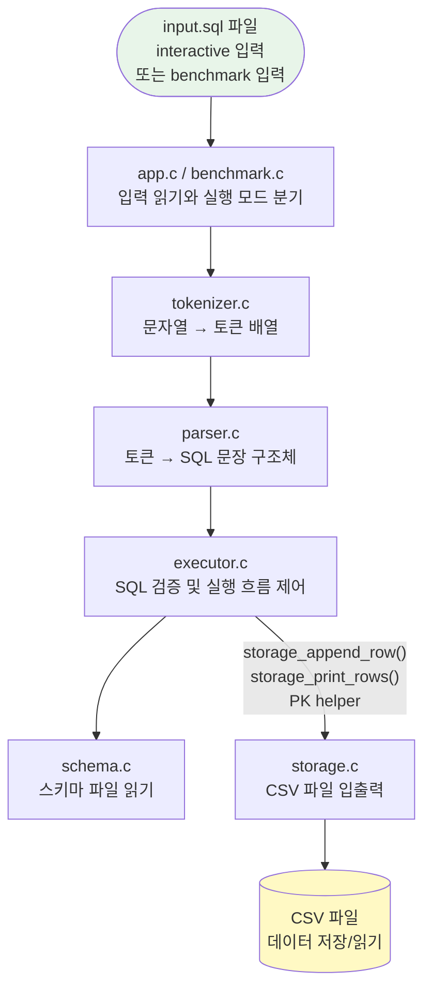

### 단계별 변환 예시

SQL 한 줄 `SELECT name, age FROM users;`이 어떻게 처리되는지 따라가 봅니다.

**① 토큰화** (문자열 → 조각)

```
"SELECT name, age FROM users;"

[SELECT] [name] [,] [age] [FROM] [users] [;] [EOF]
```

**② 파싱** (조각 → 구조체)

```c
SelectStatement {
    table_name   = "users"
    select_all   = 0
    column_count = 2
    column_names = ["name", "age"]
}
```

**③ 실행** (구조체 → 파일 I/O)

```
1. users.schema 로드 → 컬럼 순서 파악
2. users.csv 열기
3. 헤더 행 읽어 스키마와 일치 확인
4. 나머지 행을 한 줄씩 읽어 name, age 컬럼만 출력
```

---

## 4. 모듈별 역할

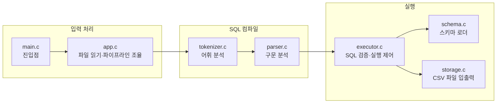

| 파일 | 주요 함수 | 한 줄 설명 |
|------|-----------|------------|
| `main.c` | `main()` | 인자 파싱 후 `run_program()` 호출 |
| `app.c` | `parse_arguments()`, `run_program()`, `load_sql_file()`, `run_sql_file()` | 인자 검증, 파일/interactive/benchmark 모드 분기, 공용 파일 실행 파이프라인 |
| `benchmark.c` | `run_benchmark_mode()` | 더미 데이터 생성, PK cold/warm와 non-PK 시간 측정, 결과 표 출력 |
| `tokenizer.c` | `tokenize_sql()` | 문자열을 `TokenList`로 변환 |
| `parser.c` | `parse_program()` | `TokenList`를 `SqlProgram`으로 변환 |
| `schema.c` | `load_table_schema()` | `.schema` 파일 읽어 `TableSchema` 반환 |
| `executor.c` | `execute_program()` | SQL 타입·이름 검증, PK 자동 발급·중복 검사, storage.c 호출 |
| `storage.c` | `storage_append_row()`, `storage_print_rows()`, `storage_find_max_int_value()`, `storage_int_value_exists()` | CSV 경로·헤더·행 읽기/쓰기와 PK helper scan |

---

## 5. 중앙 헤더 sqlproc.h 읽는 법

모든 모듈이 공유하는 타입과 상수가 `include/sqlproc.h` 하나에 모여 있습니다.

### 상수 (크기 제한)

```c
#define SQLPROC_MAX_NAME_LEN  64   // 컬럼명·테이블명 최대 63자
#define SQLPROC_MAX_VALUE_LEN 64   // 값 문자열 최대 63자
#define SQLPROC_MAX_COLUMNS   16   // 한 테이블 최대 16개 컬럼
#define SQLPROC_MAX_TOKENS   512   // SQL 한 문자열당 최대 토큰 수
#define SQLPROC_MAX_STATEMENTS 32  // 한 SQL 입력당 최대 문장 수
#define SQLPROC_MAX_ERROR_LEN 256  // 오류 메시지 최대 길이
#define SQLPROC_MAX_SQL_SIZE 8192  // 파일/interactive 입력 최대 길이
```

> C에서는 배열 크기를 미리 정해야 합니다.  
> 이 값을 넘으면 프로그램이 오류를 반환합니다.

### 핵심 열거형(enum)

```c
/* 토크나이저가 만드는 토큰 종류 */
typedef enum {
    TOKEN_EOF,              // 입력 끝
    TOKEN_IDENTIFIER,       // 테이블명, 컬럼명 등
    TOKEN_NUMBER,           // 숫자 리터럴: 1, 20, -5
    TOKEN_STRING,           // 문자열 리터럴: 'kim'
    TOKEN_COMMA,            // ,
    TOKEN_SEMICOLON,        // ;
    TOKEN_LPAREN,           // (
    TOKEN_RPAREN,           // )
    TOKEN_STAR,             // *
    TOKEN_KEYWORD_INSERT,   // INSERT
    TOKEN_KEYWORD_INTO,     // INTO
    TOKEN_KEYWORD_VALUES,   // VALUES
    TOKEN_KEYWORD_SELECT,   // SELECT
    TOKEN_KEYWORD_FROM      // FROM
} TokenType;

/* 파서가 구분하는 SQL 문장 종류 */
typedef enum {
    STATEMENT_INSERT,
    STATEMENT_SELECT
} StatementType;
```

### 핵심 구조체 관계도

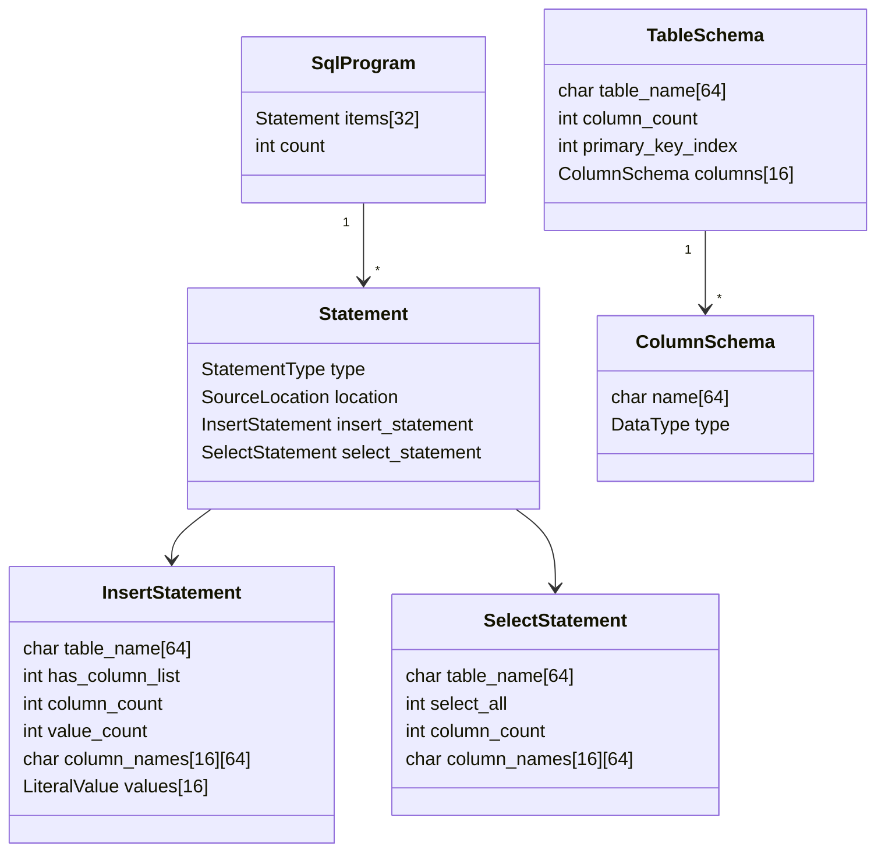

### AppConfig — 실행 설정

```c
/* parse_arguments()가 채워 주는 구조체 */
typedef struct {
    char schema_dir[256];  // --schema-dir 값
    char data_dir[256];    // --data-dir 값
    char input_path[256];   // SQL 파일 경로
    int interactive_mode;   // 1이면 --interactive
    int benchmark_mode;     // 1이면 --benchmark
} AppConfig;
```

`interactive_mode == 1`이면 `input_path` 대신 `stdin`에서 한 줄씩 읽습니다.
`benchmark_mode == 1`이면 먼저 benchmark 전용 CSV와 SQL 파일을 만들고,
결과 표를 출력한 뒤 종료합니다.

---

## 6. SQL 처리 3단계: 토큰화 → 파싱 → 실행

### 6-1. 토큰화 (tokenizer.c)

SQL 문자열을 의미 있는 조각(토큰)으로 자릅니다.

```c
/* tokenize_sql() 호출 예시 */
TokenList tokens;
ErrorInfo error;
tokenize_sql("SELECT * FROM users;", &tokens, &error);

/* 결과: tokens.items[] */
/* [0] type=TOKEN_KEYWORD_SELECT, text="SELECT" */
/* [1] type=TOKEN_STAR,           text="*"      */
/* [2] type=TOKEN_KEYWORD_FROM,   text="FROM"   */
/* [3] type=TOKEN_IDENTIFIER,     text="users"  */
/* [4] type=TOKEN_SEMICOLON,      text=";"      */
/* [5] type=TOKEN_EOF,            text=""       */
```

**토큰화 흐름:**

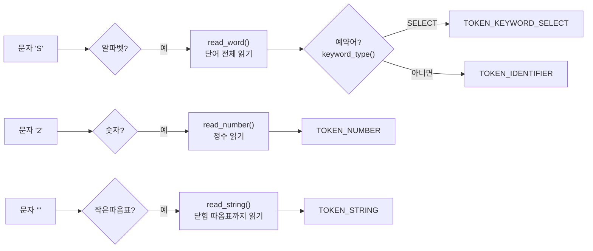

**keyword_type() 동작 원리:**

```c
/* 소문자로 변환한 단어를 예약어 목록과 비교합니다 */
static TokenType keyword_type(const char *text)
{
    if (strcmp(text, "select") == 0) return TOKEN_KEYWORD_SELECT;
    if (strcmp(text, "from")   == 0) return TOKEN_KEYWORD_FROM;
    if (strcmp(text, "insert") == 0) return TOKEN_KEYWORD_INSERT;
    /* ... */
    return TOKEN_IDENTIFIER;  /* 예약어가 아니면 식별자 */
}
```

### 6-2. 파싱 (parser.c)

토큰 배열을 받아 SQL 문장 구조체(`SqlProgram`)를 만듭니다.  
**재귀 하강 파서(Recursive Descent Parser)** 패턴을 사용합니다.

> **재귀 하강 파서란?**  
> 문법 규칙마다 함수를 하나씩 만들고, 함수들이 서로 호출해 가며 토큰을 소비하는 방식입니다.  
> `parse_program` → `parse_statement` → `parse_select_statement` 순서로 호출됩니다.

**파서 핵심 패턴:**

```c
/* consume_token: 기대한 토큰이면 소비하고, 아니면 오류 */
static int consume_token(ParserState *state,
                         TokenType expected,
                         ErrorInfo *error,
                         const char *message)
{
    if (current_token(state)->type != expected) {
        set_error(error, current_token(state), message);
        return 0;  /* 실패 */
    }
    advance_token(state);  /* 다음 토큰으로 이동 */
    return 1;              /* 성공 */
}
```

**SELECT 파싱 흐름:**

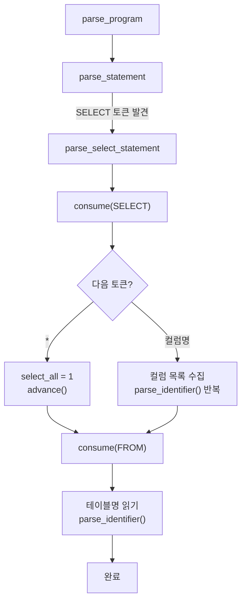

**INSERT 파싱 흐름:**

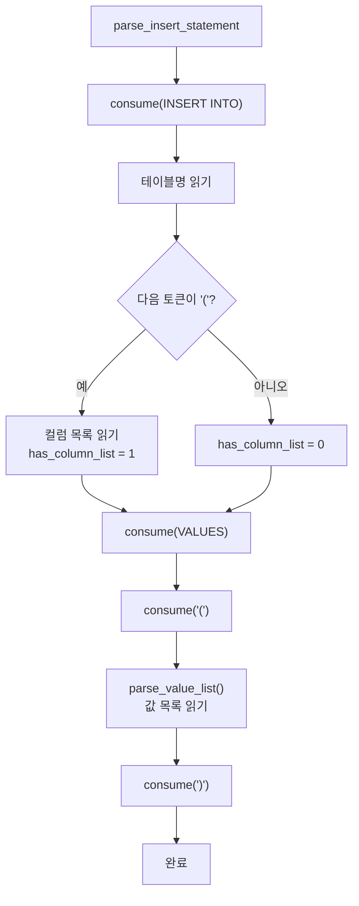

### 6-3. 실행 (executor.c + storage.c)

executor.c는 SQL 검증과 흐름 제어만 담당하고, 파일 읽기/쓰기는 storage.c에 완전히 위임합니다.

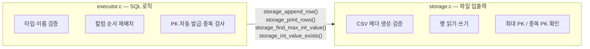

**INSERT 실행 흐름:**

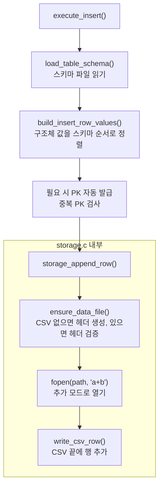

> **"a+b" 모드란?**  
> `"a"` = append(추가), `"b"` = binary, `"+"` = 읽기와 쓰기 둘 다 허용.  
> 파일 끝에 이어 쓰기 때문에 기존 데이터를 덮어쓰지 않습니다.

**build_insert_row_values() 가 하는 일:**

```c
/* 컬럼 목록 없을 때: 스키마 순서 그대로 */
INSERT INTO users VALUES (1, 'kim', 20);
→ row_values[0]="1", row_values[1]="kim", row_values[2]="20"

/* 컬럼 목록 있을 때: 이름으로 위치 찾아 배치 */
INSERT INTO users (age, name, id) VALUES (20, 'kim', 1);
→ row_values[0]="1"(id), row_values[1]="kim"(name), row_values[2]="20"(age)
/* 스키마 순서(id, name, age)에 맞게 재정렬됩니다 */

/* id:int PK 컬럼을 생략하면 자동으로 채움 */
INSERT INTO users (name, age) VALUES ('lee', 30);
→ 기존 최대 id가 5라면 row_values[0]="6", row_values[1]="lee", row_values[2]="30"
```

- `schema->primary_key_index >= 0`이면 `id:int` 컬럼이 존재한다는 뜻입니다.
- 이 경우 `execute_insert()`는 저장 전에 현재 최대 PK를 읽고, 같은 PK가 있는지도 한 번 더 확인합니다.

**SELECT 실행 흐름:**

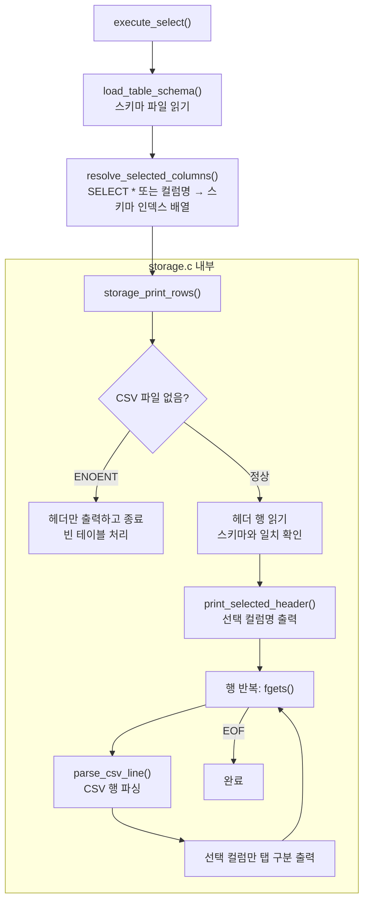

**parse_csv_line() 가 처리하는 CSV 형식:**

```c
/* 일반 값 */
1,kim,20         → ["1", "kim", "20"]

/* 쉼표를 포함한 값은 큰따옴표로 감쌈 */
1,"lee, junior",30  → ["1", "lee, junior", "30"]

/* 내부 큰따옴표는 두 번 씀 */
1,"say ""hi""",20   → ["1", "say \"hi\"", "20"]
```

---

## 7. 데이터 저장 방식 (CSV)

### 스키마 파일 (.schema)

```
examples/schemas/users.schema:

id:int,name:string,age:int
```

- 형식: `컬럼명:타입`
- 타입: `int` 또는 `string` 만 지원
- 컬럼 순서가 CSV 헤더 순서가 됩니다
- `id:int` 컬럼이 있으면 그 위치를 `primary_key_index`로 기록합니다

```c
/* load_table_schema()가 반환하는 구조체 */
TableSchema {
    table_name   = "users"
    column_count = 3
    primary_key_index = 0
    columns[0]   = { name="id",   type=DATA_TYPE_INT    }
    columns[1]   = { name="name", type=DATA_TYPE_STRING }
    columns[2]   = { name="age",  type=DATA_TYPE_INT    }
}
```

### 현재 PK 정책

- `id:int` 컬럼이 있으면 현재 구현에서는 그 컬럼을 PK처럼 다룹니다.
- 프로그램이 테이블을 처음 만질 때는 CSV를 읽어 메모리 B+ Tree를 재구성합니다.
- `INSERT`에서 `id`가 빠지면 재구성된 런타임 상태의 `next_id`를 사용해 다음 값을 채웁니다.
- 저장 직전에는 B+ Tree에서 같은 PK가 이미 있는지 먼저 확인합니다.
- `WHERE id = 값`, `WHERE id > 값`, `WHERE id < 값`은 이 메모리 인덱스를 사용하고,
  그 외 조건은 CSV 선형 탐색으로 처리합니다.

### 데이터 파일 (.csv)

```csv
id,name,age
1,kim,20
2,"lee, junior",30
3,"quote ""test""",25
```

- 첫 줄: 헤더 (스키마 순서와 반드시 일치해야 함)
- 쉼표나 큰따옴표를 포함한 값은 `"..."` 로 감쌈
- 내부 큰따옴표는 `""` 로 이스케이프
- 문자열 값이 `=`, `+`, `-`, `@`로 시작하면 스프레드시트 수식 해석을 막기 위해 INSERT를 거절합니다

### CSV 파일이 자동으로 생성되는 시점

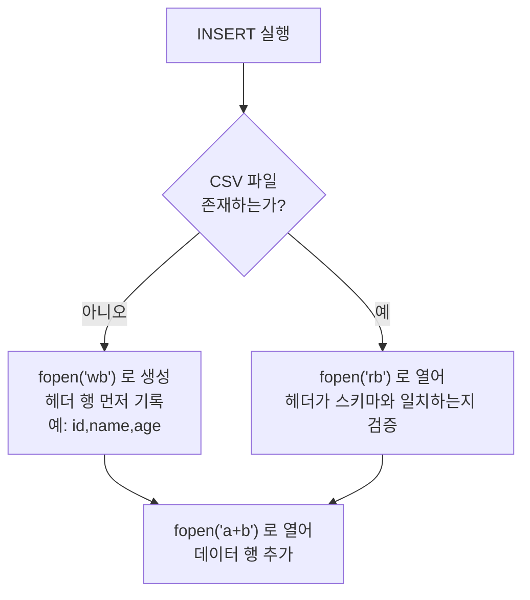

---

## 8. 오류 처리 패턴

이 프로젝트의 모든 함수는 같은 방식으로 오류를 반환합니다.

```c
/* 함수 시그니처 패턴 */
int some_function(..., ErrorInfo *error);
/*  ↑ 반환값: 1=성공, 0=실패          */
/*                       ↑ 오류 상세를 여기에 기록 */
```

```c
/* ErrorInfo 구조체 */
typedef struct {
    char message[256];  /* 오류 메시지                    */
    int  line;          /* SQL 내 줄 번호 (파일 오류면 0) */
    int  column;        /* SQL 내 열 번호 (파일 오류면 0) */
} ErrorInfo;
```

**사용 예시:**

```c
/* 호출하는 쪽 */
TableSchema schema;
ErrorInfo error;

if (!load_table_schema(config->schema_dir, "users", &schema, &error)) {
    /* 실패: error.message에 이유가 담겨 있음 */
    print_error(&error);
    return 0;
}
/* 성공: schema를 안심하고 사용 가능 */
```

> **C 초보자 팁**: C에는 `try/catch`가 없습니다.  
> 대신 함수가 `int` (1=성공, 0=실패)를 반환하고,  
> 오류 상세는 포인터(`ErrorInfo *error`)로 전달받는 관례를 씁니다.

**오류 전파 흐름:**

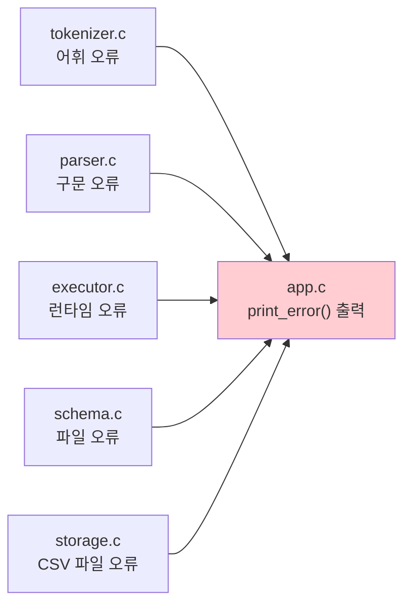

---

## 9. 빌드 및 실행 방법

### 빌드

```bash
make          # build/sqlproc 생성
make test     # 테스트 실행
make clean    # build/ 삭제
```

### 실행 (파일 모드)

```bash
mkdir -p /tmp/data
./build/sqlproc \
  --schema-dir examples/schemas \
  --data-dir   /tmp/data \
  examples/demo.sql
```

인자 설명:

| 인자 | 설명 |
|------|------|
| `--schema-dir <dir>` | `.schema` 파일들이 있는 디렉터리 |
| `--data-dir <dir>` | `.csv` 파일들이 저장되는 디렉터리 |
| `<input.sql>` | 실행할 SQL 파일 경로 |

`--data-dir`는 미리 존재해야 합니다. 현재 구현은 CSV 파일은 만들지만 부모 디렉터리까지 생성하지는 않습니다.

### 실행 (interactive 모드)

```bash
mkdir -p /tmp/data
./build/sqlproc \
  --schema-dir examples/schemas \
  --data-dir   /tmp/data \
  --interactive
```

- 프롬프트는 `sqlproc>` 형태로 표시됩니다.
- `SELECT * FROM users;`처럼 한 줄씩 입력합니다.
- `.exit`, `exit`, `quit` 중 하나를 입력하면 종료합니다.

### 실행 (benchmark 모드)

```bash
mkdir -p /tmp/data
./build/sqlproc \
  --schema-dir examples/schemas \
  --data-dir   /tmp/data \
  --benchmark
```

- 시작하면 `>> 벤치마크를 위한 더미 데이터는 몇 개를 생성하시겠습니까? : ` 프롬프트가 뜹니다.
- 입력한 개수만큼 `/tmp/data/benchmark/` 아래에 `schemas/`, `data/`, `sql/`을 만듭니다.
- benchmark는 `pk_lookup.sql`, `non_pk_lookup.sql`을 같은 `run_sql_file()` 경로로 실행해 시간을 잽니다.
- 표를 출력한 뒤에는 프로그램이 종료됩니다.

### 스키마 파일 예시

```
# examples/schemas/users.schema
id:int,name:string,age:int
```

### SQL 파일 예시

```sql
-- examples/demo.sql
INSERT INTO users VALUES (1, 'kim', 20);
INSERT INTO users (name, age) VALUES ('lee', 30);
INSERT INTO users (age, name) VALUES (40, 'park');
SELECT * FROM users;
SELECT id, name FROM users;
```

### 실행 결과

```
id	name	age
1	kim	20
2	lee	30
3	park	40
id	name
1	kim
2	lee
3	park
```

---

## 부록: 코드 읽기 순서 추천

처음 코드를 읽을 때는 이 순서를 따르면 전체 맥락이 잡힙니다.

```
1. include/sqlproc.h       ← 전체 타입 훑어보기 (20분)
2. src/main.c              ← 진입점 확인 (5분)
3. src/app.c               ← 파일 읽기와 파이프라인 연결 (15분)
4. src/tokenizer.c         ← tokenize_sql() 함수 (20분)
5. src/parser.c            ← parse_insert_statement(),
                              parse_select_statement() (25분)
6. src/schema.c            ← load_table_schema() 함수 (15분)
7. src/executor.c          ← execute_insert(), PK 자동 발급 흐름 (20분)
8. src/storage.c           ← storage_append_row(), storage_print_rows(),
                              storage_find_max_int_value() (20분)
```

> executor.c와 storage.c는 함께 읽는 것을 권장합니다.  
> executor.c가 "무엇을"만 결정하고, storage.c가 "어떻게 파일에" 쓰는지 경계를 확인하세요.  
> 자세한 함수 흐름은 [docs/storage-executor.md](docs/storage-executor.md)를 참고합니다.

> 각 파일은 독립적으로 읽을 수 있습니다.  
> 막히면 `sqlproc.h`에서 관련 구조체를 먼저 확인하세요.
