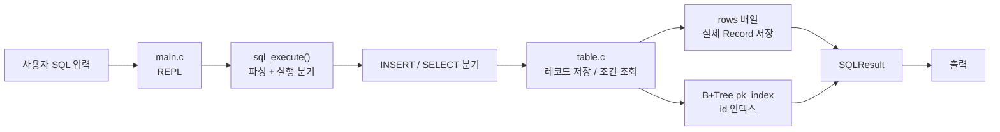
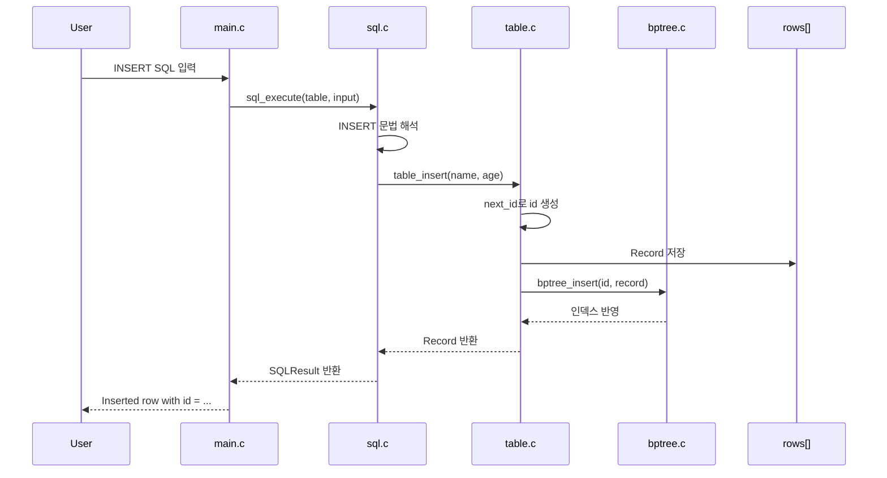
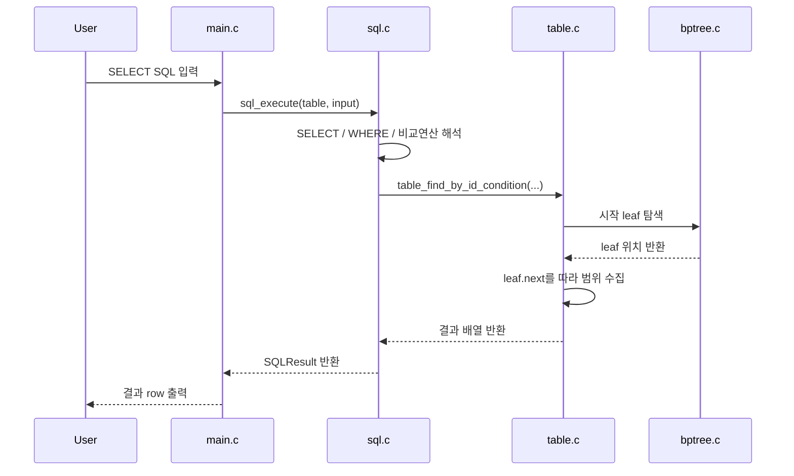

# Mini SQL Processor with B+ Tree Index

이 문서는 , `메모리 기반 users 테이블 + B+Tree 인덱스` 구조를 설명합니다.

이번 프로젝트의 핵심은 단순히 SQL 문장을 실행하는 데서 끝나는 것이 아니라, **AI가 만든 코드까지 팀원 모두가 직접 설명할 수 있을 정도로 이해하는 것**입니다.

---

## 1. 어떤 프로젝트인가

이번 프로젝트는 C 언어로 만든 **메모리 기반 미니 SQL 처리기**입니다.

사용자는 REPL에 SQL 문장을 입력하고, 프로그램은 이를 해석해 `users` 테이블에 저장하거나 조회합니다.

```text
입력(SQL) -> 파싱 -> 실행 -> 테이블 저장 / 인덱스 검색 -> 결과 출력
```

현재 구현은 범용 DBMS가 아니라, 아래 목표에 집중한 학습용 MVP입니다.

- SQL 처리 흐름 이해
- B+Tree 인덱스 동작 이해
- split과 leaf link를 직접 설명할 수 있는 수준까지 소스코드 이해
- 인덱스 검색과 선형 탐색의 차이 확인

현재 지원 범위는 아래와 같습니다.

- `INSERT INTO users VALUES ('Alice', 20);`
- `SELECT * FROM users;`
- `SELECT * FROM users WHERE id = 1;`
- `SELECT * FROM users WHERE id >= 10;`
- `SELECT * FROM users WHERE name = 'Alice';`
- `SELECT * FROM users WHERE age > 20;`
- `id` 자동 증가
- `id` 기준 B+Tree 인덱스 검색
- `name`, `age` 기준 선형 탐색

즉 이 프로젝트는 **작은 SQL 처리기 위에 B+Tree 인덱스를 붙여, DB 내부 동작을 설명 가능한 수준까지 재구성한 학습 프로젝트**입니다.

---

## 2. 팀 목표

우리 팀의 목표는 결과물을 빠르게 만드는 것보다, **생성된 코드의 구조와 이유를 직접 설명할 수 있게 되는 것**이었습니다.

진행 방향은 아래와 같았습니다.

1. SQL과 인덱스의 기본 개념을 먼저 정리했습니다.
2. AI를 활용해 최소 구현을 빠르게 만들었습니다.
3. 생성된 코드를 같이 읽으면서, 각 함수가 왜 필요한지 설명했습니다.
4. 특히 B+Tree split, leaf link, `WHERE id` 처리 흐름을 중심으로 다시 검증했습니다.

즉 이번 프로젝트는

- AI를 활용한 빠른 MVP 구현
- 생성된 코드를 팀이 함께 읽고 설명하는 과정

을 동시에 목표로 두었습니다.

---

## 3. 전체 로직 구조

현재 브랜치의 핵심 실행 흐름은 아래와 같습니다.



한 줄로 요약하면:

> `입력(SQL)` -> `sql_execute()` -> `table / bptree` -> `SQLResult` -> `출력`

여기서 중요한 점은 조회 경로가 조건에 따라 달라진다는 것입니다.

- `WHERE id`: B+Tree 사용
- `WHERE id >= ...`: leaf node 연결을 따라 range 조회
- `WHERE name`, `WHERE age`: 선형 탐색

즉 이 프로젝트는 단순 SQL 처리기이면서 동시에, **인덱스를 타는 경우와 타지 않는 경우를 비교해서 보여주는 구조**입니다.

---

## 4. 코드 구조

현재 저장소는 루트 단위의 단순 구조를 사용합니다.

```text
main.c                  REPL 실행 루프
sql.h / sql.c           고정 패턴 SQL 파싱 + 실행
table.h / table.c       users 테이블 저장 / 검색 / 출력
bptree.h / bptree.c     B+Tree 구현
unit_test.c             단위 테스트
perf_test.c             id 1000회 검색 성능 비교
condition_perf_test.c   id 조건 경로 성능 비교
Makefile                빌드 스크립트
docs/diagrams/*.mmd     Mermaid 다이어그램 소스
```

역할을 기준으로 보면 다음처럼 나눌 수 있습니다.

- `main.c`: 사용자 입력을 받고 결과를 출력
- `sql.c`: 허용된 SQL 문법을 해석하고 실행 함수 호출
- `table.c`: 실제 row 저장, 선형 탐색, 인덱스 연동
- `bptree.c`: insert, search, split, leaf link 관리

즉 구조는 크게

> `입력 계층` / `SQL 해석 계층` / `테이블 계층` / `인덱스 계층`

으로 설명할 수 있습니다.

---

## 5. 핵심 자료구조

현재 구현에서 중요한 자료구조는 `Record`, `Table`, `BPTreeNode`, `SQLResult`입니다.

### 5-1. Record

`users` 테이블의 한 row를 표현합니다.

```c
typedef struct Record {
    int id;
    char name[RECORD_NAME_SIZE];
    int age;
} Record;
```

- `id`: 자동 증가 PK
- `name`: 사용자 이름
- `age`: 정수 나이

### 5-2. Table

테이블 본체와 인덱스를 함께 들고 있는 구조입니다.

```c
typedef struct Table {
    int next_id;
    Record **rows;
    size_t size;
    size_t capacity;
    BPTree *pk_index;
} Table;
```

- `rows`: 실제 레코드 포인터 배열
- `pk_index`: `id` 기준 B+Tree
- `next_id`: INSERT 시 자동 증가 값

즉 실제 데이터는 `rows`에 저장하고, 빠른 검색은 `pk_index`가 담당합니다.

### 5-3. BPTreeNode

인덱스 노드는 key와 child/value를 가집니다.

```c
typedef struct BPTreeNode {
    int is_leaf;
    int num_keys;
    int keys[BPTREE_MAX_KEYS];
    void *values[BPTREE_MAX_KEYS];
    struct BPTreeNode *children[BPTREE_ORDER];
    struct BPTreeNode *parent;
    struct BPTreeNode *next;
} BPTreeNode;
```

핵심 포인트는 아래와 같습니다.

- 내부 노드: 검색 경로 안내
- 리프 노드: 실제 `(id, Record *)` 저장
- `next`: 리프 노드끼리 연결

이 `next` 포인터 덕분에 `WHERE id >= 10` 같은 range 조회를 효율적으로 처리할 수 있습니다.

### 5-4. SQLResult

실행 결과를 호출자에게 넘기는 구조체입니다.

- 실행 성공/실패 상태
- INSERT된 id
- SELECT 결과 row 목록
- SQL 오류 메시지

즉 문자열을 바로 출력하지 않고, 먼저 결과 구조체로 정리한 뒤 `main.c`에서 출력합니다.

---

## 6. 실제 실행 흐름

### 6-1. INSERT 흐름

예를 들어 아래 SQL이 들어오면:

```sql
INSERT INTO users VALUES ('Alice', 20);
```

내부 동작은 아래와 같습니다.



핵심은 `INSERT`가 단순히 배열에 넣는 것으로 끝나지 않고,

- 실제 row 저장
- B+Tree 인덱스 반영

두 작업을 함께 수행한다는 점입니다.

### 6-2. SELECT 흐름

예를 들어 아래 SQL이 들어오면:

```sql
SELECT * FROM users WHERE id >= 10;
```

내부 동작은 아래와 같습니다.



반대로 `WHERE age = 20`은 인덱스를 사용하지 않고 `rows`를 끝까지 순회합니다.

- `id 조건`: 인덱스 사용
- `name`, `age` 조건: 선형 탐색
- 같은 SELECT라도 내부 경로가 다름

---

## 7. 구현하면서 든 고민과 현재 답

이번 프로젝트에서 중요한 부분은 "무엇을 구현했는가"보다, **왜 이런 구조를 택했는가**였습니다.

### 고민 1. B+Tree 노드 구조체에 안 쓰는 필드가 많은데 최적화해야 하나

현재 `BPTreeNode`는 leaf와 internal node가 같은 구조체를 공유합니다.

- leaf에서는 `values[]`, `next`가 핵심이고 `children[]`는 사실상 쓰지 않음
- internal에서는 `children[]`가 핵심이고 `values[]`, `next`는 사실상 쓰지 않음

그래서 구현하면서 "이 구조는 직관적이지만 메모리 면에서 낭비가 있지 않나"라는 고민을 많이 했습니다.

#### 현재 답

최적화 방향 자체는 분명히 있습니다.

1. leaf / internal을 아예 다른 구조체로 분리하기
2. `union`을 써서 `values[]`와 `children[]`를 상황별로 겹쳐 쓰기
3. 공통 헤더 + 타입별 payload 구조로 나누기

하지만 이번 프로젝트에서는 그 최적화보다 **구현 단순성**을 우선했습니다.

- 노드 생성, split, parent 연결, destroy 로직을 한 타입 기준으로 읽을 수 있음
- 디버깅할 때 "이 노드는 어떤 필드를 가진다"를 따로 해석할 필요가 적음
- 학습 단계에서 leaf split / internal split 흐름을 설명하기 쉬움

즉 지금 구조는 메모리 최적화보다는,

> B+Tree의 동작을 명확하게 보이게 하는 교육용 구조

에 더 가깝습니다.

나중에 노드 수가 매우 많아지거나 디스크 페이지 단위로 확장한다면, 그때는 leaf / internal 분리 구조나 `union` 기반 최적화를 다시 검토하는 것이 맞습니다.


### 고민 2. 왜 B+Tree order를 4로 뒀나

실제 DBMS는 더 큰 페이지 단위와 fan-out을 가집니다. 하지만 학습 단계에서는 그 구조가 너무 커지면 split이 잘 보이지 않습니다.

#### 현재 답

`BPTREE_ORDER = 4`로 두어서

- 최대 key 수가 작고
- leaf split, internal split, 새 root 생성

이 빠르게 발생하게 만들었습니다.

즉 이 값은 성능 최적화보다 **학습과 설명 가능성**을 위한 선택입니다.

### 고민 3. 왜 데이터와 인덱스를 분리했나

레코드를 트리 안에 직접 넣는 방식도 생각할 수 있습니다.

#### 현재 답

현재 구현은

- 실제 데이터: `rows`
- 빠른 접근 경로: `pk_index`

로 분리했습니다.

즉 B+Tree는 데이터를 "보관"하는 구조라기보다,

> 데이터를 빨리 찾기 위한 접근 경로

로 사용합니다.

이 분리는 나중에 디스크 저장이나 다른 인덱스를 붙일 때도 자연스럽습니다.


---

## 8. 테스트와 검증

현재 저장소는 기능 검증과 성능 비교를 분리해 두었습니다.

### 8-1. 기능 검증

```bash
make
./unit_test
```

If `make` is unavailable in MinGW on Windows, run `mingw32-make` instead.

`unit_test.c`에서는 아래 항목을 검증합니다.

- 빈 트리 검색
- 단일 key insert/search
- duplicate key 거부
- leaf split 이후 검색 보존
- internal split 이후 검색 보존
- leaf next 연결 유지
- auto increment
- `WHERE id`, `WHERE age` 조건 조회
- SQL 실행 결과 row 순서와 개수

현재 로컬 실행 결과:

```text
All unit tests passed.
```

### 8-2. 성능 비교

```bash
./perf_test
./condition_perf_test
```

이 테스트는 100만 건 데이터를 넣은 뒤,

- 같은 `id` 1000개를 `B+Tree`와 `rows` 선형 탐색으로 각각 비교
- `id = ?` 를 `B+Tree`와 `rows` 스캔으로 비교
- `id >= ...` 를 `B+Tree`와 `rows` 스캔으로 비교

를 수행합니다.

로컬 실행 결과 이미지는 아래와 같습니다. 측정값은 환경에 따라 달라질 수 있으므로, 아래 이미지는 각 시점의 로컬 실행 예시입니다.

`./perf_test` (1000 lookups)


`./condition_perf_test` (1000 exact queries)


---

## 9. 데모 명령

### 기본 실행

```bash
make
./main
```

If `make` is unavailable in MinGW on Windows, run `mingw32-make` instead.

### Server Bootstrap

```bash
make server
./server
```

### REPL에서 바로 보여주기 좋은 입력

```sql
INSERT INTO users VALUES ('Alice', 20);
INSERT INTO users VALUES ('Bob', 30);
SELECT * FROM users;
SELECT * FROM users WHERE id = 1;
SELECT * FROM users WHERE id >= 2;
SELECT * FROM users WHERE name = 'Bob';
SELECT * FROM users WHERE age > 20;
QUIT
```

### 테스트 실행

```bash
./unit_test
./perf_test
./condition_perf_test
```

---
