# `week6-team5-sql`

> `WHERE id = ?` 조회가 왜 빠른지 B+ Tree 인덱스로 보여주는 교육용 SQL 처리기

## 한눈에 보기

| 항목 | 내용 |
| --- | --- |
| 목표 | PK 조회 시 B+ Tree 인덱스를 사용하는 흐름을 눈에 보이게 구현 |
| 이번 주 핵심 | `WHERE id = ?`는 B+ Tree, 그 외 조건은 CSV 선형 탐색 |
| 입력 | `.sql` 파일, `--interactive`, `--benchmark` |
| 출력 | 표준 출력 + `.csv` 파일 |
| 지원 문장 | `INSERT`, `SELECT` |
| 지원 WHERE | 단일 조건 `=`, `>`, `<`, `!=` |
| PK 정책 | 스키마에 `id:int`가 있으면 자동 PK 관리 |
| 인덱스 값 | `id -> CSV row offset` |
| 저장 방식 | `CSV` |
| 스키마 | `<table>.schema` |

## 시스템 구조

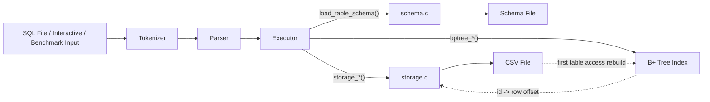

## 이번 주 핵심: PK 조회는 B+ Tree

- 이번 요구사항의 핵심은 `SELECT * FROM users WHERE id = ?`처럼 PK 하나를 찾을 때 B+ Tree 인덱스를 사용하는 것입니다.
- 현재 구현은 여기에 더해 PK 범위 조회 `id > ?`, `id < ?`도 leaf 연결을 따라 처리합니다.
- 반대로 `name`, `age` 같은 PK가 아닌 컬럼 조건은 기존 CSV 선형 탐색 흐름을 그대로 유지합니다.
- 발표에서는 아래 순서로 보면 핵심이 가장 빨리 들어옵니다.
  - `PK 조회와 일반 조회의 분기` Mermaid
  - `조회 방식 요약` 표
  - 아래 `7주차: B+ Tree 인덱스`의 exact lookup Mermaid

### 1. PK 조회와 일반 조회의 분기

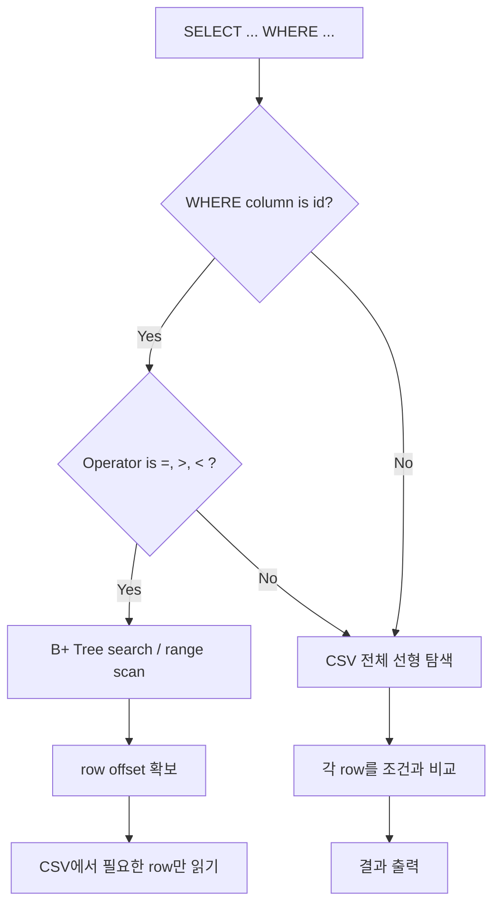

### 2. INSERT가 인덱스를 유지하는 방식

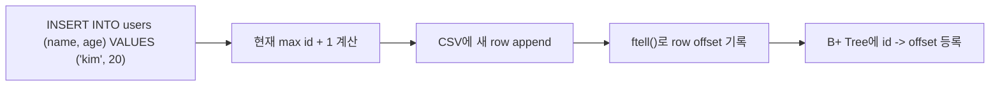

### 3. 프로그램 재실행 후 인덱스 재구성

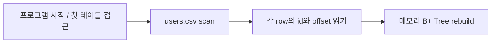

### 조회 방식 요약

| 쿼리 | 실행 로그 | 실제 경로 | 설명 |
| --- | --- | --- | --- |
| `SELECT * FROM users WHERE id = 2;` | `[INDEX]` | B+ Tree exact search -> offset -> 해당 row 읽기 | 이번 과제의 핵심 |
| `SELECT * FROM users WHERE id > 2;` | `[INDEX-RANGE]` | B+ Tree leaf range scan | 추가 구현 |
| `SELECT name FROM users WHERE name = 'kim';` | `[SCAN]` | CSV 전체 선형 탐색 | PK 인덱스가 아님 |
| `SELECT id, name FROM users WHERE age != 20;` | `[SCAN]` | CSV 전체 선형 탐색 | 현재 인덱스 범위 밖 |

## 실행 흐름

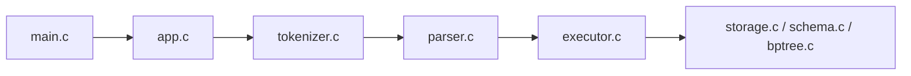

| 단계 | 함수 / 파일 | 핵심 역할 |
| --- | --- | --- |
| 1 | `main.c` | 프로그램 진입점 |
| 2 | `app.c` + `benchmark.c` | SQL 파일 읽기, interactive 입력, benchmark 실행 처리 |
| 3 | `tokenizer.c` | SQL 문자열을 토큰 배열로 분리 |
| 4 | `parser.c` | 토큰 배열을 `SqlProgram`으로 변환 |
| 5 | `executor.c` + `storage.c` + `schema.c` + `bptree.c` | 스키마 확인, PK 검증, 인덱스/CSV 반영 |

### 단계별 예시 이미지

### 1. `tokenizer.c`

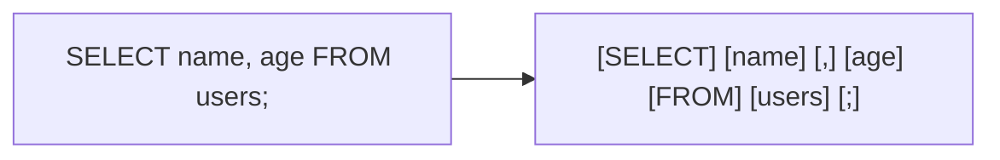

### 2. `parser.c` - SELECT

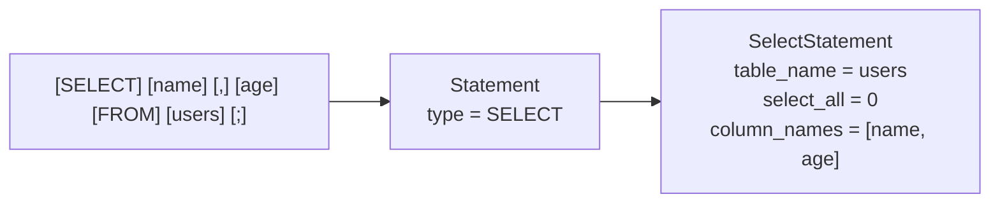

### 3. `executor.c` + `storage.c` - SELECT

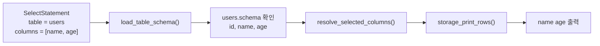

### 4. `parser.c` - INSERT

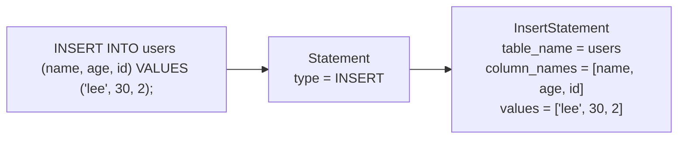

### 5. `executor.c` + `storage.c` - INSERT

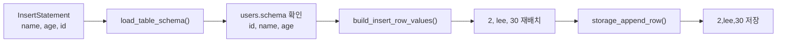

## 핵심 구조체

| 구조체 | 역할 | 생성 단계 | 포함 |
| --- | --- | --- | --- |
| `TokenList` | SQL 문자열을 잘라낸 토큰 배열 | `tokenizer.c` | `Token[]` |
| `SqlProgram` | 파싱된 SQL 문장 목록 | `parser.c` | `Statement[]` |
| `Statement` | `INSERT` / `SELECT` 구분 단위 | `parser.c` | `InsertStatement` or `SelectStatement` |
| `AppConfig` | 실행 경로와 interactive/benchmark 모드 설정 | `app.c` | `schema_dir`, `data_dir`, `input_path`, `interactive_mode`, `benchmark_mode` |
| `InsertStatement` | 테이블명, 컬럼명[], 값[] | `parser.c` | `LiteralValue[]` |
| `SelectStatement` | 테이블명, `select_all`, 컬럼명[] | `parser.c` | — |
| `TableSchema` | 컬럼 순서·타입·PK 위치 정의 | `schema.c` | `ColumnSchema[]`, `primary_key_index` |
| `BPlusTree` | PK `id`로 CSV row offset을 찾는 메모리 인덱스 | `executor.c` / `storage.c` | leaf 연결, `id -> offset` |
| `ErrorInfo` | 오류 메시지 + 위치 | 전 단계 공용 | — |

### 구조체를 사용하는 이유

- tokenizer 결과와 parser 결과를 단계별로 분리해서 저장하기 위해 사용했습니다.
- `INSERT`, `SELECT`를 문자열이 아니라 정리된 데이터 형태로 넘기기 위해 사용했습니다.
- executor가 스키마 기준으로 컬럼 순서와 타입을 확인하기 쉽게 만들기 위해 사용했습니다.
- 오류가 어느 단계에서 났는지 같은 형식으로 기록하기 위해 사용했습니다.

### 구조체를 사용했을 때 장점

- 각 단계가 어떤 데이터를 받고 어떤 데이터를 만드는지 바로 보입니다.
- tokenizer, parser, executor 역할이 섞이지 않습니다.
- `INSERT`, `SELECT` 문장을 같은 `Statement` 단위로 관리할 수 있습니다.
- 디버깅할 때 문자열 전체를 다시 읽지 않고, 정리된 결과만 보면 됩니다.
- 발표에서도 "문자열 -> 토큰 -> 문장 구조체 -> 실행" 흐름을 설명하기 쉽습니다.

## 지원 SQL

```sql
INSERT INTO users VALUES (1, 'kim', 20);
INSERT INTO users (name, age) VALUES ('lee', 30);
SELECT * FROM users;
SELECT name, age FROM users;
SELECT * FROM users WHERE id = 1;
SELECT name FROM users WHERE name = 'kim';
SELECT * FROM users WHERE id > 999990;
SELECT id, name FROM users WHERE age != 20;
```

## 7주차: B+ Tree 인덱스

아래 두 그림은 PK exact lookup과 일반 scan이 실제로 어디서 갈라지는지 보여줍니다.

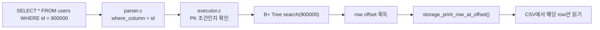

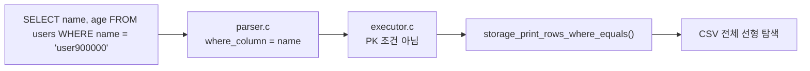

- `INSERT INTO users (name, age) VALUES ('kim', 20);`처럼 `id`를 생략하면 자동으로 다음 PK가 부여됩니다.
- CSV에 row를 쓰기 직전 `ftell()`로 row 시작 위치를 얻고, B+ Tree에는 `id -> CSV offset`만 저장합니다.
- 프로그램 실행 중 테이블을 처음 사용할 때 기존 CSV를 스캔해 메모리 B+ Tree를 재구성합니다.
- `SELECT * FROM users WHERE id = 2;`는 `[INDEX]` 로그를 출력하고 B+ Tree로 row offset을 찾아 필요한 row만 읽습니다.
- 이번 요구사항의 핵심은 위 exact lookup 경로입니다.
- `SELECT * FROM users WHERE id > 999990;`와 `id < ...`는 `[INDEX-RANGE]` 로그를 출력하고 B+ Tree leaf 연결을 따라 범위 결과를 찾습니다.
- `SELECT * FROM users WHERE name = 'kim';`처럼 PK가 아닌 컬럼 조건은 `[SCAN]` 로그를 출력하고 CSV를 선형 탐색합니다.
- `!=` 조건은 인덱스 범위가 아니므로 `[SCAN]`으로 처리합니다.

### 인덱스 데모

```bash
make
make test
rm -rf demo-data
mkdir demo-data
./build/sqlproc --schema-dir ./examples/schemas --data-dir ./demo-data ./examples/index_demo.sql
```

### 성능 비교

```bash
make bench
```

빠르게 시연하려면 아래 순서가 가장 이해하기 쉽습니다.

1. `./build/sqlproc --schema-dir ./examples/schemas --data-dir ./demo-data ./examples/index_demo.sql`
2. `./build/sqlproc --schema-dir ./examples/schemas --data-dir ./demo-data ./examples/perf_compare.sql`
3. `./build/sqlproc --schema-dir ./examples/schemas --data-dir ./demo-data --benchmark`

`make bench`는 이제 `sqlproc --benchmark`를 실행합니다. 벤치마크를 시작하면
아래 프롬프트가 뜨고, 입력한 개수만큼 `demo-data/benchmark/` 아래에 더미
CSV와 조회용 SQL 파일 2개를 만듭니다.

```text
>> 벤치마크를 위한 더미 데이터는 몇 개를 생성하시겠습니까? : 1000000
```

벤치마크는 같은 `sqlproc` 파일 실행 경로로 아래 3가지를 순서대로 재며,
쿼리 결과 자체는 숨기고 요약 표만 보여 줍니다.

- `PK (id, cold)` — 첫 PK 조회와 인덱스 재구성 비용 포함
- `PK (id, warm)` — 같은 PK를 한 번 더 조회한 warm lookup
- `not PK (name)` — PK가 아닌 `name` equality 선형 탐색

예시 출력은 아래와 같습니다.

```text
============= 벤치마크 결과 =============
PK (id, cold)                    309.519ms
PK (id, warm)                      0.060ms
not PK (name)                     91.877ms
========================================

sqlproc interactive mode
type .exit to quit
sqlproc>
```

벤치마크가 끝나면 자동으로 일반 interactive 모드로 넘어갑니다. 이때
interactive는 원래 전달한 `--schema-dir`, `--data-dir`를 그대로 사용하고,
벤치마크 데이터는 `data_dir/benchmark/` 아래에 따로 남습니다.

시간 차이를 직접 눈으로 보고 싶으면 기존처럼 아래 예제를 실행할 수 있습니다.
각 `SELECT` 뒤에 `elapsed: ... ms`가 출력됩니다.

```bash
./build/sqlproc --schema-dir ./examples/schemas --data-dir ./demo-data ./examples/perf_compare.sql
```

기존 `bench_index`는 하위 호환용 보조 도구로 남겨 두었습니다. 다만
parser/executor까지 포함한 전체 데모와 발표용 시연 경로는 이제
`sqlproc --benchmark`를 기준으로 보는 편이 좋습니다.

예시 측정 결과도 함께 남깁니다. 아래 수치는 `2026-04-16`에
`./build/sqlproc --schema-dir ./examples/schemas --data-dir /tmp/sqlproc-bench-doc --benchmark`
로 실행해 `1000000`을 입력한 로컬 결과이며,
환경에 따라 달라질 수 있습니다.

| 레코드 수 | PK cold (`id = 900000`) | PK warm (`id = 900000`) | 비-PK (`name = 'user900000'`) |
| --- | --- | --- | --- |
| 1,000,000 | `309.519ms` | `0.060ms` | `91.877ms` |

- 스키마에 `id:int` 컬럼이 있으면 PK로 인식하고, `INSERT`에서 `id`를 빼면 현재 최대값 + 1을 자동 부여합니다.
- 이미 존재하는 `id`를 넣으면 `PK 값이 이미 존재합니다.` 오류로 거절합니다.
- 현재 `WHERE`는 단일 조건 `=`, `>`, `<`, `!=`를 지원합니다.
- 인덱스는 `WHERE id = 값`, `WHERE id > 값`, `WHERE id < 값`에서 사용됩니다.
- 아직 지원하지 않는 문법은 `AND`, `OR`, `JOIN`, `ORDER BY`, `UPDATE`, `DELETE`입니다.

## 실행 모드

- 새 데이터 디렉터리를 쓸 때는 먼저 `mkdir -p /tmp/sqlproc-data`처럼 부모 디렉터리를 만들어 두어야 합니다.
- 파일 모드: `./build/sqlproc --schema-dir ./examples/schemas --data-dir /tmp/sqlproc-data ./examples/demo.sql`
- interactive 모드: `./build/sqlproc --schema-dir ./examples/schemas --data-dir /tmp/sqlproc-data --interactive`
- benchmark 모드: `./build/sqlproc --schema-dir ./examples/schemas --data-dir /tmp/sqlproc-data --benchmark`
- interactive 모드에서는 `sqlproc>` 프롬프트에서 SQL 한 줄씩 입력하고 `.exit`로 종료합니다.
- benchmark 모드에서는 더미 데이터 개수를 먼저 입력하고, 결과 표가 끝나면 곧바로 `sqlproc>` 프롬프트로 이어집니다.

## 시연 예시

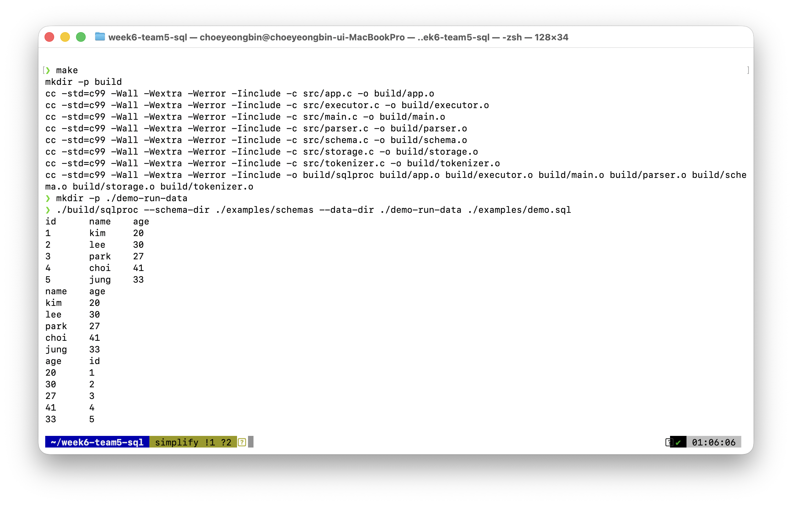

```sql
INSERT INTO users VALUES (1, 'kim', 20);
INSERT INTO users (name, age) VALUES ('lee', 30);
INSERT INTO users VALUES (3, 'park', 27);
INSERT INTO users (age, name) VALUES (41, 'choi');
INSERT INTO users VALUES (5, 'jung', 33);
SELECT * FROM users;
SELECT name, age FROM users;
SELECT age, id FROM users;
```

## 우리 팀의 포인트

### 1. tokenizer, parser, executor의 오류를 나눠서 처리

| 단계      | 대표 메시지                            |
| --------- | -------------------------------------- |
| Tokenizer | `지원하지 않는 문자를 찾았습니다.`     |
| Tokenizer | `문자열 리터럴이 닫히지 않았습니다.`   |
| Parser    | `FROM 키워드가 필요합니다.`            |
| Parser    | `문장 끝에는 세미콜론이 필요합니다.`   |
| Parser    | `컬럼 수와 값 수가 일치하지 않습니다.` |
| Executor  | `INSERT 값 타입이 스키마와 맞지 않습니다.` |
| Executor  | `SELECT 대상 컬럼이 스키마에 없습니다.` |
| Executor  | `PK 값이 이미 존재합니다.` |
| Executor  | `문자열 값이 CSV에서 수식으로 해석될 수 없습니다.` |

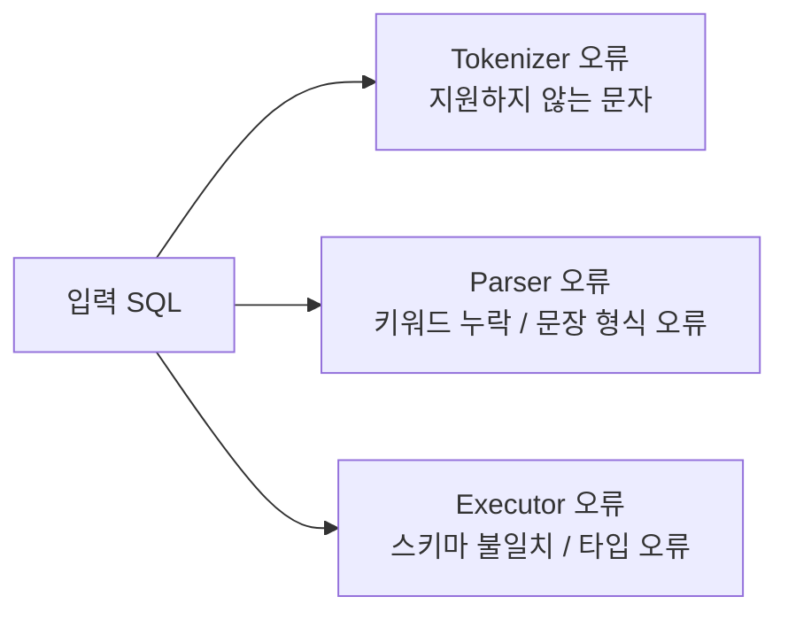

예시:

- tokenizer 오류: `SELECT @ FROM users;`
- parser 오류: `SELECT name users;`
- executor 오류: `INSERT INTO users VALUES ('kim', 1, 20);`

### 2. storage.c에서도 파일/CSV 오류를 따로 처리

| 구분 | 대표 메시지 |
| --- | --- |
| Storage | `데이터 파일을 만들 수 없습니다.` |
| Storage | `기존 데이터 파일 헤더 형식이 잘못되었습니다.` |
| Storage | `CSV 헤더가 스키마와 다릅니다.` |
| Storage | `CSV 헤더 순서가 스키마와 다릅니다.` |
| Storage | `CSV 행을 읽는 중 오류가 발생했습니다.` |

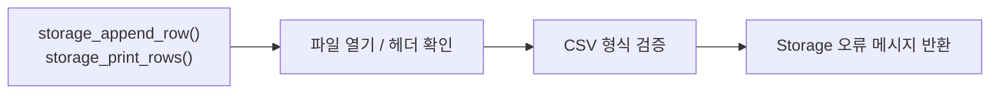

예시:

- storage 오류: `데이터 파일을 만들 수 없습니다.`
- storage 오류: `CSV 헤더가 스키마와 다릅니다.`

### 3. 오류 위치까지 함께 출력

```text
오류: 지원하지 않는 문자를 찾았습니다. (line 1, column 8)
오류: FROM 키워드가 필요합니다. (line 1, column 13)
```

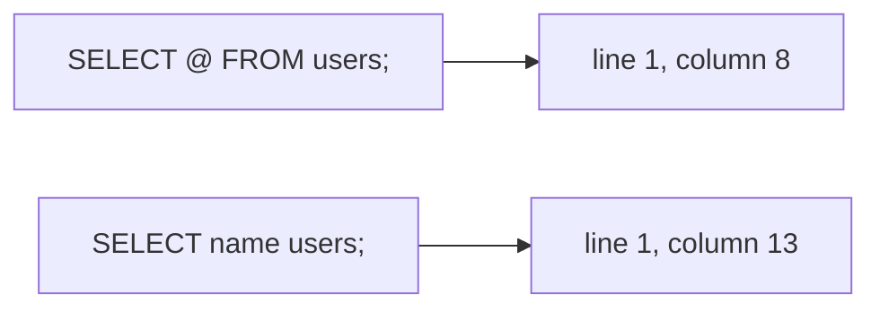

### 4. 스키마를 기준으로 컬럼 순서와 타입을 맞춤

```text
id:int,name:string,age:int
```

- 컬럼 순서를 통일합니다.
- `int`, `string` 타입을 검증합니다.
- 사용자가 컬럼 순서를 바꿔도 schema 기준으로 다시 맞춥니다.

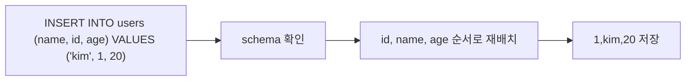

### 5. executor와 storage를 분리해 역할을 명확히 구분

- 스키마에 `id:int` 컬럼이 있으면 `schema.c`가 PK 위치를 기억합니다.
- `INSERT`에서 `id`를 생략하면 `executor.c`가 기존 CSV의 최대 `id`를 읽어 다음 값을 채웁니다.
- 저장 직전에는 같은 `id`가 이미 있는지 확인해 중복 PK를 막습니다.

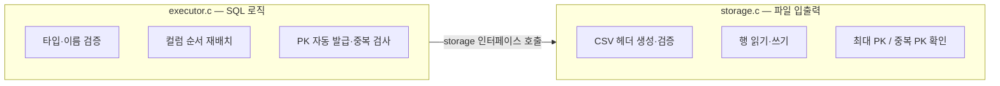

- `storage_append_row()` — INSERT 시 CSV에 한 행 추가
- `storage_print_rows()` — SELECT 시 해당 컬럼만 출력
- `storage_find_max_int_value()` — 자동 PK 발급용 최대값 계산
- `storage_int_value_exists()` — PK 중복 여부 확인
- storage.c를 교체해도 executor.c를 건드릴 필요가 없음

## 협업과 회고

| 주제      | 내용                                                                  |
| --------- | --------------------------------------------------------------------- |
| 리뷰 방식 | `AGENTS.md`의 멀티 페르소나 관점을 참고해 에이전트를 리뷰어처럼 활용  |
| 협업 방식 | 한 컴퓨터에서 상세 프롬프트를 작성하고 같은 환경에서 바로 빌드·테스트 |
| 효과      | 정확성, 자료구조 일관성, 초심자 가독성을 분리해 점검 가능             |

### 작업 플로우

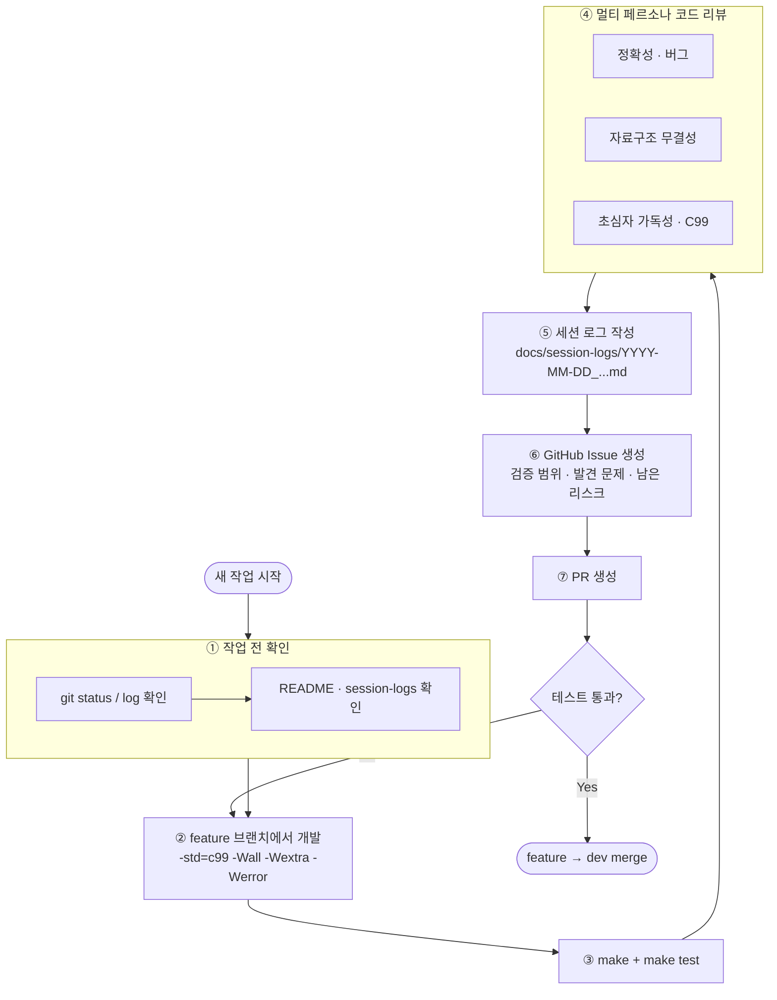
