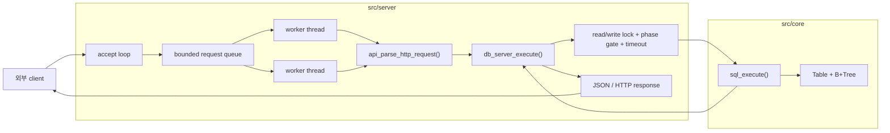
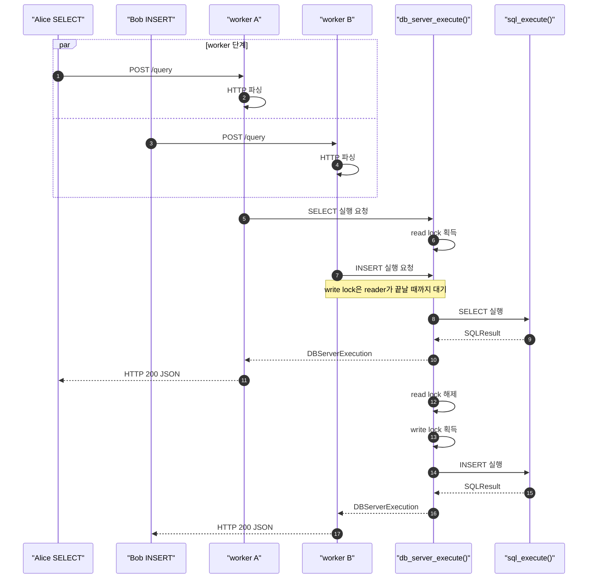

# Mini DBMS SQL API Server

C 기반 in-memory `users` SQL 엔진을 외부 client가 호출할 수 있는 HTTP API 서버로 감싼 프로젝트입니다. 발표의 핵심은 SQL 파서를 새로 만드는 것이 아니라, **이전 SQL 처리기와 B+Tree를 그대로 활용하면서 여러 HTTP 요청을 thread pool로 병렬 처리하고, 하나의 공유 DB를 안전하게 보호하는 API 서버 경계**를 구현한 점입니다.

한 줄로 말하면, 기존 `src/core/`의 `sql_execute()`, `Table`, `B+Tree`는 유지하고 `src/server/`에 HTTP endpoint, bounded request queue, worker thread pool, read/write lock, timeout, backpressure, metrics, JSON 응답을 추가했습니다.

## 1. 요구사항과 구현 매핑

| 과제 요구사항 | 이번 구현 |
|---|---|
| 외부 클라이언트에서 DBMS 기능 사용 | `GET /health`, `GET /metrics`, `POST /query` HTTP API 제공 |
| thread pool로 SQL 요청 병렬 처리 | accept loop가 socket을 받고, bounded queue를 거쳐 fixed worker thread pool이 처리 |
| 이전 SQL 처리기와 B+Tree 재사용 | `src/core/sql.c`, `table.c`, `bptree.c`를 그대로 서버 뒤쪽 엔진으로 사용 |
| 내부 DB 엔진과 외부 API 서버 연결 | `api_parse_http_request()` -> `db_server_execute()` -> `sql_execute()` -> JSON 응답 |
| 멀티 스레드 동시성 이슈 대응 | `SELECT`는 read lock, `INSERT`는 write lock으로 공유 `Table *` 보호 |
| 품질과 edge case 검증 | unit test, HTTP smoke, Postman edge/burst collection, queue/timeout metrics 확인 |

## 2. 전체 구조



초심자 관점에서는 서버를 세 층으로 보면 됩니다.

| 층 | 역할 | 대표 코드 |
|---|---|---|
| HTTP 서버 | 연결을 받고 worker에게 일을 나눠 줌 | `http_server_run()`, `HTTPRequestQueue` |
| API/DB 경계 | HTTP를 SQL 실행 결과로 바꾸고 lock/metrics를 관리 | `api_parse_http_request()`, `db_server_execute()` |
| 기존 DB 엔진 | `users` 테이블에 SQL을 실행 | `sql_execute()`, `Table`, `B+Tree` |

`src/core/`는 socket, HTTP, lock을 모릅니다. 동시성 정책을 `src/server/db_server.c`에 모아 둔 덕분에 기존 CLI와 SQL 엔진은 유지하면서 API 서버 동작만 따로 설명하고 검증할 수 있습니다.

## 3. 요청 하나가 처리되는 길

| 단계 | 함수/구조 | 쉬운 설명 |
|---|---|---|
| 1 | `accept()` | client 연결을 받음 |
| 2 | `http_request_queue_push()` | 바로 실행하지 않고 대기줄에 socket을 넣음 |
| 3 | worker thread | queue에서 socket을 꺼내 한 요청을 끝까지 처리 |
| 4 | `api_parse_http_request()` | method, path, JSON body의 `query`를 읽음 |
| 5 | `db_server_execute()` | SQL 종류를 보고 lock을 잡은 뒤 core 실행 |
| 6 | `api_build_execution_response()` | 실행 결과를 JSON으로 만듦 |
| 7 | `api_render_http_response()` | HTTP status/header/body를 client에게 보냄 |

queue를 둔 이유는 backpressure입니다. worker가 처리할 수 있는 양보다 요청이 더 빨리 들어오면 무한히 쌓지 않고, queue가 가득 찬 순간 `503 queue_full`로 거절합니다. 반대로 worker까지 배정됐지만 DB lock을 너무 오래 기다리면 SQL을 실행하지 않고 `503 lock_timeout`을 돌려줍니다.

| 압박 지점 | 서버 반응 | client가 받는 신호 |
|---|---|---|
| queue 여유 있음 | socket을 queue에 넣고 worker가 처리 | 정상 응답 또는 SQL/API 오류 |
| queue 포화 | accept loop가 즉시 실패 응답 | `503 queue_full` |
| DB lock 대기 초과 | `db_server_execute()`가 timeout 처리 | `503 lock_timeout` |

## 4. 동시성 문제와 해결

공유 자원은 하나의 in-memory `Table *`입니다. 여러 worker가 동시에 같은 테이블과 B+Tree를 만지면 C에서는 data race나 깨진 포인터 접근이 생길 수 있습니다.

| 상황 | 위험 |
|---|---|
| `INSERT` 중 `SELECT` | 반쯤 갱신된 record나 index를 읽을 수 있음 |
| `INSERT` / `INSERT` 동시 실행 | 같은 `next_id`를 읽거나 B+Tree 갱신이 충돌할 수 있음 |
| B+Tree 갱신 중 조회 | node split 중인 구조를 다른 worker가 따라갈 수 있음 |

그래서 `db_server_execute()`는 SQL을 먼저 분류하고 공유 DB에 들어가는 문 앞에서 lock을 잡습니다.

| SQL | 동시성 정책 | 결과 |
|---|---|---|
| `SELECT` | read lock | 다른 `SELECT`와 함께 실행 가능 |
| `INSERT` | write lock | 테이블 변경과 B+Tree 갱신은 한 번에 하나씩 실행 |
| `EXIT`, `QUIT`, 그 외 지원하지 않는 명령 | core가 syntax/query/exit 상태를 판정하고 API가 JSON 오류로 변환 | HTTP 서버는 CLI 종료 명령을 실행하지 않음 |

Mutex만 쓰면 안전하지만 `SELECT`끼리도 모두 한 줄로 서야 합니다. Semaphore는 "최대 N개 진입"은 표현하지만 읽기와 쓰기의 차이를 직접 설명하기 어렵습니다. 이 프로젝트에서는 `SELECT`는 함께 읽고, `INSERT`는 혼자 쓰는 규칙이 필요했기 때문에 read/write lock이 가장 잘 맞았습니다.

RwLock만으로도 부족한 부분은 `phase gate`로 보완했습니다. writer가 기다리기 시작하면 새 reader가 계속 앞질러 들어가지 못하게 막고, 이미 들어온 reader batch가 끝난 뒤 writer 차례를 열어 줍니다. lock 획득은 `platform_rwlock_try_read_lock()` / `platform_rwlock_try_write_lock()`을 반복 시도하며, `--lock-timeout-ms`를 넘으면 `503 lock_timeout`으로 끝냅니다.

용어를 짧게 풀면, bounded queue는 "길이가 정해진 대기줄", backpressure는 "감당 못 할 요청을 명시적으로 거절하는 압력 조절", phase gate는 "reader와 writer의 차례를 정하는 문지기"입니다.



## 5. HTTP API와 SQL 범위

모든 응답 body는 JSON이고 `Content-Type: application/json; charset=utf-8`을 사용합니다.

| Endpoint | 용도 |
|---|---|
| `GET /health` | 서버 생존 확인 |
| `GET /metrics` | 서버가 기록한 query/health/metrics/queue/timeout counter 확인 |
| `POST /query` | SQL 실행 |

`POST /query` 요청 예시:

```json
{"query":"SELECT * FROM users WHERE id = 1;"}
```

성공 응답 예시:

```json
{"ok":true,"status":"ok","action":"select","rowCount":1,"usedIndex":true,"rows":[{"id":1,"name":"Alice","age":20}]}
```

대표 오류:

| 오류 | HTTP status | 의미 |
|---|---:|---|
| `syntax_error` | `400` | SQL 문법 오류 |
| `query_error` | `400` | 지원하지 않는 SQL 동작 또는 컬럼 |
| `malformed_http` | `400` | HTTP/JSON 요청 형식 오류 |
| `method_not_allowed` | `405` | endpoint와 맞지 않는 method |
| `not_found` | `404` | 지원하지 않는 path |
| `queue_full` | `503` | request queue 포화 |
| `lock_timeout` | `503` | DB lock 대기 초과 |
| `internal_error` | `500` | 내부 처리 오류 |

지원 SQL은 기존 엔진의 `users(id, name, age)` 테이블 범위입니다.

```sql
INSERT INTO users VALUES ('Alice', 20);

SELECT * FROM users;
SELECT * FROM users WHERE id = 1;
SELECT * FROM users WHERE id >= 10;
SELECT * FROM users WHERE name = 'Alice';
SELECT * FROM users WHERE age <= 20;
```

- `id`는 자동 증가 primary key이며 `id` 조건 조회는 B+Tree index를 사용합니다.
- `name`, `age` 조건은 linear scan입니다.
- HTTP에서는 `EXIT`, `QUIT`를 실행 명령으로 받지 않고 `400 query_error`로 처리합니다.

## 6. 시연과 검증

```bash
make
./build/bin/server --serve --port 8080 --workers 4 --queue 16
```

발표용 확인은 아래 순서면 충분합니다.

```bash
curl http://127.0.0.1:8080/health

curl -X POST http://127.0.0.1:8080/query \
  -H "Content-Type: application/json" \
  -d "{\"query\":\"INSERT INTO users VALUES ('Alice', 20);\"}"

curl -X POST http://127.0.0.1:8080/query \
  -H "Content-Type: application/json" \
  -d "{\"query\":\"SELECT * FROM users WHERE id = 1;\"}"

curl http://127.0.0.1:8080/metrics
```

주요 서버 옵션:

| 옵션 | 기본값 | 설명 |
|---|---:|---|
| `--workers <n>` | `4` | worker thread 수 |
| `--queue <n>` | `16` | request queue 크기 |
| `--lock-timeout-ms <ms>` | `1000` | DB lock 대기 상한 |
| `--simulate-read-delay-ms <ms>` | `0` | 검증용 read 지연 |
| `--simulate-write-delay-ms <ms>` | `0` | 검증용 write 지연 |
| `--max-requests <n>` | `0` | 지정 응답 수 이후 종료 |

검증은 아래 관점으로 진행했습니다.

| 검증 항목 | 확인한 내용 |
|---|---|
| Unit test | SQL 실행, B+Tree 조회, API parser/response builder, `db_server_execute()` metrics |
| 동시 SELECT | 여러 reader가 동시에 read 경로로 진입하고 결과가 유지되는지 확인 |
| read/write 충돌 | writer 대기, reader batch, phase 전환이 깨지지 않는지 확인 |
| lock timeout | lock 대기가 상한을 넘으면 `503 lock_timeout`과 metrics가 기록되는지 확인 |
| HTTP smoke | `/health`, INSERT, indexed SELECT, syntax error, `/metrics` counter 확인 |
| Backpressure | 작은 queue와 지연 옵션으로 `503 queue_full` 응답 확인 |
| Postman collection | 404/405, malformed request, read-only burst, mixed 80/20, write-heavy burst 시나리오 구성 |

```bash
make unit_test
./build/bin/unit_test
```

Windows smoke test:

```powershell
powershell -ExecutionPolicy Bypass -File .\tests\smoke\server_http_smoke_test.ps1
```

## 7. 비범위와 결론

- 다중 테이블, DDL, `UPDATE`, `DELETE`
- join, aggregate, order by
- 영속화, transaction, WAL
- TLS, auth, 인터넷 배포

이 프로젝트의 목표는 새 DBMS 전체를 만드는 것이 아닙니다. 작은 SQL 엔진을 HTTP API 서버로 노출했을 때 필요한 **thread, queue, lock, timeout, backpressure, metrics** 경계를 구현하고, 동시에 요청을 받아도 어디까지 안전하다고 설명할 수 있는지 검증하는 것입니다.
