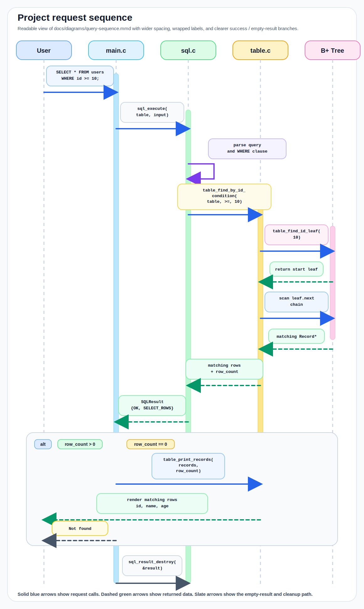

# Mini DBMS SQL API Server

REPL 기반 미니 SQL 엔진 위에 HTTP API 서버를 얹은 과제용 프로젝트입니다.  
기존 엔진의 핵심 경계인 `sql_execute(Table *, const char *)`와 `SQLResult`를 그대로 재사용하고, 서버 계층에서만 shared table, 요청 큐, worker, rwlock, metrics, JSON 응답 계약을 추가했습니다.

## 핵심 포인트

- 기존 SQL 엔진 재사용: `src/core/sql.c`, `src/core/table.c`, `src/core/bptree.c`는 lock-unaware 상태를 유지합니다.
- 동시성 정책 명확화: `SELECT`는 read lock, `INSERT`는 write lock 아래에서만 실행됩니다.
- HTTP 경계 제공: `GET /health`, `GET /metrics`, `POST /query`
- 운영 시그널 노출: `usedIndex`, `queue_full`, `lock_timeout`, metrics
- 테스트 포함: unit test, CLI smoke test, HTTP smoke test 스크립트 포함

## 지원 SQL

- `INSERT INTO users VALUES ('Alice', 20);`
- `SELECT * FROM users;`
- `SELECT * FROM users WHERE id = 1;`
- `SELECT * FROM users WHERE id >= 10;`
- `SELECT * FROM users WHERE name = 'Alice';`
- `SELECT * FROM users WHERE age > 20;`
- `EXIT`, `QUIT`
  - CLI 모드에서만 종료 명령으로 처리합니다.
  - HTTP API에서는 오류로 거절합니다.

## 아키텍처

```text
client
  -> socket accept
  -> bounded request queue
  -> worker thread
  -> db_server_execute()
  -> sql_execute()
  -> table / bptree
  -> JSON response
```

전체 요청 흐름을 시퀀스로 보면 아래와 같습니다.



구성 파일은 아래처럼 폴더 단위로 나뉩니다.

- `src/core/`: SQL 파싱/실행, table 저장소, B+Tree 인덱스
- `src/server/`: CLI 하네스, HTTP 서버, API 직렬화, shared DB 서버 경계, 플랫폼 래퍼
- `src/cli/main.c`: 기존 REPL 엔트리포인트
- `tests/unit/unit_test.c`: 엔진과 서버 경계 단위 테스트
- `tests/smoke/`: PowerShell 기반 CLI/HTTP smoke test
- `benchmarks/`: 성능 확인용 벤치마크
- `docs/`: 설계 문서, 다이어그램, 발표/검증 가이드

## 동시성 규칙

이번 버전의 약속은 아래 세 줄입니다.

1. `SELECT`는 read lock 아래에서만 엔진을 읽습니다.
2. `INSERT`는 write lock 아래에서만 엔진을 변경합니다.
3. `src/core/sql.c`, `src/core/table.c`, `src/core/bptree.c`는 lock-unaware로 두고 서버 경계에서만 동기화합니다.

조금 더 직관적으로 말하면:

- 엔진은 여전히 "한 테이블을 다루는 순수한 실행기"입니다.
- 서버가 바깥에서 락과 요청 흐름을 책임집니다.
- 그래서 엔진 내부를 크게 바꾸지 않고도, 여러 HTTP 클라이언트를 정직하게 받을 수 있습니다.

## 빌드

```bash
make
```

Windows MinGW 환경에서 `make`가 없으면 `mingw32-make`를 사용하면 됩니다.

직접 빌드할 때는 아래처럼도 가능합니다.

```bash
mkdir -p build/bin
gcc -std=c11 -Wall -Wextra -Werror -pedantic -O2 -Isrc/core -Isrc/server -o build/bin/unit_test.exe tests/unit/unit_test.c src/server/db_server.c src/server/api.c src/server/platform.c src/core/bptree.c src/core/table.c src/core/sql.c
gcc -std=c11 -Wall -Wextra -Werror -pedantic -O2 -Isrc/core -Isrc/server -o build/bin/server.exe src/server/server.c src/server/http_server.c src/server/db_server.c src/server/api.c src/server/platform.c src/core/bptree.c src/core/table.c src/core/sql.c -lws2_32
```

## 실행 방법

### 1. 기존 REPL

```bash
./build/bin/main
```

### 2. 서버 CLI 하네스

여러 쿼리를 같은 shared table 상태에 이어서 실행할 수 있습니다.

```bash
./build/bin/server --query "INSERT INTO users VALUES ('Alice', 20);" \
                   --query "SELECT * FROM users WHERE id = 1;" \
                   --query "QUIT"
```

또는 인자 없이 실행하면 한 줄씩 입력받는 모드로 동작합니다.

```bash
./build/bin/server
```

### 3. HTTP 서버

```bash
./build/bin/server --serve --port 8080 --workers 4 --queue 16
```

추가 옵션:

- `--lock-timeout-ms <ms>`: DB lock 대기 timeout
- `--simulate-read-delay-ms <ms>`: 테스트용 read 지연
- `--simulate-write-delay-ms <ms>`: 테스트용 write 지연
- `--max-requests <n>`: 지정한 개수의 응답을 마치면 서버 종료

## HTTP API 계약

### `GET /health`

응답 예시:

```json
{
  "ok": true,
  "status": "healthy"
}
```

### `GET /metrics`

응답 예시:

```json
{
  "ok": true,
  "status": "ok",
  "metrics": {
    "totalRequests": 5,
    "totalHealthRequests": 1,
    "totalMetricsRequests": 1,
    "totalQueryRequests": 3,
    "totalSelectRequests": 2,
    "totalInsertRequests": 1,
    "totalErrors": 0,
    "totalSyntaxErrors": 0,
    "totalQueryErrors": 0,
    "totalInternalErrors": 0,
    "totalNotFoundResults": 0,
    "totalQueueFull": 0,
    "totalLockTimeouts": 0,
    "activeQueryRequests": 0
  }
}
```

### `POST /query`

요청 body:

```json
{
  "query": "SELECT * FROM users WHERE id = 1;"
}
```

성공 응답 예시:

```json
{
  "ok": true,
  "status": "ok",
  "action": "select",
  "rowCount": 1,
  "usedIndex": true,
  "rows": [
    { "id": 1, "name": "Alice", "age": 20 }
  ]
}
```

빈 조회도 성공으로 취급합니다.

```json
{
  "ok": true,
  "status": "ok",
  "action": "select",
  "rowCount": 0,
  "usedIndex": true,
  "rows": []
}
```

`INSERT` 응답 예시:

```json
{
  "ok": true,
  "status": "ok",
  "action": "insert",
  "insertedId": 1,
  "usedIndex": false
}
```

오류 응답 예시:

```json
{
  "ok": false,
  "status": "syntax_error",
  "error": "syntax_error",
  "message": "..."
}
```

현재 매핑되는 대표 오류는 아래와 같습니다.

- `syntax_error`: SQL 문법 오류
- `query_error`: 존재하지 않는 컬럼 등 질의 오류
- `internal_error`: 내부 실행/직렬화 실패
- `lock_timeout`: lock 대기 timeout
- `queue_full`: worker queue 포화
- `malformed_http`: 잘못된 request line/header/body framing
- `method_not_allowed`: 잘못된 HTTP 메서드
- `not_found`: 지원하지 않는 경로

## curl 예시

```bash
curl http://127.0.0.1:8080/health
```

```bash
curl http://127.0.0.1:8080/metrics
```

```bash
curl -X POST http://127.0.0.1:8080/query \
  -H "Content-Type: application/json" \
  -d "{\"query\":\"INSERT INTO users VALUES ('Alice', 20);\"}"
```

```bash
curl -X POST http://127.0.0.1:8080/query \
  -H "Content-Type: application/json" \
  -d "{\"query\":\"SELECT * FROM users WHERE id = 1;\"}"
```

## 테스트

### Unit test

```bash
./build/bin/unit_test
```

현재 unit test는 아래를 확인합니다.

- B+Tree split / search 동작
- table 검색 경로
- SQL 결과와 오류 매핑
- `db_server` shared table 유지
- `usedIndex` 분류
- lock timeout 동작
- metrics 집계
- HTTP request parsing / JSON response contract

### CLI smoke test

```bash
powershell -ExecutionPolicy Bypass -File .\tests\smoke\server_cli_smoke_test.ps1
```

### HTTP smoke test

```bash
powershell -ExecutionPolicy Bypass -File .\tests\smoke\server_http_smoke_test.ps1
```

이 스크립트는 두 단계로 확인합니다.

1. 정상 질의, 빈 조회, syntax error, metrics 응답 검증
2. 작은 queue와 read 지연을 이용해 `queue_full` 응답 검증

자세한 절차는 [docs/http-smoke-test.md](./docs/http-smoke-test.md)에 정리했습니다.

## 현재 확인 상태

- `make` 전체 빌드는 현재 작업 세션에서 통과 확인
- `build/bin/unit_test`는 현재 작업 세션에서 통과 확인
- `make benchmarks`로 `benchmarks/perf10.c`, `benchmarks/cond10.c` 빌드 확인
- `build/bin/server --query ...` CLI 하네스 기본 흐름 확인
- `tests/smoke/server_cli_smoke_test.ps1`, `tests/smoke/server_http_smoke_test.ps1`는 저장소에 포함
- PowerShell smoke test는 Windows/PowerShell 환경에서 실행하는 검증 경로입니다

즉, 저장소에는 검증 경로를 다 넣어두었고 실제 팀 로컬 환경에서는 그대로 재현할 수 있는 상태입니다.

## 비범위

- DDL
- 다중 테이블
- UPDATE / DELETE
- 영속화
- TLS / auth
- 인터넷 배포

이번 과제의 핵심은 "새 DBMS를 만드는 것"보다, 기존 엔진을 거짓말 없이 HTTP 서비스 경계로 감싸는 데 있습니다.
