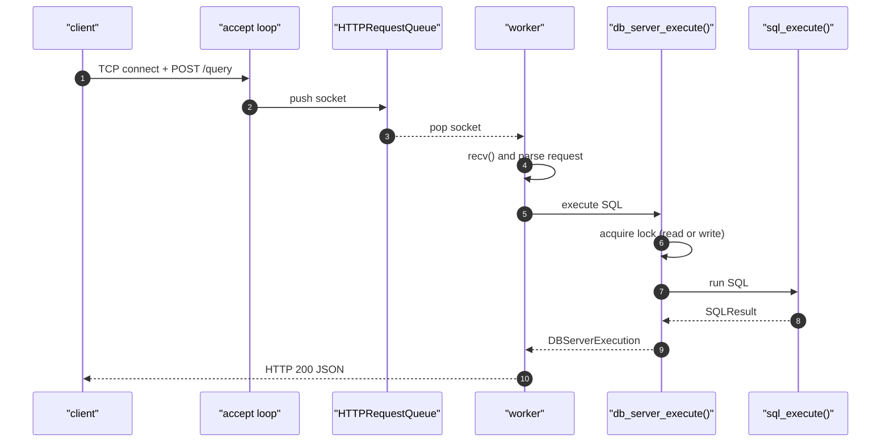
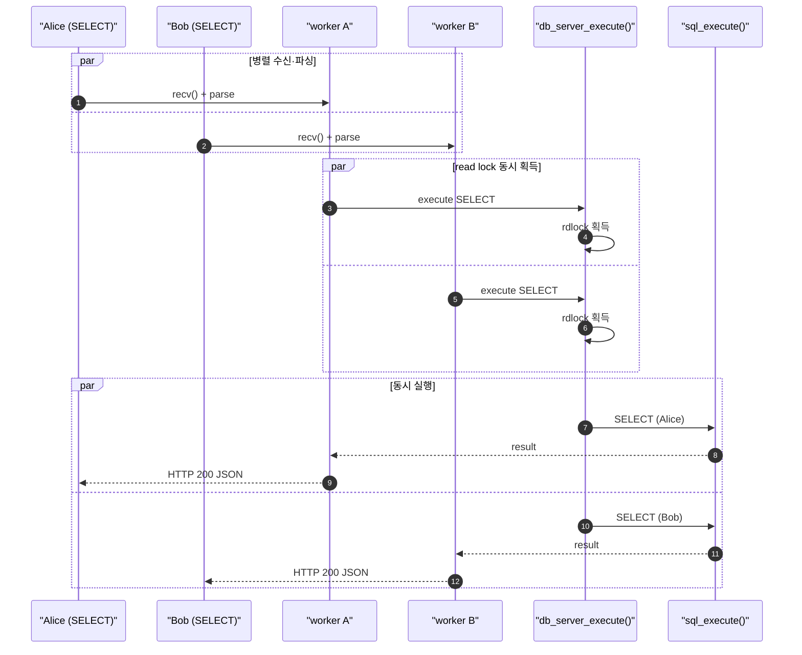
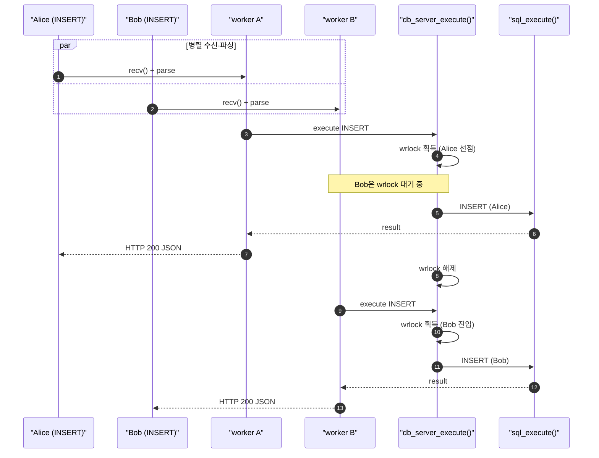
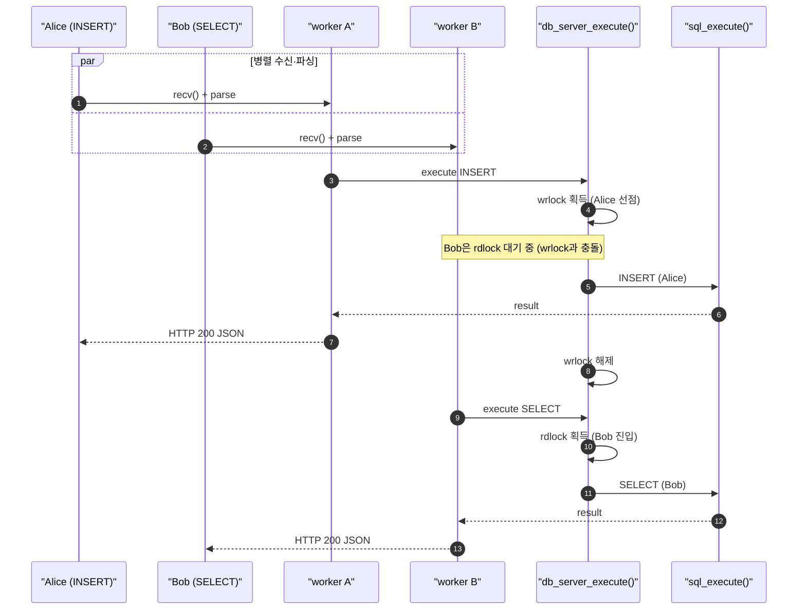

# Mini DBMS SQL API Server

C 기반 in-memory `users` SQL 엔진을 HTTP API 서버로 확장한 프로젝트입니다.

기존 `src/core/`의 `sql_execute()`, `Table`, `B+Tree`를 그대로 재사용하고, `src/server/`에 HTTP endpoint, bounded request queue, worker thread pool, read/write lock, metrics, JSON 응답 계약을 추가했습니다.

## 핵심 요약

- 단일 in-memory 테이블: `users(id, name, age)`
- SQL 지원: `INSERT`, `SELECT *`, 단순 `WHERE`
- `id`는 자동 증가 primary key이며 B+Tree index로 조회
- HTTP endpoint: `GET /health`, `GET /metrics`, `POST /query`
- 병렬 요청 처리: accept loop + fixed-size queue + worker thread pool
- 공유 DB 보호: `SELECT`는 read lock, `INSERT`는 write lock
- 운영 시그널: `usedIndex`, `queue_full`, `lock_timeout`, metrics
- 검증: unit test, CLI/HTTP smoke test, Postman collection, benchmark target

## 요구사항과 구현 매핑

| 요구사항 | 구현 |
|---|---|
| 외부 클라이언트에서 DBMS 사용 | `GET /health`, `GET /metrics`, `POST /query` |
| SQL 요청 병렬 처리 | bounded queue + worker thread pool |
| 기존 SQL 처리기 활용 | `sql_execute(Table *, const char *)` |
| 기존 B+Tree 활용 | `id` 조건 조회에서 primary index 사용 |
| 동시 접근 보호 | `src/server/db_server.c`의 read/write lock |
| 장애/부하 신호 제공 | `503 queue_full`, `503 lock_timeout`, `/metrics` |
| 품질 검증 | unit test, HTTP smoke, Postman edge/burst collection |

## 프로젝트 구조

```text
src/
  cli/       기존 REPL 엔트리포인트
  core/      SQL 파서/실행기, Table 저장소, B+Tree index
  server/    HTTP 서버, API 직렬화, shared DB 서버 경계, platform wrapper
tests/
  unit/      core와 server 경계 단위 테스트
  smoke/     CLI/HTTP smoke test, Postman collection
benchmarks/ 성능 확인용 benchmark
docs/       설계 문서, 순차 다이어그램, 검증 가이드
outputs/    발표 자료 초안과 PPT 산출물
```

## 전체 아키텍처

```text
client
  -> accept()
  -> HTTPRequestQueue
  -> worker thread
  -> api_parse_http_request()
  -> db_server_execute()
  -> sql_execute()
  -> Table / B+Tree
  -> JSON response
```

가장 중요한 경계는 `db_server_execute()`입니다. 여러 worker가 같은 in-memory table을 공유하므로, 이 함수가 SQL 실행 전에 read/write lock을 잡고 metrics를 기록합니다. 반대로 `src/core/sql.c`, `src/core/table.c`, `src/core/bptree.c`는 lock을 모르는 순수 DB 엔진 영역으로 유지합니다.

## 동시 요청 흐름

아래 다이어그램은 `docs/alice-bob-concurrent-request-sequences.md`의 Alice/Bob 시나리오를 README용으로 줄인 버전입니다.

**1. 단일 요청 (SELECT 또는 INSERT)**



**2. SELECT / SELECT (동시 읽기)**



**3. INSERT / INSERT (직렬 쓰기)**



**4. INSERT / SELECT (쓰기·읽기 충돌)**



동시성 규칙은 단순합니다.

| 동시 요청 | HTTP worker 단계 | DB lock 단계 |
|---|---|---|
| `SELECT / SELECT` | 병렬 처리 가능 | read lock을 함께 잡을 수 있음 |
| `INSERT / INSERT` | 병렬 파싱 가능 | write lock 때문에 하나씩 실행 |
| `INSERT / SELECT` | 병렬 파싱 가능 | write lock과 read lock이 충돌하므로 한쪽이 대기 |
| queue 포화 | worker에 도달하기 전 실패 | `503 queue_full` |
| lock 대기 초과 | worker는 배정됨 | `503 lock_timeout` |

## HTTP API

모든 HTTP 응답 body는 JSON이며 `Content-Type: application/json; charset=utf-8`을 사용합니다.

### `GET /health`

```json
{"ok":true,"status":"healthy"}
```

### `GET /metrics`

요청 수, query 수, SELECT/INSERT 수, 오류 수, queue full, lock timeout, active query 수를 확인합니다. 아래 JSON은 주요 필드만 줄인 예시입니다.

```json
{
  "ok": true,
  "status": "ok",
  "metrics": {
    "totalRequests": 4,
    "totalQueryRequests": 2,
    "totalSelectRequests": 1,
    "totalInsertRequests": 1,
    "totalErrors": 0,
    "totalQueueFull": 0,
    "totalLockTimeouts": 0,
    "activeQueryRequests": 0
  }
}
```

### `POST /query`

요청 body:

```json
{
  "query": "SELECT * FROM users WHERE id = 1;"
}
```

INSERT 성공:

```json
{
  "ok": true,
  "status": "ok",
  "action": "insert",
  "insertedId": 1,
  "usedIndex": false
}
```

SELECT 성공:

```json
{
  "ok": true,
  "status": "ok",
  "action": "select",
  "rowCount": 1,
  "usedIndex": true,
  "rows": [
    { "id": 1, "name": "Alice", "age": 20 }
  ]
}
```

대표 오류:

| 오류 | HTTP status | 의미 |
|---|---:|---|
| `syntax_error` | `400` | SQL 문법 오류 |
| `query_error` | `400` | 존재하지 않는 컬럼, HTTP에서의 `EXIT`/`QUIT` 등 |
| `malformed_http` | `400` | 잘못된 request/header/body 또는 JSON 계약 위반 |
| `method_not_allowed` | `405` | endpoint와 맞지 않는 HTTP method |
| `not_found` | `404` | 지원하지 않는 path |
| `queue_full` | `503` | worker queue 포화 |
| `lock_timeout` | `503` | DB read/write lock 대기 초과 |
| `internal_error` | `500` | 내부 실행 또는 직렬화 실패 |

## 지원 SQL

세미콜론은 선택 사항이고, 키워드/테이블명/컬럼명은 대소문자를 구분하지 않습니다.

```sql
INSERT INTO users VALUES ('Alice', 20);

SELECT * FROM users;
SELECT * FROM users WHERE id = 1;
SELECT * FROM users WHERE id >= 10;
SELECT * FROM users WHERE name = 'Alice';
SELECT * FROM users WHERE age = 20;
SELECT * FROM users WHERE age <= 20;
```

- `id`는 1부터 자동 증가합니다.
- 현재 select list는 `*`만 지원합니다.
- `id` 조건은 `=`, `<`, `<=`, `>`, `>=`를 지원하고 B+Tree index를 사용합니다.
- `age` 조건은 `=`, `<`, `<=`, `>`, `>=`를 지원하고 linear scan으로 찾습니다.
- `name` 조건은 `=`만 지원하고 linear scan으로 찾습니다.
- `EXIT`, `QUIT`는 CLI에서는 종료 명령이지만 HTTP에서는 `400 query_error`입니다.

## 빌드

macOS와 Ubuntu:

```bash
make
```

Windows MinGW:

```powershell
mingw32-make
```

주요 target:

| 명령 | 결과물 |
|---|---|
| `make main` | `build/bin/main` REPL |
| `make server` | `build/bin/server` CLI harness + HTTP server |
| `make unit_test` | `build/bin/unit_test` |
| `make benchmarks` | benchmark 실행 파일 |

## 실행

### CLI REPL

```bash
./build/bin/main
```

### 서버 CLI 하네스

같은 shared table 상태에 여러 SQL을 순서대로 실행합니다.

```bash
./build/bin/server \
  --query "INSERT INTO users VALUES ('Alice', 20);" \
  --query "SELECT * FROM users WHERE id = 1;" \
  --query "QUIT"
```

대표 출력:

```text
OK INSERT id=1 used_index=false
OK SELECT rows=1 used_index=true
ROW id=1 name=Alice age=20
BYE
```

### HTTP 서버

```bash
./build/bin/server --serve --port 8080 --workers 4 --queue 16
```

옵션:

| 옵션 | 기본값 | 설명 |
|---|---:|---|
| `--port <n>` | `8080` | listen port |
| `--workers <n>` | `4` | worker thread 수 |
| `--queue <n>` | `16` | bounded request queue 크기 |
| `--lock-timeout-ms <ms>` | `1000` | DB lock 대기 timeout |
| `--simulate-read-delay-ms <ms>` | `0` | 테스트용 read 지연 |
| `--simulate-write-delay-ms <ms>` | `0` | 테스트용 write 지연 |
| `--max-requests <n>` | `0` | 지정한 응답 수 이후 종료, `0`은 비활성화 |

## curl 예시

```bash
curl http://127.0.0.1:8080/health
```

```bash
curl -X POST http://127.0.0.1:8080/query \
  -H "Content-Type: application/json" \
  -d "{\"query\":\"INSERT INTO users VALUES ('Alice', 20);\"}"
```

```bash
curl -X POST http://127.0.0.1:8080/query \
  -H "Content-Type: application/json" \
  -d "{\"query\":\"SELECT * FROM users WHERE id = 1;\"}"
```

```bash
curl http://127.0.0.1:8080/metrics
```

## 테스트와 검증

### Unit test

```bash
make unit_test
./build/bin/unit_test
```

unit test는 아래를 확인합니다.

- B+Tree insert/search/split/leaf link
- table auto increment, index lookup, linear scan, 조건 검색
- SQL 실행 결과와 syntax/query error
- shared table을 사용하는 `db_server_execute()`
- `usedIndex` 분류
- lock timeout과 metrics 집계
- HTTP request parsing과 JSON response contract

### HTTP smoke test

Windows/PowerShell 환경:

```powershell
powershell -ExecutionPolicy Bypass -File .\tests\smoke\server_http_smoke_test.ps1
```

검증 내용:

- `/health` 응답
- `POST /query` INSERT
- `WHERE id = ...` SELECT와 `usedIndex: true`
- 빈 SELECT 결과
- syntax error 응답
- `/metrics` counter
- 작은 queue와 read delay를 이용한 `queue_full`

자세한 절차는 [docs/http-smoke-test.md](./docs/http-smoke-test.md)를 참고합니다.

### Postman collection

- 기본 smoke: [tests/smoke/server_http_smoke_test.postman_collection.json](./tests/smoke/server_http_smoke_test.postman_collection.json)
- edge/burst: [tests/smoke/server_http_edge_burst_test.postman_collection.json](./tests/smoke/server_http_edge_burst_test.postman_collection.json)

Postman collection은 정상 API 계약, edge case, read/write burst 상황에서 응답과 metrics가 무너지지 않는지 확인합니다.

## 발표 자료

발표 흐름과 4분 발표 스크립트는 아래 파일에 정리되어 있습니다.

- [outputs/wk08-sql-api-presentation/presentation_draft.md](./outputs/wk08-sql-api-presentation/presentation_draft.md)
- [outputs/wk08-sql-api-presentation/output.pptx](./outputs/wk08-sql-api-presentation/output.pptx)

Alice/Bob 동시 요청의 자세한 순차 다이어그램은 아래 문서를 참고합니다.

- [docs/alice-bob-concurrent-request-sequences.md](./docs/alice-bob-concurrent-request-sequences.md)

## 비범위

- DDL
- 다중 테이블
- `UPDATE` / `DELETE`
- join / aggregate / order by
- 영속화
- TLS / auth
- 인터넷 배포

이 프로젝트의 초점은 새 DBMS 전체를 만드는 것이 아니라, 작은 SQL 엔진을 명확한 HTTP/동시성 경계로 감싸고 검증 가능한 API 계약을 제공하는 데 있습니다.
