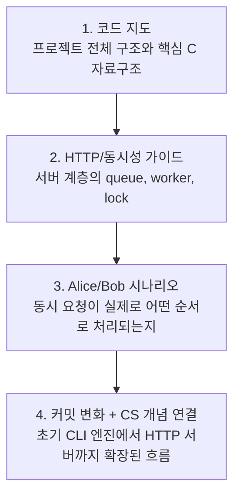

# Mini DBMS SQL API Server 문서 읽기 가이드

이 디렉터리의 초심자용 설명 문서는 모두 같은 프로젝트를 다루지만, 바라보는 각도가 다르다.

처음 읽는다면 아래 순서를 추천한다.

1. [C 초심자를 위한 Mini DBMS SQL API Server 코드 지도](c-beginner-codebase-map.md)
2. [HTTP API 서버, 요청 큐, worker thread, read/write lock 초심자 가이드](http-api-concurrency-beginner-guide.md)
3. [Alice와 Bob의 동시 요청 순차 다이어그램](alice-bob-concurrent-request-sequences.md)
4. [커밋 변화로 이해하는 Mini DBMS SQL API Server](e2975a5-to-596d9ec-system-io-network-concurrency-guide.md)

## 한눈에 보는 추천 순서



이 순서는 "코드 전체 지도"에서 시작해 "서버 동시성 구조"를 이해하고, 그 다음 "구체적인 동시 요청 예시"로 감각을 잡은 뒤, 마지막에 "커밋 변화와 CSAPP 개념 연결"로 넓게 복습하는 흐름이다.

## 각 문서의 역할

| 문서 | 역할 | 먼저 얻어야 할 것 |
|---|---|---|
| [C 초심자를 위한 Mini DBMS SQL API Server 코드 지도](c-beginner-codebase-map.md) | 코드베이스 전체 지도를 제공하는 첫 진입점이다. `src/core/`, `src/cli/`, `src/server/`, `tests/unit/`이 각각 무엇을 맡는지 설명하고, `Record`, `Table`, `BPTree`, `SQLResult`, `DBServer` 같은 핵심 구조체를 초심자 눈높이로 풀어준다. | "이 프로젝트가 어떤 파일들로 이루어졌고, 어느 파일부터 열어야 하는가" |
| [HTTP API 서버, 요청 큐, worker thread, read/write lock 초심자 가이드](http-api-concurrency-beginner-guide.md) | 서버 계층을 집중적으로 설명한다. `accept()`, `HTTPRequestQueue`, worker thread, `api_parse_http_request()`, `db_server_execute()`, read/write lock, `queue_full`, `lock_timeout`, metrics를 하나의 요청 흐름으로 연결한다. | "HTTP 요청 하나가 서버 안에서 어떤 단계를 거쳐 SQL 실행까지 가는가" |
| [Alice와 Bob의 동시 요청 순차 다이어그램](alice-bob-concurrent-request-sequences.md) | 동시성 동작을 예시 중심으로 보여준다. Alice와 Bob이 `INSERT/INSERT`, `INSERT/SELECT`, `SELECT/SELECT`를 거의 동시에 보냈을 때 worker, queue, DB lock, 응답 순서가 어떻게 달라지는지 sequence diagram으로 설명한다. | "동시에 요청하면 실제 결과 순서가 왜 달라질 수 있는가" |
| [커밋 변화로 이해하는 Mini DBMS SQL API Server](e2975a5-to-596d9ec-system-io-network-concurrency-guide.md) | 초기 커밋 `e2975a5`의 CLI SQL 엔진이 최신 커밋 `596d9ec`의 HTTP API 서버로 확장된 과정을 설명한다. System-Level I/O, Network Programming, Concurrent Programming 개념을 현재 코드의 socket, `send_all()`, bounded queue, worker thread, rwlock과 연결한다. | "프로젝트가 어떻게 커졌고, CS 개념이 코드 어디에 대응되는가" |

## 단계별 체크포인트

각 문서를 처음 읽을 때 모든 세부사항을 외울 필요는 없다. 아래 문장들을 자기 말로 설명할 수 있으면 다음 단계로 넘어가도 된다.

| 순서 | 문서 | 읽고 나서 말할 수 있으면 좋은 것 |
|---:|---|---|
| 1 | [C 초심자를 위한 Mini DBMS SQL API Server 코드 지도](c-beginner-codebase-map.md) | `users(id, name, age)` 테이블이 어디에 저장되고, `INSERT`와 `SELECT`가 어떤 함수 흐름으로 실행되는지 설명할 수 있다. |
| 2 | [HTTP API 서버, 요청 큐, worker thread, read/write lock 초심자 가이드](http-api-concurrency-beginner-guide.md) | HTTP 요청 하나가 `accept()`에서 `db_server_execute()`와 JSON 응답까지 가는 큰 흐름을 설명할 수 있다. |
| 3 | [Alice와 Bob의 동시 요청 순차 다이어그램](alice-bob-concurrent-request-sequences.md) | `INSERT/INSERT`, `INSERT/SELECT`, `SELECT/SELECT`에서 어떤 lock 규칙 때문에 응답 순서나 결과가 달라지는지 설명할 수 있다. |
| 4 | [커밋 변화로 이해하는 Mini DBMS SQL API Server](e2975a5-to-596d9ec-system-io-network-concurrency-guide.md) | 초기 CLI SQL 엔진 위에 HTTP 서버, 요청 큐, worker thread, read/write lock이 어떻게 얹혔는지 설명할 수 있다. |

1단계에서 `Record *`, `Record **`, `Record ***` 같은 포인터 표현이 나와도 처음부터 완벽히 이해하려고 멈출 필요는 없다. 처음에는 "값 하나", "포인터 배열", "결과 배열을 함수 밖으로 돌려주기 위한 포인터" 정도의 모양만 잡고 넘어가도 충분하다.

서버 모드의 큰 흐름은 아래처럼 압축해서 보면 된다.

```text
client
  -> accept()
  -> HTTPRequestQueue
  -> worker thread
  -> recv()
  -> api_parse_http_request()
  -> db_server_execute()
  -> sql_execute()
  -> JSON response
```

이때 특히 아래 구분을 기억하면 이후 문서가 훨씬 덜 헷갈린다.

| 헷갈리기 쉬운 지점 | 기억할 것 |
|---|---|
| `HTTPRequestQueue` | 파싱된 HTTP 요청이 아니라 `client_socket`이 들어간다. |
| `src/core/` | lock을 직접 잡지 않는다. SQL 엔진과 table 저장소만 담당한다. |
| `src/server/db_server.c` | shared table에 들어가는 정문이며 read/write lock과 metrics를 관리한다. |
| `queue_full` | worker에게 넘기기 전, 요청 큐가 꽉 찬 경우다. |
| `lock_timeout` | worker가 요청을 읽은 뒤 DB lock을 너무 오래 기다린 경우다. |

## 목적별 빠른 선택

| 지금 하고 싶은 일 | 바로 읽을 문서 |
|---|---|
| 코드베이스에 처음 들어왔다 | [C 초심자를 위한 Mini DBMS SQL API Server 코드 지도](c-beginner-codebase-map.md) |
| HTTP 서버 요청 흐름을 이해하고 싶다 | [HTTP API 서버, 요청 큐, worker thread, read/write lock 초심자 가이드](http-api-concurrency-beginner-guide.md) |
| 동시 요청 결과를 발표하거나 설명해야 한다 | [Alice와 Bob의 동시 요청 순차 다이어그램](alice-bob-concurrent-request-sequences.md) |
| `queue_full`과 `lock_timeout` 차이를 빠르게 보고 싶다 | [HTTP API 서버, 요청 큐, worker thread, read/write lock 초심자 가이드](http-api-concurrency-beginner-guide.md) 또는 [Alice와 Bob의 동시 요청 순차 다이어그램](alice-bob-concurrent-request-sequences.md) |
| 초기 커밋과 최신 커밋의 차이를 이해하고 싶다 | [커밋 변화로 이해하는 Mini DBMS SQL API Server](e2975a5-to-596d9ec-system-io-network-concurrency-guide.md) |
| 운영체제/네트워크/동시성 수업 내용과 연결하고 싶다 | [커밋 변화로 이해하는 Mini DBMS SQL API Server](e2975a5-to-596d9ec-system-io-network-concurrency-guide.md) |

## 읽기 전 기억하면 좋은 핵심 문장

이 프로젝트의 중심 흐름은 아래 한 문장으로 요약할 수 있다.

> HTTP로 들어온 SQL 요청을 worker thread가 처리하고, 공유 `users` table은 `DBServer`가 read/write lock으로 보호한다.

처음에는 세부 구현을 모두 이해하려고 하기보다 아래 네 경계만 먼저 잡으면 된다.

| 경계 | 담당 |
|---|---|
| `src/core/` | SQL 파싱/실행, table 저장, B+Tree index |
| `src/cli/` | 터미널에서 직접 SQL을 입력하는 REPL |
| `src/server/api.c` | HTTP 문자열과 C 구조체/JSON 응답 사이의 변환 |
| `src/server/db_server.c` | 여러 worker가 공유 table에 접근할 때 필요한 lock과 metrics |

이 네 경계가 보이면, 나머지 문서의 다이어그램과 시나리오도 훨씬 덜 낯설어진다.
