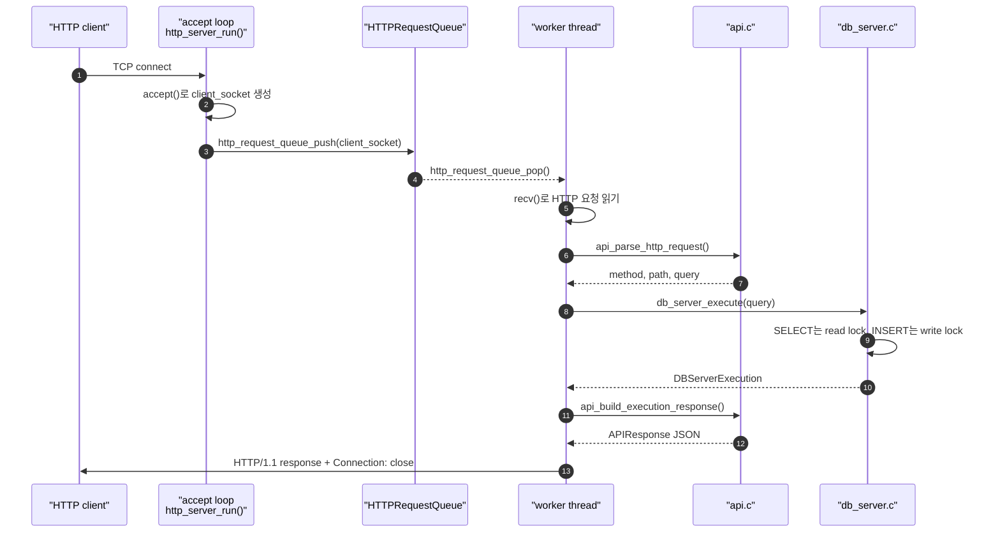
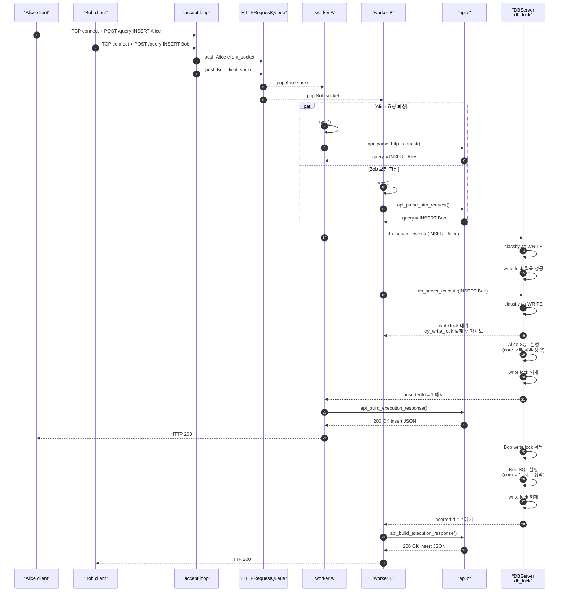
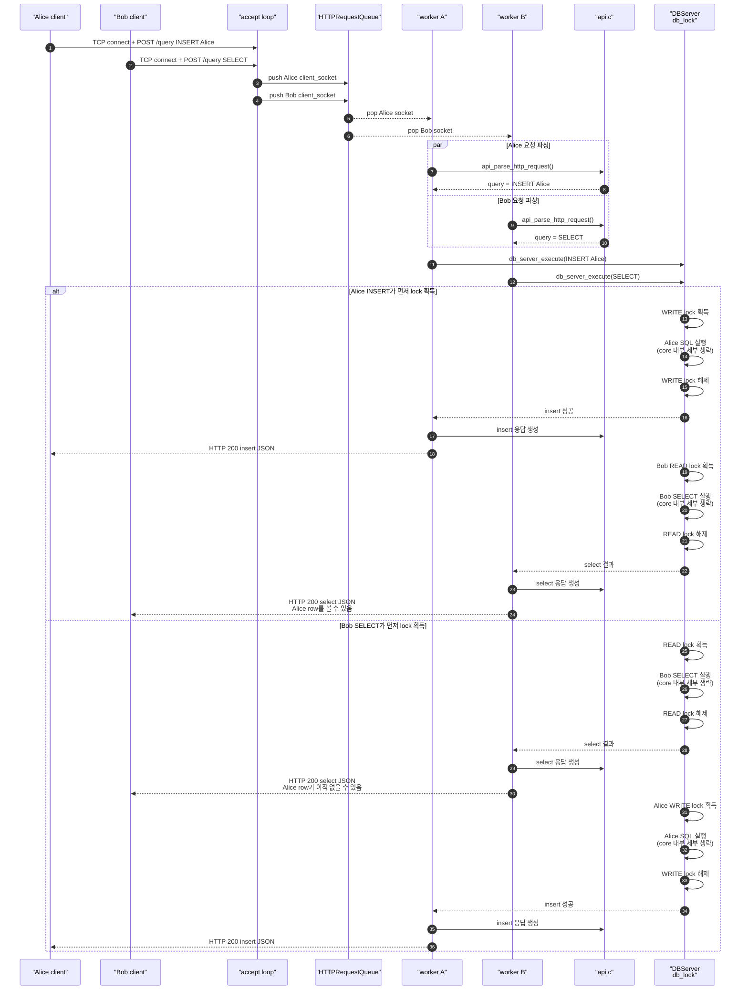
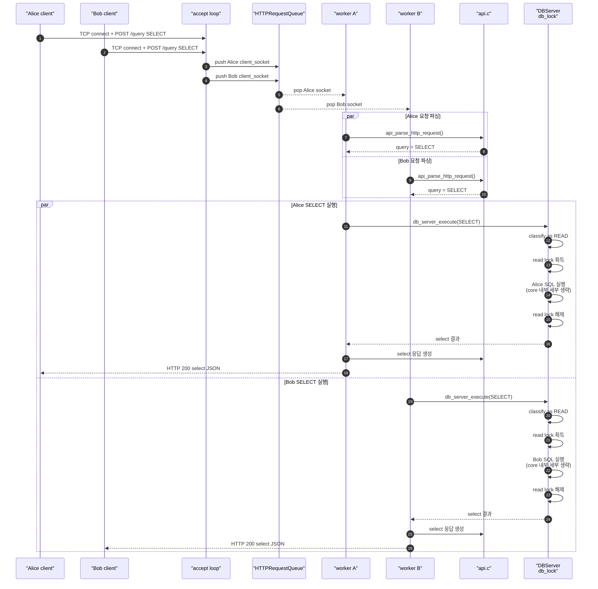

# Alice와 Bob의 동시 요청 순차 다이어그램

이 문서는 Alice와 Bob이 HTTP API 서버에 거의 동시에 요청을 보냈을 때 서버가 어떤 순서로 반응하는지 설명한다.

범위는 `src/server/` 계층이다.

- HTTP 연결 수락: `src/server/http_server.c`
- 요청 큐와 worker thread: `src/server/http_server.c`
- HTTP request/response 파싱과 생성: `src/server/api.c`
- shared table 보호용 read/write lock: `src/server/db_server.c`
- OS별 thread/lock wrapper: `src/server/platform.c`

`src/core/` 안의 SQL 파싱, Table 저장 방식, B+Tree 재정렬 과정은 이 문서에서 자세히 다루지 않는다. 다이어그램에서 "SQL 실행"이라고 표시한 부분이 바로 그 내부 영역이다.

## 먼저 알아야 할 공통 흐름

아래 설명은 보통 서버 설정인 `--workers 4 --queue 16 --lock-timeout-ms 1000`처럼 worker가 2개 이상 있고 queue가 가득 차지 않은 상황을 기준으로 한다.



| 단계 | 초심자용 설명 | 코드에서 볼 곳 |
|---|---|---|
| `accept()` | 서버가 새 TCP 연결을 받아 `client_socket`을 만든다. | `http_server_run()` |
| queue push | 큐에는 파싱된 HTTP 요청이 아니라 `client_socket`이 들어간다. | `http_request_queue_push()` |
| worker pop | worker thread가 큐에서 소켓을 꺼낸 뒤 그때부터 HTTP 요청을 읽는다. | `http_server_worker_main()` |
| API parse | raw HTTP 문자열을 `APIRequest`로 바꾼다. `/query`면 JSON body의 `"query"`를 꺼낸다. | `api_parse_http_request()` |
| DB lock | `INSERT`는 write lock, `SELECT`는 read lock을 잡는다. | `db_server_execute()` |
| response | 실행 결과를 JSON으로 만들고 HTTP 응답 문자열로 렌더링해 보낸다. | `api_build_execution_response()`, `api_render_http_response()` |

중요한 예외가 하나 있다. queue가 이미 꽉 차 있으면 accept loop가 worker에게 넘기지 못하고 바로 `503 queue_full`을 보낸다. 이 경우에는 API parse나 DB lock 단계까지 가지 않는다.

아래 시나리오의 HTTP 요청 예시는 흐름을 보여주기 위한 축약형이다. 실제 raw HTTP 요청에는 `Content-Length`와 빈 줄(`\r\n\r\n`)이 필요하고, `curl`이나 Postman 같은 클라이언트는 이런 헤더를 자동으로 붙여준다.

세 시나리오를 읽기 전에 규칙을 먼저 잡으면 쉽다.

| 동시 요청 | 가장 중요한 규칙 |
|---|---|
| `INSERT / INSERT` | write lock은 한 번에 하나만 들어간다. |
| `INSERT / SELECT` | write lock과 read lock은 서로 같이 들어가지 못한다. |
| `SELECT / SELECT` | read lock끼리는 writer가 없을 때 같이 들어갈 수 있다. |

lock을 기다리는 방식도 단순하다. `db_server_try_acquire_lock()`은 lock 획득을 시도하고, 실패하면 timeout 여부를 확인한 뒤 `platform_sleep_ms(1)`로 아주 짧게 쉰 다음 다시 시도한다. FIFO 순서표가 있는 대기열은 아니므로 "누가 먼저 lock을 잡는가"는 thread 실행 타이밍에 따라 달라질 수 있다.

## 시나리오 1. Alice INSERT / Bob INSERT

개념용 축약 요청:

```http
POST /query
{"query":"INSERT INTO users VALUES ('Alice', 20);"}
```

```http
POST /query
{"query":"INSERT INTO users VALUES ('Bob', 30);"}
```

두 요청 모두 `INSERT`이므로 둘 다 write lock이 필요하다. write lock은 한 번에 한 worker만 잡을 수 있다.

아래 다이어그램은 Alice 쪽 worker가 먼저 write lock을 잡은 예시다. Bob이 먼저 잡으면 Alice와 Bob의 이름만 바뀐다.



| 관찰 포인트 | 서버 반응 | 초심자용 설명 |
|---|---|---|
| 두 요청이 동시에 들어옴 | accept loop는 두 연결을 받아 queue에 넣는다. | 동시에 도착해도 우선은 "대기줄"에 들어간다. |
| worker가 2개 이상 있음 | Alice와 Bob 요청을 서로 다른 worker가 동시에 읽고 파싱할 수 있다. | HTTP를 읽고 JSON을 파싱하는 일은 병렬로 가능하다. |
| 둘 다 `INSERT` | 둘 다 write lock을 요구한다. | 데이터를 바꾸는 작업이므로 같은 테이블에 둘이 동시에 들어가면 안 된다. |
| write lock 경쟁 | 먼저 lock을 잡은 요청만 SQL 실행에 들어간다. 다른 요청은 1ms 단위로 재시도한다. | "쓰기 방"에는 한 명만 들어간다. |
| 성공 응답 | lock을 순서대로 잡으면 둘 다 `HTTP 200`을 받는다. | 다만 먼저 온 사람이 반드시 `insertedId=1`을 받는다는 보장은 없다. lock을 먼저 잡은 쪽이 먼저 삽입된다. |
| lock timeout | 기다리는 쪽이 `--lock-timeout-ms`를 넘기면 `HTTP 503` + `lock_timeout`을 받는다. | 줄을 섰지만 DB lock 문 앞에서 너무 오래 기다린 경우다. |

재현 팁: `--workers 2 --simulate-write-delay-ms 200 --lock-timeout-ms 1000`처럼 실행하면 한 INSERT가 write lock을 잡고 있는 동안 다른 INSERT가 기다리는 모습을 보기 쉽다. timeout을 일부러 보고 싶다면 `--lock-timeout-ms`를 더 작게 둔다.

정리하면, `INSERT/INSERT`는 HTTP worker 단계에서는 병렬로 처리될 수 있지만, DB write lock 단계에서는 순서대로 하나씩 실행된다.

## 시나리오 2. Alice INSERT / Bob SELECT

개념용 축약 요청:

```http
POST /query
{"query":"INSERT INTO users VALUES ('Alice', 20);"}
```

```http
POST /query
{"query":"SELECT * FROM users;"}
```

`INSERT`는 write lock이 필요하고, `SELECT`는 read lock이 필요하다. read lock과 write lock은 서로 동시에 잡을 수 없다.

동시에 들어온 경우 결과는 "누가 lock을 먼저 잡았는가"에 따라 갈린다.



| 관찰 포인트 | 서버 반응 | 초심자용 설명 |
|---|---|---|
| HTTP 단계 | Alice와 Bob 요청은 서로 다른 worker에서 동시에 파싱될 수 있다. | HTTP 처리 자체는 병렬이다. |
| DB lock 단계 | `INSERT`의 write lock과 `SELECT`의 read lock은 동시에 잡히지 않는다. | 한쪽이 테이블을 바꾸는 동안 다른 쪽이 읽으면 중간 상태를 볼 수 있으므로 막는다. |
| INSERT가 먼저 실행 | Bob의 SELECT는 Alice 삽입이 끝난 뒤 실행된다. | Bob이 `SELECT *`를 했다면 Alice row가 결과에 포함될 수 있다. |
| SELECT가 먼저 실행 | Alice의 INSERT는 Bob의 읽기가 끝난 뒤 실행된다. | Bob은 삽입 전 상태를 읽을 수 있다. 이 서버는 "읽기 시작 시점의 별도 복사본"을 만들어 주지 않는다. |
| 응답 순서 | 먼저 lock을 잡아 실행한 쪽이 보통 먼저 응답한다. | 동시에 보냈다고 항상 Alice 응답이 먼저 오는 것은 아니다. |
| lock timeout | 오래 기다리는 쪽은 `HTTP 503` + `lock_timeout`이 될 수 있다. | 특히 테스트용 `--simulate-read-delay-ms`나 `--simulate-write-delay-ms`가 크면 재현하기 쉽다. |

재현 팁: INSERT가 먼저 실행되는 모습을 보려면 `--simulate-write-delay-ms`를 키워 Bob의 SELECT가 기다리는지 관찰한다. SELECT가 먼저 읽는 경우는 두 요청을 여러 번 동시에 보내면 thread 실행 타이밍에 따라 나타날 수 있다.

정리하면, `INSERT/SELECT`는 둘 중 하나만 DB lock 안으로 들어간다. Bob의 SELECT 결과는 Alice의 INSERT가 먼저 완료됐는지에 따라 달라질 수 있다.

## 시나리오 3. Alice SELECT / Bob SELECT

개념용 축약 요청:

```http
POST /query
{"query":"SELECT * FROM users;"}
```

```http
POST /query
{"query":"SELECT * FROM users WHERE id = 1;"}
```

두 요청 모두 `SELECT`이므로 둘 다 read lock을 요구한다. read lock은 여러 worker가 동시에 잡을 수 있다.



| 관찰 포인트 | 서버 반응 | 초심자용 설명 |
|---|---|---|
| 둘 다 `SELECT` | 둘 다 read lock 경로로 들어간다. | 읽기만 하는 작업이다. |
| read lock | writer가 없으면 여러 reader가 동시에 lock을 잡을 수 있다. | 여러 사람이 같은 책을 동시에 읽을 수 있는 것과 비슷하다. |
| 실행 결과 | 이 시나리오처럼 Alice와 Bob 외 writer가 없다면 둘은 같은 테이블 상태를 읽는다. | 조회 조건이 다르면 결과 row 수는 다를 수 있지만, 기준이 되는 저장 상태는 같다. |
| 응답 순서 | 둘 다 동시에 실행될 수 있으므로 어느 응답이 먼저 올지는 실행 시간에 따라 달라진다. | `SELECT *`처럼 결과가 큰 요청이 더 늦게 끝날 수 있다. |
| writer가 이미 lock 보유 중 | 둘 다 read lock을 기다린다. timeout을 넘으면 `lock_timeout`이 될 수 있다. | reader끼리는 같이 들어갈 수 있지만, writer가 문을 잠그고 있으면 못 들어간다. |

재현 팁: `--workers 2 --simulate-read-delay-ms 200`처럼 read 지연을 넣으면 두 SELECT가 같은 시간대에 read lock을 잡는 상황을 관찰하기 쉽다.

정리하면, `SELECT/SELECT`는 worker가 2개 이상이고 writer가 없으면 HTTP 처리도 DB read lock 단계도 병렬로 진행될 수 있다.

## 세 시나리오 한눈에 보기

| 동시 요청 | HTTP worker 단계 | DB lock 단계 | 일반적인 성공 응답 | 결과 순서에서 조심할 점 |
|---|---|---|---|---|
| `INSERT / INSERT` | 병렬 가능 | write lock 때문에 한 번에 하나씩 실행 | 둘 다 `200 OK`, 각각 `action:"insert"` | `insertedId`는 lock을 먼저 잡은 쪽이 먼저 받는다. |
| `INSERT / SELECT` | 병렬 가능 | write lock과 read lock이 서로 충돌해서 한쪽이 기다림 | 둘 다 `200 OK` 가능 | SELECT가 INSERT 전 상태를 읽을 수도, 후 상태를 읽을 수도 있다. |
| `SELECT / SELECT` | 병렬 가능 | read lock은 여러 개 동시 허용 | 둘 다 `200 OK`, 각각 `action:"select"` | 응답 순서는 결과 크기와 thread 실행 타이밍에 따라 달라질 수 있다. |

## `queue_full`과 `lock_timeout` 구분하기

| 에러 | 발생 위치 | HTTP 상태 | 의미 |
|---|---|---:|---|
| `queue_full` | accept loop가 `client_socket`을 queue에 넣으려는 순간 | `503` | worker에게 넘기기 전부터 대기줄이 꽉 차 있다. |
| `lock_timeout` | worker가 `/query`를 파싱한 뒤 DB lock을 기다리는 순간 | `503` | worker는 배정됐지만 read/write lock을 너무 오래 못 잡았다. |

초심자 입장에서는 두 에러를 이렇게 구분하면 쉽다.

- `queue_full`: "아직 주문 내용을 읽기도 전에 대기줄이 꽉 찼다."
- `lock_timeout`: "주문은 읽었지만 DB 문 앞에서 너무 오래 기다렸다."

## 설정에 따른 차이

| 설정 | 동작 변화 |
|---|---|
| `--workers 1` | Alice와 Bob이 동시에 접속해도 worker가 하나라 요청 처리가 거의 순차적으로 보인다. |
| `--workers 2` 이상 | 서로 다른 worker가 각 요청을 동시에 읽고 DB lock 경쟁까지 갈 수 있다. |
| `--queue`가 너무 작음 | worker가 바쁘면 새 연결이 `queue_full`로 바로 실패할 수 있다. |
| `--lock-timeout-ms`가 작음 | lock을 잠깐만 기다려도 `lock_timeout`이 날 수 있다. |
| `--simulate-read-delay-ms`, `--simulate-write-delay-ms`가 큼 | lock을 오래 잡는 상황을 일부러 만들어 동시성 동작을 관찰하기 쉽다. |

## 코드 기준 요약

| 질문 | 답 |
|---|---|
| worker thread는 어디서 만들어지나? | `http_server_run()`이 `platform_thread_create(..., http_server_worker_main, &context)`를 worker 수만큼 호출한다. |
| queue에는 무엇이 들어가나? | `APIRequest`가 아니라 `client_socket`이 들어간다. |
| worker는 무엇을 하나? | queue에서 socket을 꺼내고, `recv()`로 HTTP를 읽고, API 파싱 후 `/query`면 `db_server_execute()`를 호출한다. |
| INSERT/SELECT 구분은 어디서 하나? | `db_server_classify_query()`가 SQL의 첫 키워드를 보고 `READ` 또는 `WRITE`로 분류한다. |
| read/write lock은 어디서 잡나? | `db_server_try_acquire_lock()`이 `platform_rwlock_try_read_lock()` 또는 `platform_rwlock_try_write_lock()`을 호출한다. |
| lock은 언제 풀리나? | SQL 실행이 끝난 뒤 `db_server_release_lock()`에서 read lock 또는 write lock을 해제한다. |
| HTTP 응답은 어디서 만들어지나? | `api_build_execution_response()`가 JSON body를 만들고, `api_render_http_response()`가 HTTP 문자열로 바꾼다. |
