# B+ Tree 쉽게 이해하기

이 문서는 이 코드베이스의 B+ Tree가 무엇을 저장하고, 왜 필요한지,
그리고 실제 SQL 실행 흐름에서 어떻게 쓰이는지를 초심자 기준으로
쉽게 설명하기 위한 문서입니다.

핵심만 먼저 말하면 이 프로젝트의 B+ Tree는 "데이터 자체"를 저장하지
않습니다. `id -> CSV row offset`만 저장합니다. 그래서
`SELECT * FROM users WHERE id = 900000;`처럼 PK 하나를 찾을 때,
CSV 전체를 처음부터 끝까지 읽지 않고 바로 해당 row 위치로 점프할 수
있습니다.

## 한눈에 보기

| 항목 | 이 프로젝트에서의 의미 |
| --- | --- |
| key | PK `id` 값 |
| value | CSV 파일에서 해당 row가 시작되는 `offset` |
| 저장 위치 | 메모리 |
| 사용 시점 | `WHERE id = 값`, `WHERE id > 값`, `WHERE id < 값` |
| 사용하지 않는 경우 | `WHERE name = 'kim'`, `WHERE age != 20` 같은 비-PK 조건 |
| 구현 파일 | [include/bptree.h](/Users/donghyunkim/Documents/week7-02-sql-index/include/bptree.h:1), [src/bptree.c](/Users/donghyunkim/Documents/week7-02-sql-index/src/bptree.c:1) |

## 왜 B+ Tree가 필요한가

CSV 파일만 있으면 PK 조회도 결국 처음부터 끝까지 비교해야 합니다.
레코드가 적을 때는 괜찮지만, 100만 건처럼 많아지면 `id = 900000` 하나를
찾기 위해 거의 모든 row를 훑게 됩니다.

이 프로젝트는 그 문제를 아래처럼 해결합니다.


반대로 PK가 아닌 컬럼 조건은 아직 별도 인덱스가 없으므로 기존 방식대로
선형 탐색을 사용합니다.

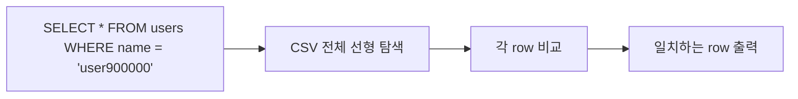

## 이 프로젝트의 B+ Tree가 저장하는 것

보통 B+ Tree를 처음 배우면 "트리가 데이터를 다 들고 있는 구조"처럼
느껴질 수 있습니다. 하지만 이 코드베이스는 훨씬 단순합니다.

- B+ Tree의 key는 `id`
- B+ Tree의 value는 `offset`
- 실제 row 데이터는 CSV 파일에만 있음

즉 B+ Tree는 "책 내용"이 아니라 "책갈피" 역할을 합니다.

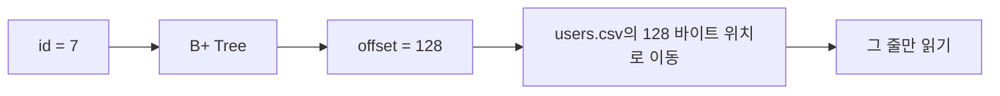

이 설계는 [include/bptree.h](/Users/donghyunkim/Documents/week7-02-sql-index/include/bptree.h:4) 주석에도
직접 드러나 있습니다.

## 구조를 먼저 보자

이 구현은 `BPTREE_ORDER = 4`입니다.

```c
#define BPTREE_ORDER 4
```

이 말은 간단히 이렇게 이해하면 됩니다.

- internal node의 자식은 최대 4개
- key는 최대 3개
- leaf node도 key를 최대 3개까지 저장

코드에서는 아래처럼 계산합니다.

- `BPTREE_ORDER = 4`
- `BPTREE_MAX_KEYS = BPTREE_ORDER - 1`

### 노드 종류

이 구현에는 node가 2종류 있습니다.

1. internal node
2. leaf node

둘 다 `keys[]`는 갖고 있지만, 나머지는 다릅니다.

| 노드 | 무엇을 저장하나 |
| --- | --- |
| internal node | `keys[]`, `children[]` |
| leaf node | `keys[]`, `offsets[]`, `next` |

`next` 포인터가 중요한 이유는 range scan 때문입니다.
leaf를 왼쪽에서 오른쪽으로 연결해 두면 `id > 900000` 같은 조건에서
다음 leaf로 계속 넘어가며 결과를 모을 수 있습니다.

### 예시 트리 모양

아래 그림은 이 프로젝트의 B+ Tree를 아주 단순하게 그린 예시입니다.
핵심은 internal node는 "어느 자식으로 내려갈지"만 안내하고, 실제
`id -> offset` 쌍은 leaf node에만 들어 있다는 점입니다. 이 그림은
설명용 스냅샷이며, `offset` 숫자도 이해를 돕기 위한 예시입니다.

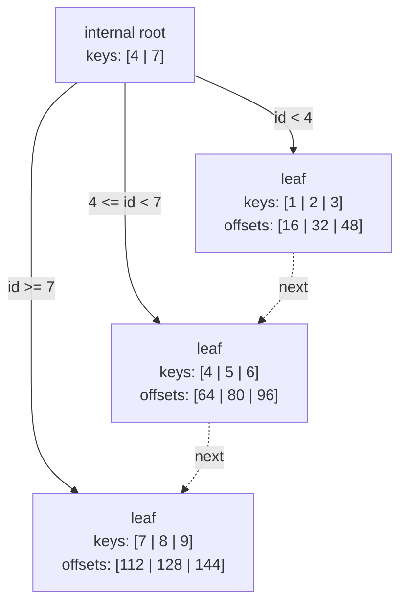

이 그림을 읽는 방법은 아래처럼 생각하면 쉽습니다.

- root의 `4`는 "오른쪽으로 한 칸 가면 4부터 시작"이라는 경계값
- root의 `7`은 "그다음 자식은 7부터 시작"이라는 경계값
- 실제 CSV 위치 정보는 leaf의 `offsets[]`에만 저장
- range scan은 `next`를 따라 leaf를 왼쪽에서 오른쪽으로 순회

## 코드 구조

핵심 구조체는 [src/bptree.c](/Users/donghyunkim/Documents/week7-02-sql-index/src/bptree.c:8) 에 있습니다.

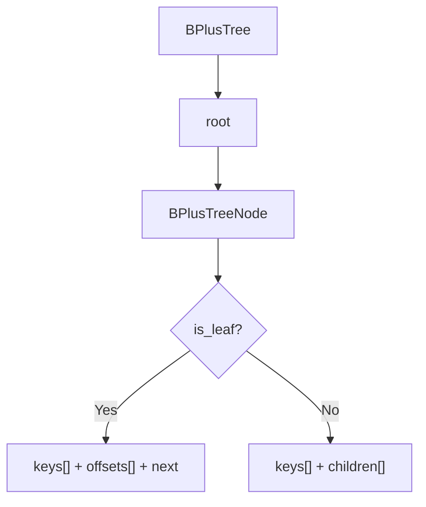

이 코드를 읽을 때는 아래 순서가 가장 쉽습니다.

1. [include/bptree.h](/Users/donghyunkim/Documents/week7-02-sql-index/include/bptree.h:1) 에서 공개 API 보기
2. [src/bptree.c](/Users/donghyunkim/Documents/week7-02-sql-index/src/bptree.c:329) 의 `bptree_insert()`
3. [src/bptree.c](/Users/donghyunkim/Documents/week7-02-sql-index/src/bptree.c:366) 의 `bptree_search()`
4. [src/bptree.c](/Users/donghyunkim/Documents/week7-02-sql-index/src/bptree.c:427) 이후 range scan 함수 보기

## 검색은 어떻게 동작하나

정확히 하나를 찾는 검색은 [src/bptree.c](/Users/donghyunkim/Documents/week7-02-sql-index/src/bptree.c:366)
의 `bptree_search()`가 담당합니다.

동작은 단순합니다.

1. root에서 시작
2. internal node면 key를 비교해 내려갈 child를 고름
3. leaf node에 도달
4. leaf 안에서 key를 찾음
5. 찾으면 offset 반환

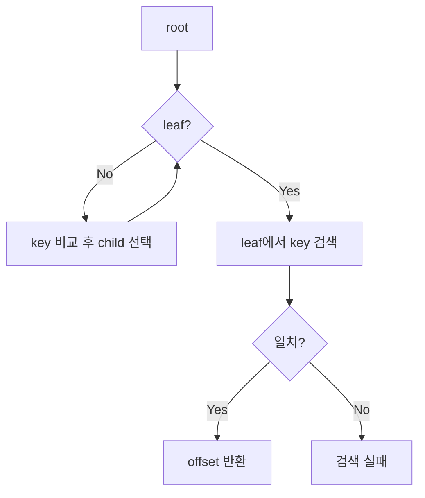

이 프로젝트에서 이 함수는 [src/executor.c](/Users/donghyunkim/Documents/week7-02-sql-index/src/executor.c:562)
의 `execute_select_with_index()`에서 호출됩니다.

## 삽입은 어떻게 동작하나

삽입의 진입점은 [src/bptree.c](/Users/donghyunkim/Documents/week7-02-sql-index/src/bptree.c:329)
의 `bptree_insert()`입니다.

큰 흐름은 아래와 같습니다.

1. tree가 비어 있으면 root leaf 생성
2. 재귀적으로 leaf까지 내려감
3. 자리가 있으면 그대로 삽입
4. 자리가 없으면 split
5. split 결과를 부모로 올림
6. root까지 split되면 새 root 생성

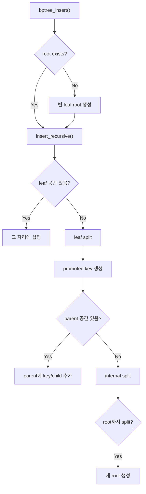

### leaf split을 예로 보면

이 구현은 leaf에 key가 최대 3개까지 들어갑니다.
예를 들어 아래처럼 꽉 찬 leaf가 있다고 가정해 보겠습니다.

```text
[ 1 | 3 | 5 ]
```

여기에 `4`를 넣으려 하면 임시로 이렇게 됩니다.

```text
[ 1 | 3 | 4 | 5 ]
```

이제 반으로 나눕니다.

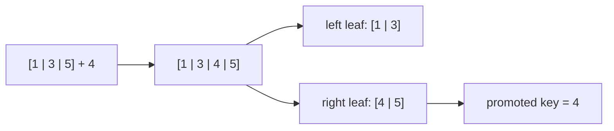

여기서 중요한 점은 `4`가 부모에게 올라간다는 것입니다.
부모는 "오른쪽 leaf는 4부터 시작한다"는 정보만 기억합니다.

## 중복 key는 왜 막을까

이 프로젝트에서 key는 PK `id`입니다. PK는 중복되면 안 되므로
삽입 시 duplicate를 실패로 처리합니다.

이 동작은 [src/bptree.c](/Users/donghyunkim/Documents/week7-02-sql-index/src/bptree.c:191)
의 `insert_into_leaf()`에서 확인할 수 있고, 테스트도 있습니다.

- [tests/test_runner.c](/Users/donghyunkim/Documents/week7-02-sql-index/tests/test_runner.c:594)

## range scan은 왜 leaf 연결이 필요할까

`WHERE id > 2` 같은 조건은 한 row만 찾는 검색이 아닙니다.
조건을 만족하는 여러 row를 순서대로 가져와야 합니다.

그래서 leaf node는 `next` 포인터로 연결됩니다.

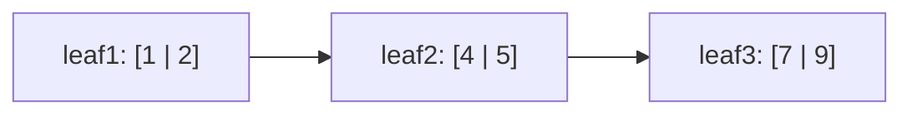

예를 들어 `id > 4`면:

1. 먼저 `4`가 들어갈 leaf를 찾음
2. 그 leaf 안에서 `4`보다 큰 key부터 읽음
3. `next`를 따라가며 뒤쪽 leaf를 계속 방문

이 구현은 아래 함수가 담당합니다.

- `bptree_visit_greater_than()`: [src/bptree.c](/Users/donghyunkim/Documents/week7-02-sql-index/src/bptree.c:427)
- `bptree_visit_less_than()`: [src/bptree.c](/Users/donghyunkim/Documents/week7-02-sql-index/src/bptree.c:463)

실제 SQL 실행 쪽에서는 [src/executor.c](/Users/donghyunkim/Documents/week7-02-sql-index/src/executor.c:649)
의 `execute_select_with_index_range()`가 이들을 사용합니다.

## 일반 컬럼 조회는 언제 선형 탐색을 쓰나

이 프로젝트는 "모든 WHERE 조건"에 인덱스를 쓰지 않습니다.
현재 B+ Tree 인덱스는 PK `id` 하나만 대상으로 붙어 있습니다.

즉 아래 두 조건 중 하나라도 해당하면 선형 탐색으로 갑니다.

1. WHERE 컬럼이 PK `id`가 아닐 때
2. WHERE 컬럼이 `id`여도 연산자가 `!=`일 때

코드 기준으로 보면 [src/executor.c](/Users/donghyunkim/Documents/week7-02-sql-index/src/executor.c:739)
의 `execute_select()`는 아래 두 경우만 인덱스를 사용합니다.

- `id = 값`
- `id > 값`, `id < 값`

그 외는 모두 [src/executor.c](/Users/donghyunkim/Documents/week7-02-sql-index/src/executor.c:709)
의 `execute_select_with_scan()`으로 갑니다.

### 선형 탐색으로 가는 대표 예시

| 쿼리 | 왜 인덱스를 안 쓰나 |
| --- | --- |
| `SELECT * FROM users WHERE name = 'kim';` | PK `id` 컬럼이 아님 |
| `SELECT * FROM users WHERE age > 30;` | PK `id` 컬럼이 아님 |
| `SELECT * FROM users WHERE id != 7;` | `!=`는 현재 인덱스 경로에 포함되지 않음 |

`id != 7`이 인덱스를 바로 쓰기 어려운 이유는 "한 점을 찾는 exact lookup"도 아니고
"한쪽 방향으로 이어지는 range scan"도 아니기 때문입니다. 현재 구현은
정확한 한 점(`=`)과 한 방향 범위(`>`, `<`)만 인덱스로 처리합니다.

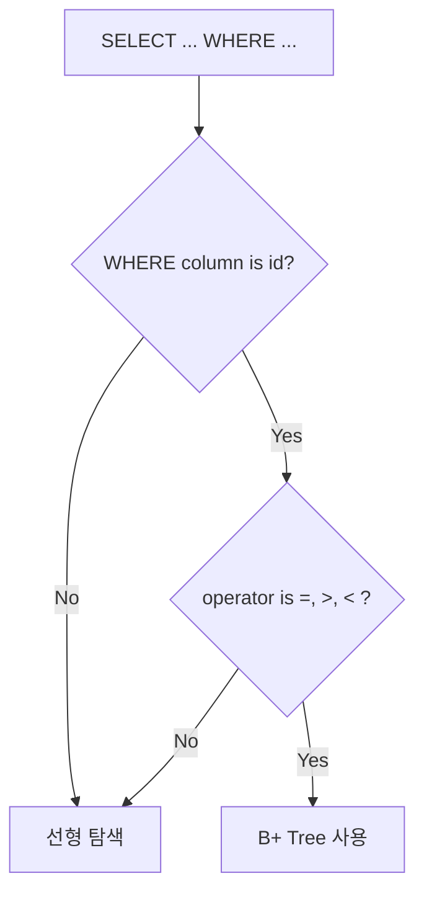

## 선형 탐색은 실제로 어떻게 동작하나

선형 탐색의 핵심은 "CSV를 처음부터 끝까지 한 줄씩 읽고 조건을 비교한다"
는 것입니다.

실행 순서는 아래와 같습니다.

1. `execute_select_with_scan()`가 `[SCAN]` 로그를 출력
2. `storage_print_rows_where_equals()` 호출
3. CSV 헤더를 읽고 스키마와 맞는지 검사
4. 데이터 row를 한 줄씩 읽음
5. 각 row의 WHERE 컬럼 값을 조건과 비교
6. 조건이 맞는 row만 출력

관련 코드는 아래입니다.

- 선형 탐색 분기: [src/executor.c](/Users/donghyunkim/Documents/week7-02-sql-index/src/executor.c:709)
- CSV 한 줄씩 비교하는 함수: [src/storage.c](/Users/donghyunkim/Documents/week7-02-sql-index/src/storage.c:675)
- 실제 비교 로직: [src/storage.c](/Users/donghyunkim/Documents/week7-02-sql-index/src/storage.c:604)

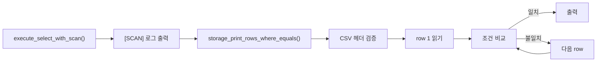

### 비교는 어디서 하나

[src/storage.c](/Users/donghyunkim/Documents/week7-02-sql-index/src/storage.c:604)
의 `csv_value_matches_where()`가 row 하나와 WHERE 조건 하나를 비교합니다.

이 함수는 아래를 처리합니다.

- 문자열 컬럼의 `=`, `!=`
- 정수 컬럼의 `=`, `>`, `<`, `!=`

즉 `storage_print_rows_where_equals()`라는 이름만 보면 "="만 할 것 같지만,
실제로는 선형 탐색 경로 전체를 담당하는 함수라고 이해하면 됩니다.

### 왜 선형 탐색이 필요한가

이 프로젝트는 "PK 조회는 인덱스, 나머지는 기존 CSV 흐름 유지"가 목표입니다.
그래서 비-PK 조건까지 억지로 인덱스로 처리하지 않고, 기존 구조를 그대로
살린 선형 탐색을 유지합니다.

이 덕분에 발표에서는 아래처럼 구분해서 설명할 수 있습니다.

- `WHERE id = 7` -> B+ Tree exact lookup
- `WHERE id > 7` -> B+ Tree range scan
- `WHERE name = 'kim'` -> CSV 선형 탐색
- `WHERE id != 7` -> CSV 선형 탐색

## 이 프로젝트 전체 흐름에서 B+ Tree는 어디에 붙는가

이제 자료구조 설명을 넘어, SQL 처리기 안에서 어디에 붙는지 보겠습니다.

### 1. 프로그램 시작 또는 첫 테이블 접근

[src/executor.c](/Users/donghyunkim/Documents/week7-02-sql-index/src/executor.c:120)
의 `create_table_state()`는 PK 인덱스를 만들고,
[src/storage.c](/Users/donghyunkim/Documents/week7-02-sql-index/src/storage.c:1127)
의 `storage_rebuild_pk_index()`로 기존 CSV를 다시 읽습니다.

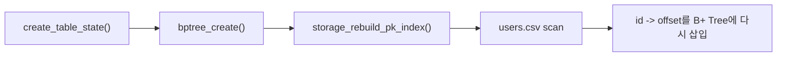

이 단계가 필요한 이유는 인덱스가 메모리 기반이기 때문입니다.
프로그램을 끄면 사라지므로, 다시 켰을 때 CSV를 읽어 복구해야 합니다.

### 2. INSERT 시 인덱스 갱신

INSERT는 아래 순서로 진행됩니다.

1. 필요하면 자동 PK 발급
2. PK 중복 확인
3. CSV에 row append
4. `ftell()`로 얻은 row offset 저장
5. `bptree_insert()`로 인덱스 갱신

관련 코드는 아래입니다.

- 자동 PK: [src/executor.c](/Users/donghyunkim/Documents/week7-02-sql-index/src/executor.c:195)
- INSERT 후 인덱스 등록: [src/executor.c](/Users/donghyunkim/Documents/week7-02-sql-index/src/executor.c:404)

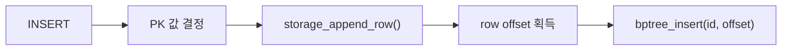

### 3. SELECT WHERE id = ? 시 인덱스 조회

PK exact lookup은 아래 경로로 갑니다.

1. parser가 `where_column = id`를 만듦
2. executor가 "PK 조건"인지 확인
3. `bptree_search()` 호출
4. offset을 받아 CSV의 해당 row만 읽음

관련 코드는 [src/executor.c](/Users/donghyunkim/Documents/week7-02-sql-index/src/executor.c:562)
에 있습니다.


## 테스트는 어떻게 보면 좋나

B+ Tree 관련 테스트는 [tests/test_runner.c](/Users/donghyunkim/Documents/week7-02-sql-index/tests/test_runner.c:542)
부터 읽으면 됩니다.

| 테스트 | 확인하는 것 |
| --- | --- |
| `test_bptree_single_key_search()` | 단일 key 삽입과 검색 |
| `test_bptree_multiple_keys_and_split()` | 여러 key 삽입과 split 이후 검색 |
| `test_bptree_duplicate_key_fail()` | 중복 PK 거부 |
| `test_bptree_thousand_keys()` | 많은 key에서도 검색 유지 |

실행은 아래처럼 하면 됩니다.

```bash
make test
```

## 초심자가 자주 헷갈리는 포인트

### 1. "왜 row 전체를 저장하지 않고 offset만 저장하나요?"

이 프로젝트의 실제 데이터는 CSV에 있으므로, 트리는 위치만 기억하면 됩니다.
이 방식이 메모리를 덜 쓰고 구현도 단순합니다.

### 2. "왜 leaf만 `next`가 있나요?"

range scan은 실제 데이터가 있는 leaf만 순서대로 읽으면 되기 때문입니다.
internal node끼리는 좌우 순회가 필요하지 않습니다.

### 3. "왜 프로그램 시작할 때 rebuild가 필요한가요?"

이 인덱스는 디스크에 저장되지 않는 메모리 구조라서, 프로그램을 다시 켜면
사라집니다. 그래서 CSV를 다시 읽어 복구합니다.

### 4. "왜 `name = 'kim'`은 인덱스를 안 쓰나요?"

현재 인덱스는 PK `id` 하나만 대상으로 만들었기 때문입니다.
`name`, `age`는 아직 별도 인덱스가 없습니다.

## 이 문서를 읽고 나서 코드로 넘어가는 추천 순서

1. [include/bptree.h](/Users/donghyunkim/Documents/week7-02-sql-index/include/bptree.h:1)
2. [src/bptree.c](/Users/donghyunkim/Documents/week7-02-sql-index/src/bptree.c:329) 의 `bptree_insert()`
3. [src/bptree.c](/Users/donghyunkim/Documents/week7-02-sql-index/src/bptree.c:366) 의 `bptree_search()`
4. [src/storage.c](/Users/donghyunkim/Documents/week7-02-sql-index/src/storage.c:1127) 의 `storage_rebuild_pk_index()`
5. [src/executor.c](/Users/donghyunkim/Documents/week7-02-sql-index/src/executor.c:562) 의 `execute_select_with_index()`
6. [tests/test_runner.c](/Users/donghyunkim/Documents/week7-02-sql-index/tests/test_runner.c:542) 의 테스트

이 순서로 읽으면 "자료구조 단독 이해 -> 프로젝트 연결 -> 테스트 확인" 순서가
잡혀서 훨씬 편합니다.
