# C 초심자를 위한 Mini DBMS SQL API Server 코드 지도

이 문서는 현재 코드베이스를 처음 보는 C 언어 초심자가 "어떤 파일을 어떤 순서로 읽어야 하는지", "함수들이 어떻게 이어지는지", "주요 구조체와 포인터가 무엇을 뜻하는지"를 빠르게 파악하도록 돕는 안내서다.

대상 코드:

- `src/core/`: SQL 파싱/실행, in-memory table, B+Tree index
- `src/cli/`: 터미널 REPL 진입점
- `src/server/`: HTTP 서버, 요청 큐, worker thread, lock, metrics, JSON 응답
- `tests/unit/`: 핵심 동작을 예제로 보여주는 단위 테스트

## 1. 먼저 한 문장으로 이해하기

이 프로젝트는 메모리 안에 `users(id, name, age)` 테이블 하나를 만들고, 사용자가 입력한 간단한 SQL을 실행한 뒤, 결과를 CLI나 HTTP JSON으로 돌려주는 C 프로그램이다.

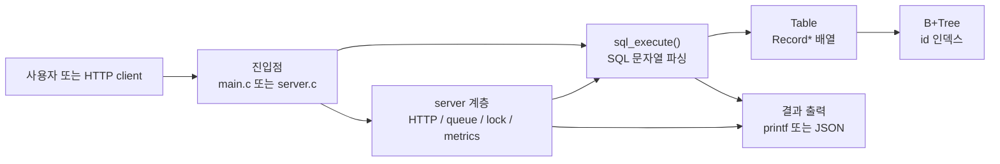

가장 중요한 경계는 이렇다.

| 영역 | 파일 | 한 줄 역할 |
|---|---|---|
| CLI REPL | `src/cli/main.c` | 터미널에서 SQL 한 줄을 읽고 `sql_execute()`를 호출한다. |
| 서버 실행 파일 | `src/server/server.c` | `--query`, stdin, `--serve` 모드를 고른다. |
| HTTP 서버 | `src/server/http_server.c` | socket, request queue, worker thread를 관리한다. |
| HTTP/JSON 변환 | `src/server/api.c` | HTTP request를 파싱하고 JSON response를 만든다. |
| 공유 DB 경계 | `src/server/db_server.c` | `Table`을 lock으로 보호하고 metrics를 기록한다. |
| SQL 엔진 | `src/core/sql.c` | SQL 문자열을 파싱해서 table 함수들을 호출한다. |
| 테이블 저장소 | `src/core/table.c` | `Record`를 동적 배열에 저장하고 검색한다. |
| ID 인덱스 | `src/core/bptree.c` | `id`로 빠르게 찾기 위한 B+Tree를 구현한다. |
| OS 차이 흡수 | `src/server/platform.c` | Windows/POSIX thread, mutex, rwlock 차이를 감춘다. |

## 2. 추천 읽기 순서

처음부터 `http_server.c`를 열면 어렵다. socket, queue, thread, lock이 한꺼번에 나오기 때문이다. 아래 순서로 읽으면 "작은 실행 흐름"에서 "큰 서버 흐름"으로 자연스럽게 확장된다.

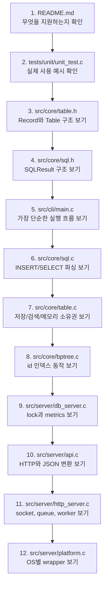

초심자에게 `tests/unit/unit_test.c`가 특히 좋다. 테스트의 `main()`은 아래 순서로 핵심 기능을 확인한다.

```c
int main(void) {
    test_empty_tree_search();
    test_single_insert_search();
    test_duplicate_key_rejected();
    test_leaf_split_search();
    test_internal_split_new_root();
    test_leaf_next_link();
    test_table_auto_increment();
    test_table_find_by_id();
    test_table_linear_search_fields();
    test_table_condition_search();
    test_sql_execution();
    test_sql_detailed_errors();
    test_db_server_shared_table_execution();
    test_db_server_lock_timeout_and_metrics();
    test_api_http_contract();

    printf("All unit tests passed.\n");
    return 0;
}
```

이 테스트 순서는 곧 학습 순서다.

| 테스트 묶음 | 먼저 배울 개념 |
|---|---|
| `test_*tree*` | B+Tree가 key/value를 저장하고 찾는 방식 |
| `test_table_*` | `Record`, `Table`, 자동 증가 `id`, 선형 검색 |
| `test_sql_*` | SQL 문자열이 `SQLResult`로 바뀌는 흐름 |
| `test_db_server_*` | shared table, read/write lock, metrics |
| `test_api_*` | HTTP request 파싱과 JSON response 생성 |

## 3. 빌드 결과물과 진입점

`Makefile`은 같은 core 코드를 여러 실행 파일에 연결한다.

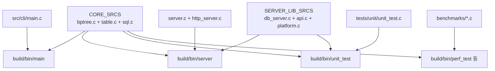

주요 `make` target은 아래처럼 보면 된다.

| 명령 | 만들어지는 것 | 읽을 진입점 |
|---|---|---|
| `make main` | `build/bin/main` | `src/cli/main.c` |
| `make server` | `build/bin/server` | `src/server/server.c` |
| `make unit_test` | `build/bin/unit_test` | `tests/unit/unit_test.c` |
| `make benchmarks` | benchmark 실행 파일 | `benchmarks/*.c` |

`Makefile`에서 자주 보이는 기호도 알아두면 좋다.

| 기호 | 뜻 |
|---|---|
| `$@` | 만들고 있는 target 파일 이름 |
| `$^` | target을 만들 때 필요한 모든 dependency |
| `$(OBJ_DIR)/%.o: %.c` | 모든 `.c` 파일을 `.o` 파일로 컴파일하는 공통 규칙 |
| `-Isrc/core -Isrc/server` | `#include "sql.h"` 같은 header 검색 경로 |

## 4. 핵심 데이터 구조: `Record`, `Table`, `BPTree`

`src/core/table.h`가 데이터 모델의 중심이다.

```c
#define RECORD_NAME_SIZE 64

typedef struct Record {
    int id;                         /* 자동 증가 primary key */
    char name[RECORD_NAME_SIZE];    /* 고정 길이 문자열 buffer */
    int age;
} Record;

typedef struct Table {
    int next_id;        /* 다음 INSERT에 줄 id */
    Record **rows;      /* Record*들을 담는 동적 배열 */
    size_t size;        /* 현재 저장된 row 수 */
    size_t capacity;    /* rows 배열의 현재 수용량 */
    BPTree *pk_index;   /* id -> Record* 인덱스 */
} Table;
```

초심자 관점에서 `Record **rows`가 가장 낯설 수 있다.

- `Record`는 실제 row 하나다.
- `Record *`는 row 하나를 가리키는 포인터다.
- `Record **rows`는 `Record *` 여러 개를 담는 배열이다.

그림으로 보면 아래와 같다.

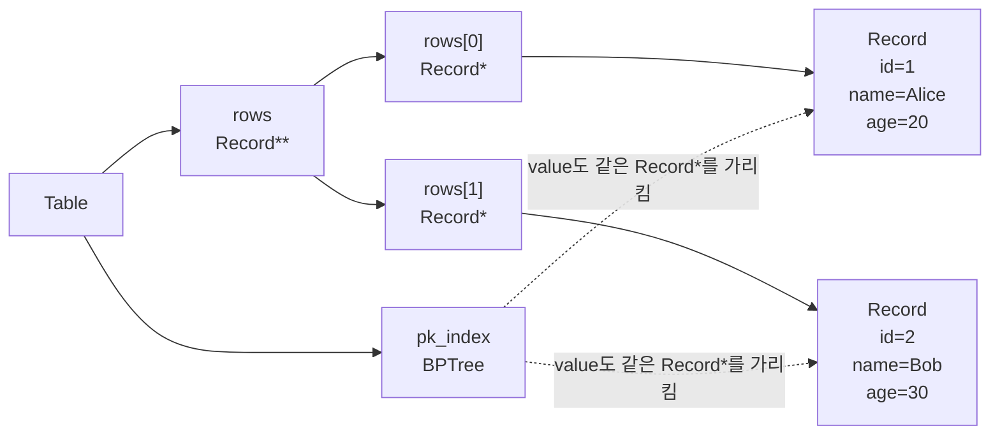

중요한 소유권 규칙:

| 메모리 | 누가 만든다 | 누가 해제한다 | 주의점 |
|---|---|---|---|
| `Table *` | `table_create()` | `table_destroy()` | 서버에서는 `DBServer`가 들고 있다. |
| `Record *` | `table_insert()` | `table_destroy()` | `SQLResult`나 B+Tree가 해제하면 안 된다. |
| `Table.rows` 배열 | `table_ensure_capacity()` | `table_destroy()` | `Record*` 목록을 저장한다. |
| B+Tree node | `bptree_insert()` 과정 | `bptree_destroy()` | node만 해제하고 `Record*`는 해제하지 않는다. |
| SELECT 결과의 `Record **records` 배열 | `table_collect_all()` 등 | `sql_result_destroy()` | 배열만 해제한다. 배열 안의 `Record*`는 빌린 포인터다. |

## 5. B+Tree는 왜 있는가

`id` 검색을 빠르게 하기 위해 `BPTree`가 있다.

```c
typedef struct BPTreeNode {
    int is_leaf;                         /* leaf node인지 */
    int num_keys;                        /* 현재 key 개수 */
    int keys[BPTREE_MAX_KEYS];           /* 정렬된 id 값 */
    void *values[BPTREE_MAX_KEYS];       /* leaf에서는 Record* */
    struct BPTreeNode *children[BPTREE_ORDER];
    struct BPTreeNode *parent;
    struct BPTreeNode *next;             /* leaf끼리 옆으로 연결 */
} BPTreeNode;
```

이 프로젝트의 B+Tree order는 4라서 node 하나에 key가 최대 3개 들어간다.

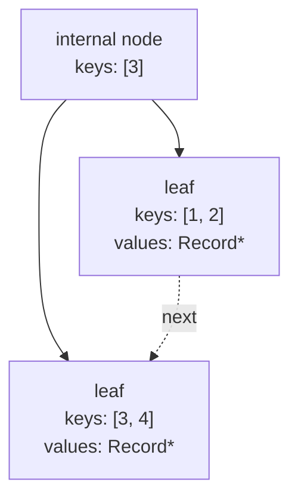

대표 함수는 아래와 같다.

| 함수 | 파일 | 역할 |
|---|---|---|
| `bptree_create()` | `src/core/bptree.c` | 빈 tree를 만든다. |
| `bptree_insert()` | `src/core/bptree.c` | `id -> Record*`를 넣는다. leaf가 꽉 차면 split한다. |
| `bptree_search()` | `src/core/bptree.c` | root에서 leaf까지 내려가 key를 찾는다. |
| `bptree_destroy()` | `src/core/bptree.c` | tree node들을 해제한다. |

`Table`은 이 B+Tree를 직접 노출하지 않고 `table_find_by_id()` 같은 함수로 감싼다.

## 6. SQL 실행 결과: `SQLResult`

`src/core/sql.h`의 `SQLResult`는 SQL 실행 결과를 담는 상자다.

```c
typedef struct SQLResult {
    SQLStatus status;        /* OK, NOT_FOUND, SYNTAX_ERROR 등 */
    SQLAction action;        /* INSERT인지 SELECT인지 */
    Record *record;          /* 대표 row 하나. 보통 records[0] */
    Record **records;        /* SELECT 결과 row 배열 */
    int inserted_id;         /* INSERT 성공 시 새 id */
    size_t row_count;        /* SELECT 결과 row 수 */
    int error_code;
    char sql_state[SQL_SQLSTATE_SIZE];
    char error_message[SQL_ERROR_MESSAGE_SIZE];
} SQLResult;
```

`status`와 `action`은 함께 봐야 한다.

| `status` | `action` | 읽어도 되는 필드 | 의미 |
|---|---|---|---|
| `SQL_STATUS_OK` | `SQL_ACTION_INSERT` | `inserted_id`, `record` | INSERT 성공 |
| `SQL_STATUS_OK` | `SQL_ACTION_SELECT_ROWS` | `records`, `row_count`, `record` | SELECT 결과 있음 |
| `SQL_STATUS_NOT_FOUND` | `SQL_ACTION_SELECT_ROWS` | `row_count` | SELECT는 성공했지만 row가 없음 |
| `SQL_STATUS_SYNTAX_ERROR` | `SQL_ACTION_NONE` | `error_code`, `sql_state`, `error_message` | SQL 문법이 틀림 |
| `SQL_STATUS_QUERY_ERROR` | `SQL_ACTION_NONE` | `error_code`, `sql_state`, `error_message` | 없는 column 같은 query 오류 |
| `SQL_STATUS_EXIT` | `SQL_ACTION_NONE` | 없음 | CLI에서 종료 명령 |
| `SQL_STATUS_ERROR` | 보통 `SQL_ACTION_NONE` | `error_message`가 있으면 참고 | 메모리 부족 등 내부 오류 |

SELECT 결과를 다 쓴 뒤에는 반드시 `sql_result_destroy()`를 호출해야 한다.

```c
SQLResult result = sql_execute(table, "SELECT * FROM users;");

if (result.status == SQL_STATUS_OK &&
    result.action == SQL_ACTION_SELECT_ROWS) {
    table_print_records(result.records, result.row_count);
}

sql_result_destroy(&result);
```

여기서 `sql_result_destroy()`는 `result.records` 배열만 해제한다. 실제 `Record`는 `Table`이 계속 소유한다.

## 7. `sql_execute()` 흐름

SQL 엔진의 public API는 하나다.

```c
SQLResult sql_execute(Table *table, const char *input);
```

실제 흐름은 아래처럼 보면 쉽다.

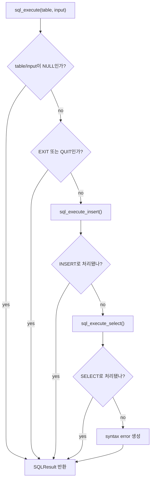

학습용으로 줄여 쓰면 이런 느낌이다.

```c
SQLResult sql_execute(Table *table, const char *input) {
    if (table == NULL || input == NULL) {
        return error_result;
    }

    if (input_is_exit_or_quit(input)) {
        return exit_result;
    }

    result = sql_execute_insert(table, input);
    if (insert_parser_handled_it(result)) {
        return result;
    }

    result = sql_execute_select(table, input);
    if (select_parser_did_not_understand_it(result)) {
        make_syntax_error(&result);
    }

    return result;
}
```

`sql.c` 안의 작은 parser helper들은 대부분 같은 패턴이다.

| 함수 | 역할 |
|---|---|
| `sql_skip_spaces()` | 공백을 건너뛴다. |
| `sql_match_keyword()` | `SELECT`, `INSERT`, `WHERE` 같은 keyword를 대소문자 무시하고 맞춘다. |
| `sql_parse_identifier()` | `users`, `id`, `name`, `age` 같은 이름을 읽는다. |
| `sql_parse_string()` | `'Alice'` 같은 작은따옴표 문자열을 읽는다. |
| `sql_parse_int()` | `20`, `-1` 같은 정수를 읽는다. |
| `sql_parse_comparison()` | `=`, `<`, `<=`, `>`, `>=`를 enum으로 바꾼다. |
| `sql_match_statement_end()` | 선택적 세미콜론과 끝 공백을 허용한다. |

## 8. INSERT 흐름

예시 SQL:

```sql
INSERT INTO users VALUES ('Alice', 20);
```

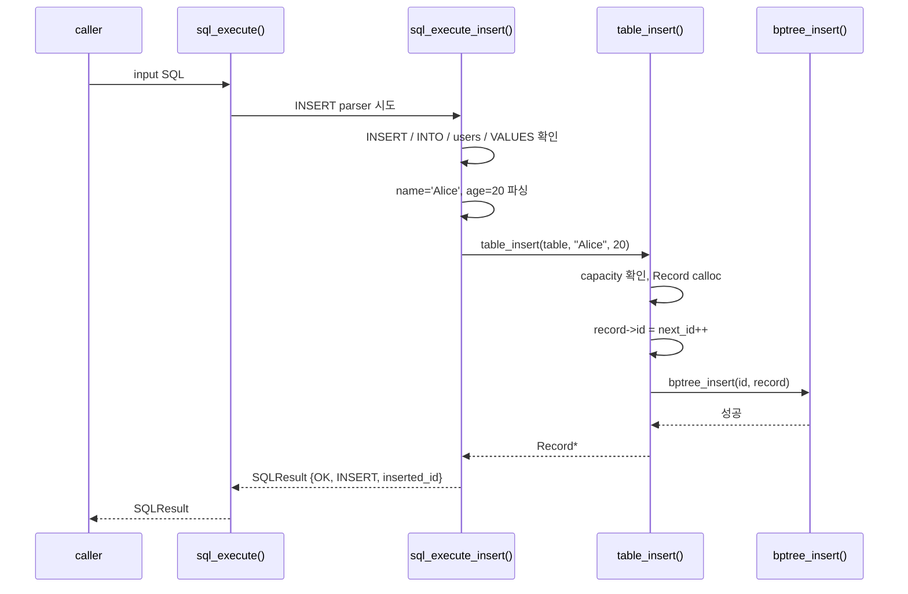

`table_insert()`에서 중요한 순서:

```c
record = (Record *)calloc(1, sizeof(Record));

record->id = table->next_id++;
strncpy(record->name, name, RECORD_NAME_SIZE - 1);
record->age = age;

table->rows[table->size] = record;
bptree_insert(table->pk_index, record->id, record);
table->size++;
```

초심자 체크포인트:

- `calloc`으로 만든 `record`는 heap 메모리다.
- `table->rows[...]`는 그 `record`의 주소를 저장한다.
- B+Tree도 같은 `record` 주소를 value로 저장한다.
- 그래서 `Record`를 해제하는 곳은 한 곳, `table_destroy()`여야 한다.

## 9. SELECT 흐름

예시 SQL:

```sql
SELECT * FROM users WHERE id >= 10;
```

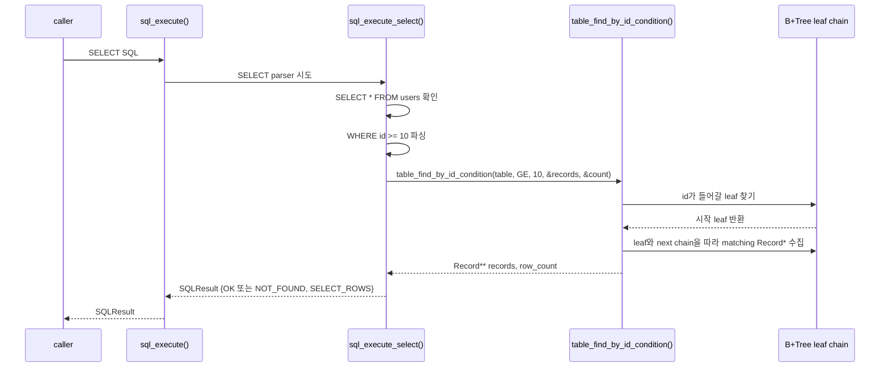

조건별 검색 방식은 다르다.

| WHERE 조건 | 사용하는 함수 | 검색 방식 |
|---|---|---|
| 없음 | `table_collect_all()` | `Table.rows` 전체 복사 |
| `id = 1` | `table_find_by_id_condition()` | B+Tree 검색 |
| `id >= 10` 등 | `table_find_by_id_condition()` | B+Tree leaf에서 시작해 leaf chain 탐색 |
| `name = 'Alice'` | `table_find_by_name_matches()` | `Table.rows` 선형 검색 |
| `age > 20` 등 | `table_find_by_age_condition()` | `Table.rows` 선형 검색 |

`Record ***records`가 나오는 이유:

```c
int table_find_by_age_condition(
    Table *table,
    TableComparison comparison,
    int age,
    Record ***records,
    size_t *count
);
```

함수 밖의 `Record **records` 변수에 새 배열 주소를 넣어줘야 하므로, 그 변수의 주소를 받는다. 그래서 한 단계 더 붙어 `Record ***records`가 된다.

```c
Record **matches = NULL;
size_t count = 0;

table_find_by_age_condition(table, TABLE_COMPARISON_GT, 20, &matches, &count);
/*                                      matches를 바꾸려면 &matches가 필요 */

free(matches); /* 배열만 해제. Record* 자체는 table이 소유 */
```

## 10. CLI 실행 흐름

`src/cli/main.c`는 가장 단순한 전체 흐름을 보여준다.

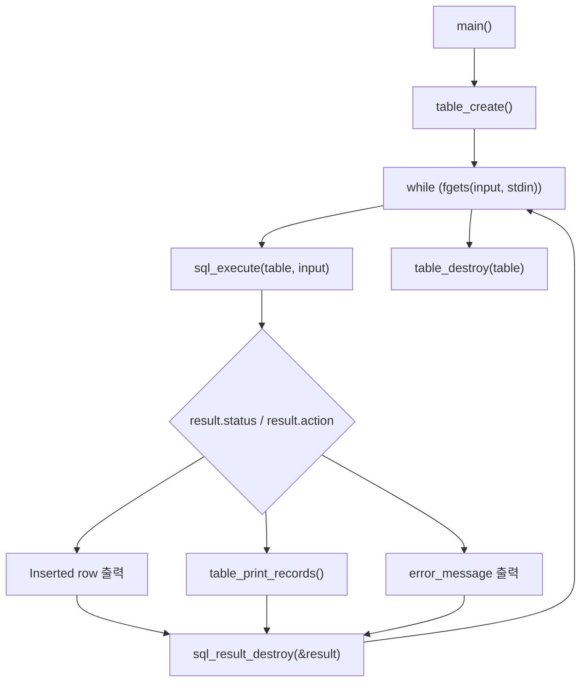

핵심 코드는 아래와 같다.

```c
while (1) {
    SQLResult result;

    printf("sql> ");
    if (fgets(input, sizeof(input), stdin) == NULL) {
        break;
    }

    result = sql_execute(table, input);

    if (result.status == SQL_STATUS_EXIT) {
        sql_result_destroy(&result);
        break;
    }

    /* status와 action에 따라 출력 방식을 고른다. */

    sql_result_destroy(&result);
}

table_destroy(table);
```

초심자에게 좋은 관찰 포인트:

- `Table *table`은 프로그램 시작 때 한 번 만든다.
- loop 안에서는 SQL을 여러 번 실행하지만 같은 table을 계속 쓴다.
- 매번 `SQLResult`는 정리하고, 마지막에 table 전체를 정리한다.

## 11. 서버 계층: `DBServer`

HTTP 서버에서는 여러 worker thread가 같은 table을 볼 수 있다. 그래서 `Table *`을 직접 쓰지 않고 `DBServer`로 감싼다.

```c
typedef struct DBServer {
    Table *table;                 /* 공유 users table */
    PlatformRWLock db_lock;       /* SELECT/INSERT 동기화 */
    PlatformMutex metrics_mutex;  /* metrics 보호 */
    DBServerConfig config;        /* timeout, simulated delay */
    DBServerMetrics metrics;      /* 요청 수, 오류 수 등 */
} DBServer;
```

`db_server_execute()`는 "SQL 실행 전후에 서버 규칙을 적용하는 문"이다.

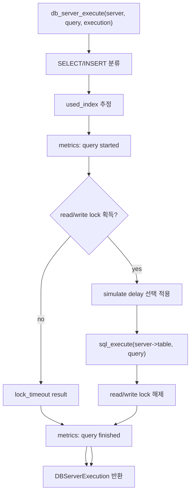

read/write lock 규칙:

| query 종류 | lock | 이유 |
|---|---|---|
| `SELECT` | read lock | 여러 SELECT는 동시에 읽어도 된다. |
| `INSERT` | write lock | table과 B+Tree를 바꾸므로 혼자 실행해야 한다. |
| 알 수 없는 SQL | lock 없음 | 어차피 `sql_execute()`에서 syntax error로 처리된다. |

`used_index` 주의:

- `DBServerExecution.used_index`는 `db_server_guess_uses_index()`가 SQL 문자열을 보고 추정한다.
- 예를 들어 `SELECT ... WHERE id = ...`이면 true로 본다.
- B+Tree가 실제로 몇 node를 방문했는지 측정한 값은 아니다.

## 12. HTTP API 흐름

HTTP 서버 전체는 `http_server_run()`에서 시작한다.

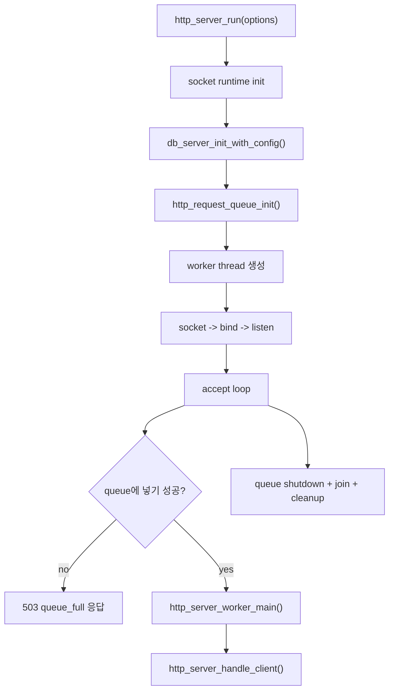

`http_server.c` 안에는 내부용 구조체가 있다. header에 공개하지 않는 이유는 다른 파일이 직접 만질 필요가 없기 때문이다.

```c
typedef struct HTTPRequestQueue {
    HTTPSocket *items;       /* client socket 배열 */
    size_t head;             /* pop 위치 */
    size_t tail;             /* push 위치 */
    size_t count;            /* 현재 queue에 들어있는 개수 */
    size_t capacity;         /* 최대 개수 */
    int shutting_down;       /* 종료 중인지 */
    PlatformMutex mutex;
    PlatformCond cond;
} HTTPRequestQueue;

typedef struct HTTPServerContext {
    DBServer db_server;
    HTTPServerOptions options;
    HTTPRequestQueue queue;
    PlatformThread *workers;
    PlatformMutex state_mutex;
    unsigned long long completed_responses;
} HTTPServerContext;
```

bounded queue는 원형 buffer처럼 움직인다.

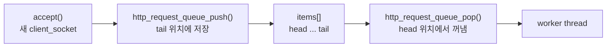

`http_server_handle_client()`는 요청 하나를 처리하는 핵심 함수다.

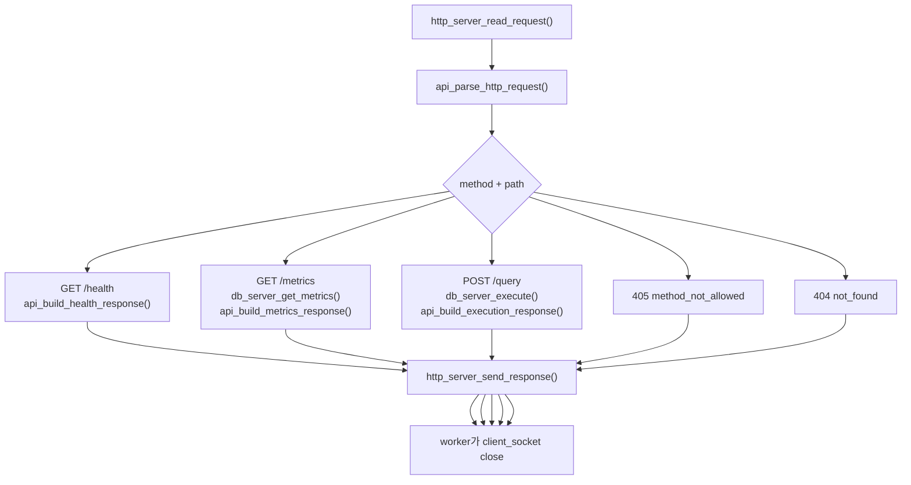

HTTP request/response 구조체:

```c
typedef struct APIRequest {
    APIRequestMethod method;  /* GET, POST, UNKNOWN */
    char path[64];            /* /health, /metrics, /query */
    char query[1024];         /* POST /query의 SQL 문자열 */
    size_t content_length;
} APIRequest;

typedef struct APIResponse {
    int status_code;
    const char *content_type;
    char *body;               /* malloc된 JSON body */
} APIResponse;
```

`APIResponse.body`는 `api_set_response_body()`나 `api_build_execution_response()`에서 heap에 만든다. 다 쓴 뒤에는 `api_response_destroy()`로 해제해야 한다.

## 13. `api.c`는 문자열 번역기다

`api.c`는 크게 두 일을 한다.

1. HTTP 요청 문자열에서 method, path, body의 `query` 값을 꺼낸다.
2. `DBServerExecution`이나 `DBServerMetrics`를 JSON 문자열로 만든다.

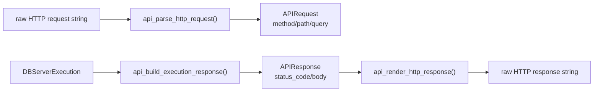

초심자 체크포인트:

- 이 프로젝트는 외부 JSON 라이브러리를 쓰지 않고 직접 단순 JSON parser를 구현한다.
- `POST /query` body에서 `"query"` 문자열 field만 추출한다.
- JSON 응답을 만들 때 이름 문자열은 `api_escape_json_string_alloc()`으로 escape한다.
- `api_render_http_response()`는 JSON body 앞에 HTTP status line과 header를 붙인다.

## 14. `platform.c`는 OS 차이를 숨긴다

Windows와 macOS/Linux는 thread, mutex, condition variable, rwlock API가 다르다. 이 차이를 모든 파일에 퍼뜨리지 않기 위해 `platform.h/c`가 wrapper를 제공한다.

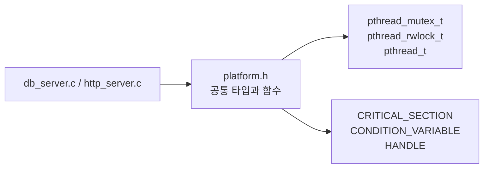

대표 wrapper:

| wrapper | POSIX/macOS/Linux | Windows |
|---|---|---|
| `PlatformMutex` | `pthread_mutex_t` | `CRITICAL_SECTION` |
| `PlatformCond` | `pthread_cond_t` | `CONDITION_VARIABLE` |
| `PlatformRWLock` | `pthread_rwlock_t` | 직접 구현한 struct |
| `PlatformThread` | `pthread_t` | `HANDLE` |
| `platform_now_millis()` | 현재 시간 ms | 현재 시간 ms |
| `platform_sleep_ms()` | ms 단위 sleep | ms 단위 sleep |

초심자는 `platform.c`를 마지막에 읽어도 된다. 처음에는 "`http_server.c`가 OS별 thread 함수를 직접 부르지 않도록 감싸는 파일" 정도로만 이해해도 충분하다.

## 15. 주요 구조체 빠른 표

| 구조체/enum | 파일 | 핵심 필드 | 읽을 때 질문 |
|---|---|---|---|
| `Record` | `src/core/table.h` | `id`, `name`, `age` | row 하나가 어떤 데이터인가? |
| `Table` | `src/core/table.h` | `next_id`, `rows`, `size`, `capacity`, `pk_index` | row들을 어디에 저장하고 id 인덱스는 어디에 있나? |
| `TableComparison` | `src/core/table.h` | `EQ`, `LT`, `LE`, `GT`, `GE` | WHERE 비교 연산자를 어떻게 표현하나? |
| `BPTreeNode` | `src/core/bptree.h` | `keys`, `values`, `children`, `next` | node split과 leaf chain을 어떻게 표현하나? |
| `SQLResult` | `src/core/sql.h` | `status`, `action`, `records`, `row_count` | SQL 실행 후 caller가 무엇을 읽어야 하나? |
| `DBServer` | `src/server/db_server.h` | `table`, `db_lock`, `metrics_mutex`, `metrics` | shared table을 어떻게 보호하나? |
| `DBServerExecution` | `src/server/db_server.h` | `result`, `used_index`, `is_write`, `server_status` | SQL 결과와 서버 상태를 함께 어떻게 전달하나? |
| `APIRequest` | `src/server/api.h` | `method`, `path`, `query` | HTTP request에서 무엇을 뽑나? |
| `APIResponse` | `src/server/api.h` | `status_code`, `content_type`, `body` | JSON 응답을 어디에 저장하나? |
| `HTTPServerOptions` | `src/server/http_server.h` | `port`, `worker_count`, `queue_capacity` | 서버 실행 옵션은 무엇인가? |
| `HTTPRequestQueue` | `src/server/http_server.c` | `items`, `head`, `tail`, `count`, `mutex`, `cond` | socket 대기열을 어떻게 보호하나? |
| `HTTPServerContext` | `src/server/http_server.c` | `db_server`, `queue`, `workers` | HTTP 서버의 공유 상태는 무엇인가? |

## 16. 주요 함수 빠른 표

| 함수 | 파일 | 호출자 | 역할 |
|---|---|---|---|
| `table_create()` | `src/core/table.c` | CLI, DB server, tests | 빈 table과 B+Tree를 만든다. |
| `table_insert()` | `src/core/table.c` | `sql_execute_insert()` | row를 만들고 배열과 B+Tree에 넣는다. |
| `table_find_by_id_condition()` | `src/core/table.c` | `sql_execute_select()` | id 조건을 B+Tree로 처리한다. |
| `table_find_by_age_condition()` | `src/core/table.c` | `sql_execute_select()` | age 조건을 선형 검색으로 처리한다. |
| `bptree_insert()` | `src/core/bptree.c` | `table_insert()` | key/value를 삽입하고 필요하면 split한다. |
| `bptree_search()` | `src/core/bptree.c` | `table_find_by_id()` | id 하나를 찾아 `Record*`를 돌려준다. |
| `sql_execute()` | `src/core/sql.c` | CLI, DB server, tests | SQL 한 문장을 파싱하고 실행한다. |
| `sql_result_destroy()` | `src/core/sql.c` | 모든 `SQLResult` caller | SELECT 결과 배열을 정리한다. |
| `db_server_execute()` | `src/server/db_server.c` | server CLI, HTTP worker, tests | lock/metrics를 적용하고 SQL을 실행한다. |
| `api_parse_http_request()` | `src/server/api.c` | `http_server_handle_client()` | raw HTTP request를 `APIRequest`로 바꾼다. |
| `api_build_execution_response()` | `src/server/api.c` | `http_server_handle_client()` | SQL 실행 결과를 JSON으로 바꾼다. |
| `api_render_http_response()` | `src/server/api.c` | `http_server_send_response()` | HTTP header와 body를 합친다. |
| `http_server_run()` | `src/server/http_server.c` | `server.c` | HTTP 서버 전체 생명주기를 관리한다. |
| `http_server_handle_client()` | `src/server/http_server.c` | worker thread | client socket 하나의 요청을 처리한다. |
| `http_request_queue_push/pop()` | `src/server/http_server.c` | accept loop, worker | bounded queue에 socket을 넣고 꺼낸다. |

## 17. 메모리 해제 체크리스트

C 코드에서는 "누가 free해야 하는가"가 흐름 이해의 절반이다.

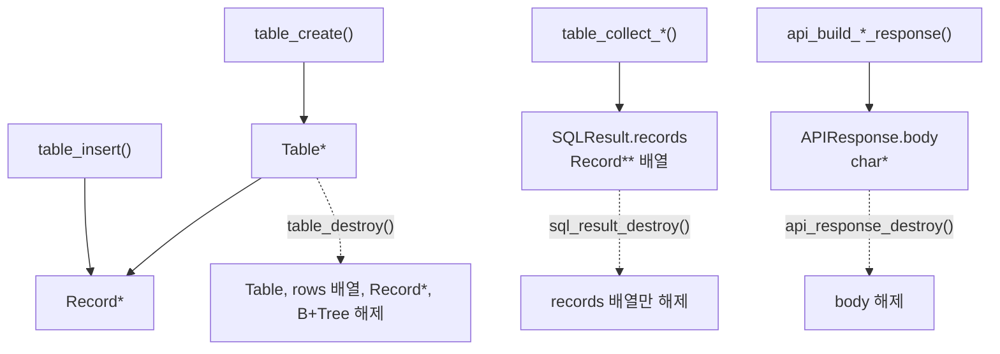

실전 규칙:

| 내가 받은 값 | 다 쓴 뒤 할 일 |
|---|---|
| `Table *table = table_create();` | `table_destroy(table);` |
| `SQLResult result = sql_execute(...);` | `sql_result_destroy(&result);` |
| `DBServerExecution execution; db_server_execute(..., &execution);` | `db_server_execution_destroy(&execution);` |
| `APIResponse response; api_build_*(&response);` | `api_response_destroy(&response);` |
| `char *raw_response; api_render_http_response(..., &raw_response);` | `free(raw_response);` |

절대 하면 안 되는 것:

- `SQLResult.records[i]`의 `Record*`를 직접 `free()`하지 않는다.
- B+Tree의 `values[]`에 들어간 `Record*`를 B+Tree가 소유한다고 생각하지 않는다.
- `APIResponse.body`를 해제하지 않고 여러 요청을 처리하지 않는다.

## 18. 초심자가 자주 헷갈리는 C 포인트

### `static` 함수

`static`이 함수 앞에 붙으면 그 함수는 해당 `.c` 파일 안에서만 쓰겠다는 뜻이다.

```c
static int sql_parse_int(const char **cursor, int *value) {
    ...
}
```

이 함수는 `sql.c` 내부 helper다. 다른 파일에서는 `sql_execute()`만 부르면 된다.

### header와 source의 역할

- `.h`: 다른 파일에게 공개하는 타입과 함수 선언
- `.c`: 실제 구현

예를 들어 `sql.h`는 `SQLResult`와 `sql_execute()`를 공개한다. 하지만 `sql_parse_string()` 같은 parser helper는 `sql.c` 안에만 있다.

### `const char **cursor`

parser는 문자열을 앞에서부터 읽으면서 현재 위치를 옮긴다.

```c
static void sql_skip_spaces(const char **cursor) {
    while (**cursor != '\0' && isspace((unsigned char)**cursor)) {
        (*cursor)++;
    }
}
```

여기서:

- `*cursor`는 현재 읽는 문자 주소다.
- `**cursor`는 현재 문자 값이다.
- `(*cursor)++`는 caller가 보고 있는 위치를 다음 문자로 옮긴다.

### `Record ***records`

SELECT 결과 배열을 함수 밖으로 돌려주려면 caller의 `Record **records` 변수를 바꿔야 한다. 그래서 그 변수의 주소인 `Record ***`를 받는다.

```c
Record **records = NULL;
size_t count = 0;

table_collect_all(table, &records, &count);
```

## 19. 기능별 전체 호출 지도

### CLI에서 INSERT

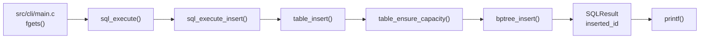

### HTTP에서 SELECT

```mermaid
flowchart LR
    Client["HTTP client"]
    Accept["accept()"]
    Queue["HTTPRequestQueue"]
    Worker["worker thread"]
    Handle["http_server_handle_client()"]
    Parse["api_parse_http_request()"]
    DB["db_server_execute()"]
    Lock["read lock"]
    SQL["sql_execute_select()"]
    Table["table_find_*()"]
    JSON["api_build_execution_response()"]
    Send["send_all()"]

    Client --> Accept --> Queue --> Worker --> Handle --> Parse --> DB --> Lock --> SQL --> Table --> JSON --> Send --> Client
```

### 에러 응답

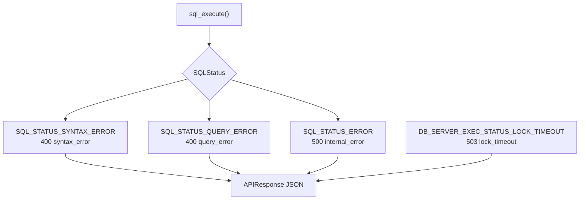

## 20. 처음 디버깅할 때 볼 곳

| 증상 | 먼저 볼 파일/함수 |
|---|---|
| INSERT가 실패한다 | `sql_execute_insert()`, `table_insert()`, `bptree_insert()` |
| SELECT 결과가 이상하다 | `sql_execute_select()`, `table_find_by_*_condition()` |
| id 검색만 이상하다 | `bptree_search()`, `table_find_by_id_condition()` |
| memory leak이 의심된다 | `sql_result_destroy()`, `table_destroy()`, `api_response_destroy()` |
| HTTP request가 파싱되지 않는다 | `http_server_read_request()`, `api_parse_http_request()` |
| JSON 응답이 이상하다 | `api_build_execution_response()`, `api_escape_json_string_alloc()` |
| 동시성 테스트가 실패한다 | `db_server_try_acquire_lock()`, `db_server_metrics_query_finished()` |
| queue full 응답이 이상하다 | `http_request_queue_push()`, accept loop의 `queue_full` 처리 |

## 21. 빠른 복습

이 코드베이스는 세 겹으로 보면 된다.

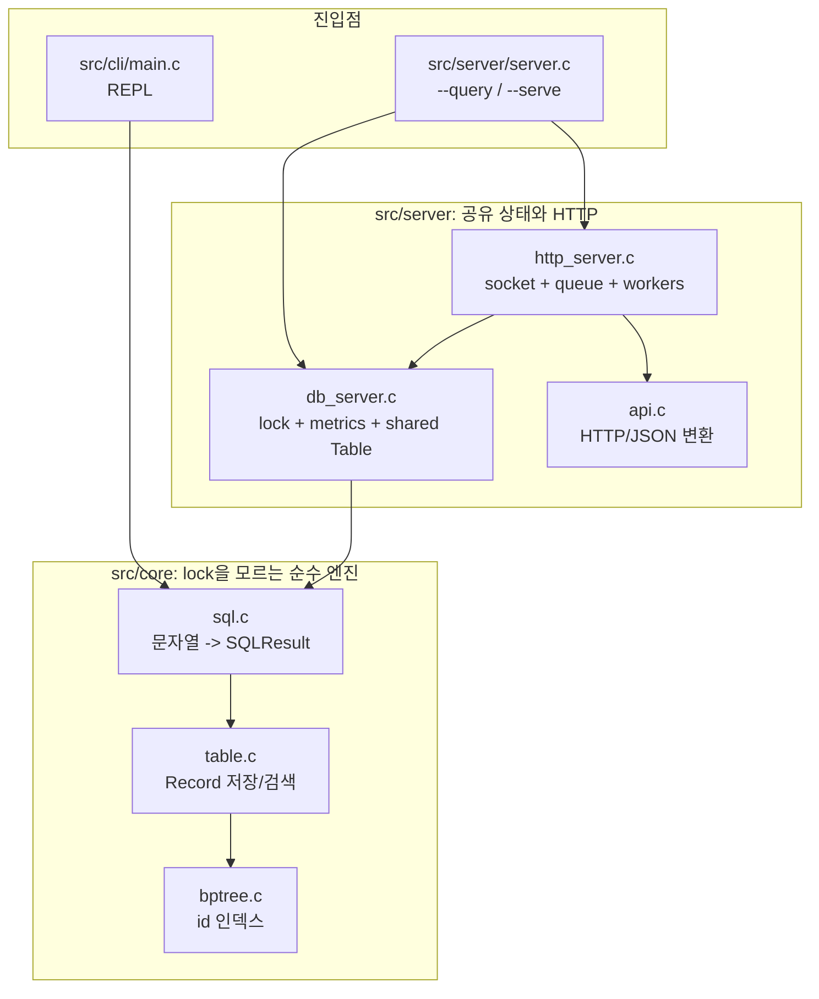

초심자에게 가장 중요한 네 가지:

1. `sql_execute()`가 SQL 엔진의 정문이다.
2. `Table`이 실제 `Record*`를 소유한다.
3. `SQLResult.records`는 SELECT 결과 배열일 뿐, `Record` 자체를 소유하지 않는다.
4. HTTP 서버에서는 `db_server_execute()`가 lock과 metrics를 책임지는 안전한 진입점이다.

