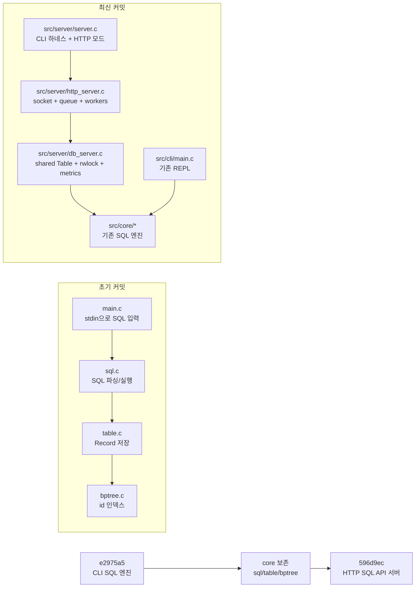
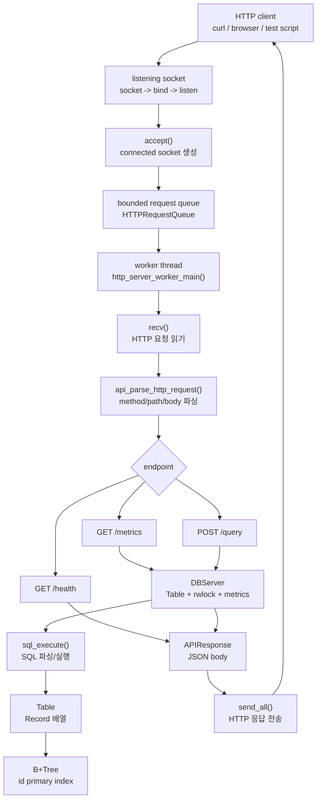
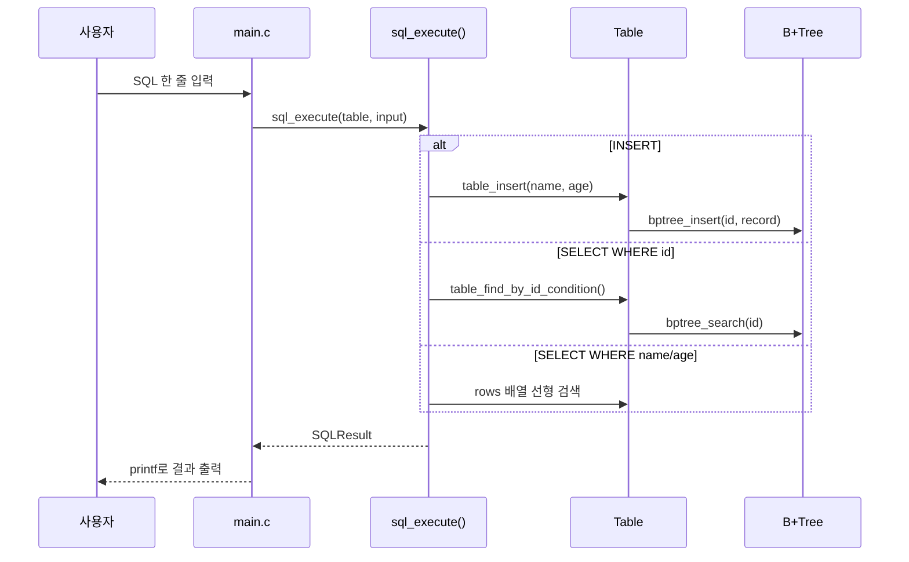
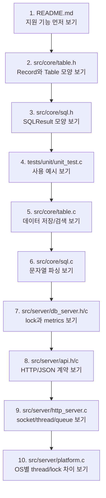
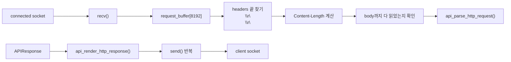
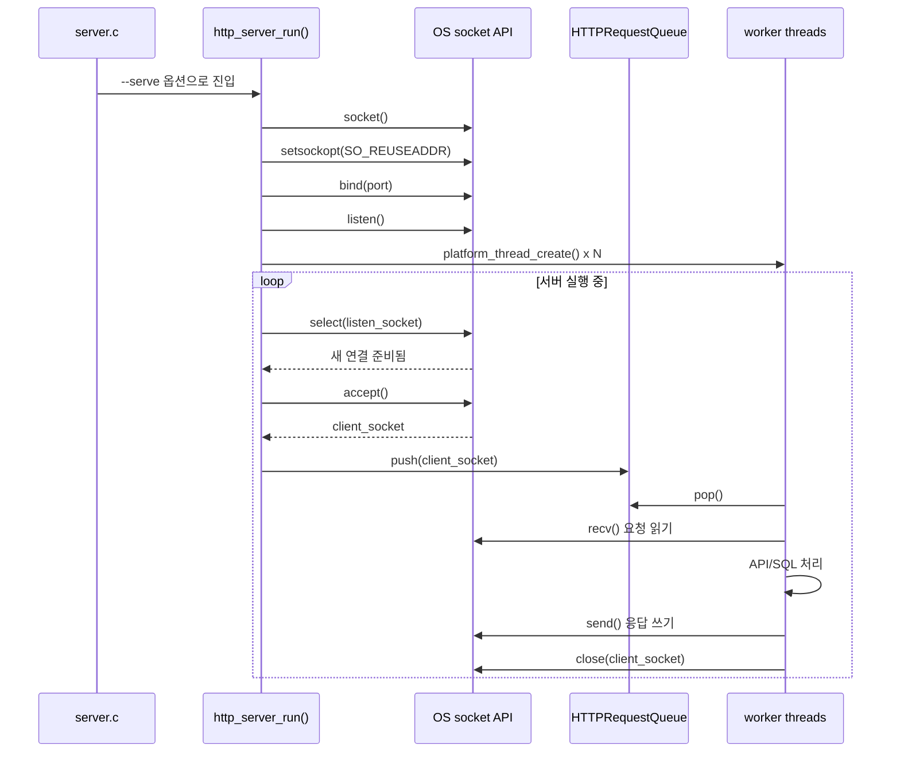
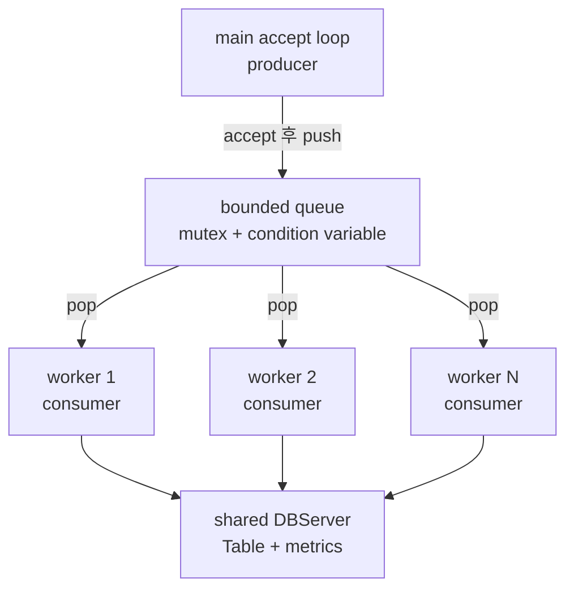
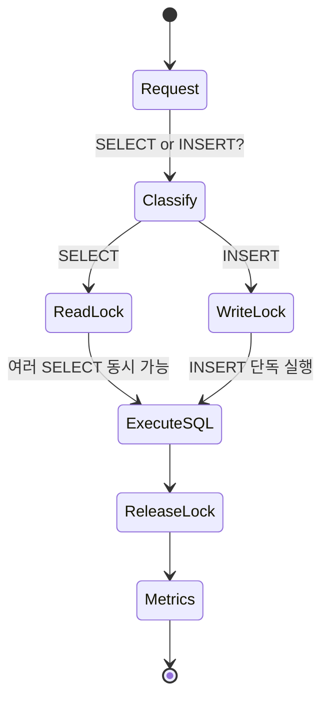
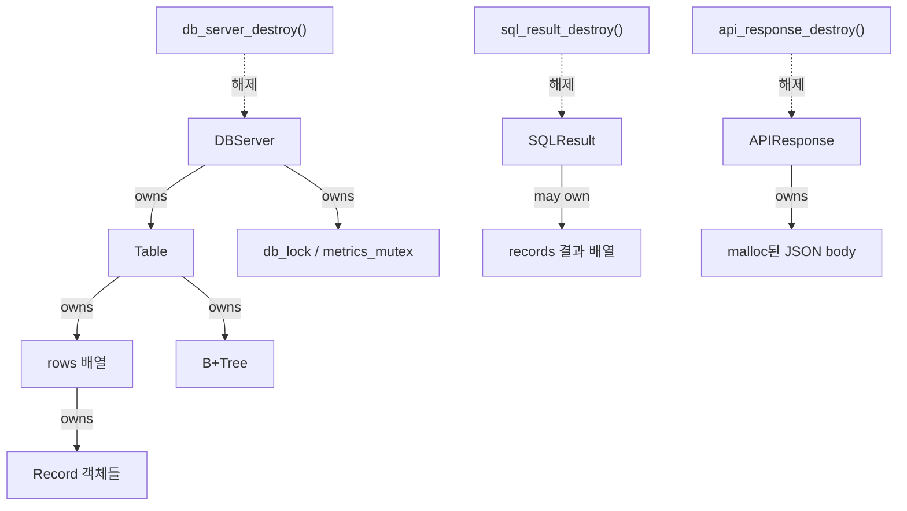
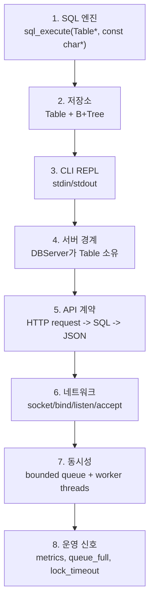

# e2975a5 -> 596d9ec로 이해하는 Mini DBMS SQL API Server

이 문서는 초기 커밋 `e2975a56217b81d3b6f7e1a3419ce05d94b2e333`과 최신 커밋 `596d9ec33fcbefd0b538873cc9fad346d4ff46f2`를 비교해서, 현재 코드베이스가 어떻게 커졌는지 설명한다.

대상 독자는 C 언어 초심자다. `struct`, 포인터, 소켓, thread, lock 같은 말이 낯설어도 전체 흐름을 먼저 잡을 수 있게 설명한다.

함께 연결해서 읽을 PDF는 아래 세 장이다.

- `docs/Chapter 10- System-Level I-O.pdf`: 파일 descriptor, `read`, `write`, short count, RIO, 표준 입출력
- `docs/Chapter 11- Network Programming.pdf`: client-server 모델, socket, `bind`, `listen`, `accept`, HTTP
- `docs/Chapter 12- Concurrent Programming.pdf`: process, I/O multiplexing, thread, shared variable, bounded buffer, synchronization, readers-writers

## 읽기 전 용어 미니 사전

처음 읽을 때는 아래 단어만 먼저 잡고 가도 충분하다.

| 용어 | 짧은 뜻 | 이 프로젝트에서 보는 곳 |
|---|---|---|
| descriptor | 운영체제가 열어 둔 입출력 대상을 가리키는 번호 | socket, `stdin`, `stdout` |
| socket | 네트워크 연결의 끝점 | `src/server/http_server.c` |
| listening socket | 새 연결 요청을 받는 서버용 socket | `listen_socket` |
| connected socket | client 한 명과 실제로 읽고 쓰는 socket | `client_socket` |
| short count | 요청한 바이트보다 적게 읽히거나 써지는 상황 | `send_all()` 반복문 |
| bounded buffer | 크기가 제한된 대기열 | `HTTPRequestQueue` |
| worker thread | queue에서 일을 꺼내 처리하는 실행 흐름 | `http_server_worker_main()` |
| mutex | 공유 데이터를 한 번에 한 thread만 만지게 하는 잠금 | `metrics_mutex`, queue mutex |
| rwlock | 읽기는 여러 개, 쓰기는 하나만 허용하는 잠금 | `db_lock` |
| metrics | 서버가 처리한 요청 수 같은 운영 숫자 | `DBServerMetrics` |

## 1. 한 줄 요약

초기 커밋은 **터미널에서 SQL을 입력하면 in-memory `users` 테이블에 실행하는 작은 SQL 엔진**이었다.

최신 커밋은 그 엔진을 거의 그대로 보존하면서, 그 위에 **HTTP API 서버, 요청 큐, worker thread, read/write lock, metrics, smoke test**를 얹었다.



커밋 차이로 보면 `33 files changed`, `4053 insertions`, `361 deletions`이다. 핵심 엔진 파일들은 대부분 `src/core/` 아래로 이동했지만 내용은 유지되었다. 즉, 프로젝트가 "엔진을 갈아엎은 것"이 아니라 "엔진 위에 서버 계층을 얹은 것"에 가깝다.

## 2. 먼저 큰 구조부터 보기

현재 프로젝트는 세 층으로 나누어 보면 쉽다.

```text
src/core/      SQL 엔진, 테이블 저장소, B+Tree 인덱스
src/cli/       기존 REPL 진입점
src/server/    HTTP API 서버, 요청 큐, worker thread, lock, metrics
```

전체 요청 흐름은 아래처럼 이어진다.



초심자용으로 더 짧게 말하면:

- `src/core/`: SQL을 실제로 처리하는 뇌
- `src/server/db_server.c`: 여러 요청이 같은 테이블을 안전하게 쓰도록 감싸는 문
- `src/server/api.c`: HTTP 문자열과 JSON 응답을 만드는 번역기
- `src/server/http_server.c`: 소켓, 요청 큐, worker thread를 담당하는 서버 몸통
- `src/server/platform.c`: Windows와 POSIX의 thread/lock API 차이를 숨기는 어댑터

## 3. 초기 커밋에는 무엇이 있었나

초기 커밋 `e2975a5`의 중심은 아래 파일들이었다.

| 파일 | 역할 | 초심자 설명 |
|---|---|---|
| `main.c` | REPL 진입점 | `fgets`로 한 줄 SQL을 읽고 `sql_execute`를 호출한다. |
| `sql.c`, `sql.h` | SQL 파서/실행기 | 문자열을 읽어 `INSERT`인지 `SELECT`인지 판단한다. |
| `table.c`, `table.h` | in-memory 테이블 | `Record`를 동적 배열에 저장하고 찾는다. |
| `bptree.c`, `bptree.h` | B+Tree 인덱스 | `id`로 빠르게 찾기 위한 자료구조다. |
| `unit_test.c` | 단위 테스트 | B+Tree, table, SQL 실행이 맞는지 확인한다. |
| `perf_test.c` 등 | benchmark | 인덱스 검색과 선형 검색의 차이를 확인한다. |

초기 흐름은 단순하다.



이 단계는 Chapter 10의 표준 입출력과 가장 가깝다. 사용자는 터미널에 입력하고, 프로그램은 `stdin`에서 읽고, `stdout`으로 출력한다.

## 4. 최신 커밋에는 무엇이 추가되었나

최신 커밋 `596d9ec` 기준으로는 서버 기능이 붙었다.

| 새 영역 | 대표 파일 | 역할 |
|---|---|---|
| 서버 상태 경계 | `src/server/db_server.c`, `src/server/db_server.h` | 하나의 공유 `Table`을 보관하고, SQL 실행 전후로 lock과 metrics를 관리한다. |
| HTTP 계약 | `src/server/api.c`, `src/server/api.h` | HTTP request를 파싱하고 JSON response를 만든다. |
| 네트워크 서버 | `src/server/http_server.c`, `src/server/http_server.h` | `socket`, `bind`, `listen`, `accept`, `recv`, `send`를 사용한다. |
| OS 차이 흡수 | `src/server/platform.c`, `src/server/platform.h` | POSIX `pthread_*`와 Windows API 차이를 숨긴다. |
| 서버 CLI | `src/server/server.c` | `--query` 하네스와 `--serve` HTTP 서버 모드를 제공한다. |
| 검증 | `tests/smoke/*`, `docs/http-smoke-test.md` | 실제 서버를 띄워 API 계약과 queue/lock 시그널을 확인한다. |

가장 중요한 새 구조체는 `DBServer`다.

```c
typedef struct DBServer {
    Table *table;
    PlatformRWLock db_lock;
    PlatformMutex metrics_mutex;
    DBServerConfig config;
    DBServerMetrics metrics;
} DBServer;
```

초기 커밋에서는 `main.c`가 `Table *table`을 직접 들고 있었다. 최신 커밋에서는 `DBServer`가 테이블과 lock과 metrics를 함께 들고 있다. 그래서 여러 worker thread가 같은 테이블을 보더라도 `db_server_execute()`라는 한 문을 통해 들어가게 된다.

## 5. 현재 코드를 읽는 추천 순서

C 초심자라면 구현 파일부터 바로 읽기보다 header와 test를 먼저 보는 편이 덜 막힌다.



왜 이 순서가 좋을까?

- `*.h` 파일은 "이 모듈을 어떻게 쓰는가"를 보여준다.
- `tests/unit/unit_test.c`는 "실제로 어떤 입력과 출력이 기대되는가"를 보여준다.
- `http_server.c`는 가장 어렵다. 소켓, 큐, thread, lock이 한 파일에 모여 있으므로 마지막에 보는 편이 좋다.

## 6. Chapter 10: System-Level I/O와 코드 연결

Chapter 10의 핵심은 "입출력은 결국 descriptor를 읽고 쓰는 일"이라는 관점이다.

초기 커밋에서는 표준 입출력을 주로 쓴다.

| PDF 개념 | 초기 코드 | 최신 코드 | 설명 |
|---|---|---|---|
| 표준 입력 | `fgets(input, sizeof(input), stdin)` | `server_run_stdin()`에서도 사용 | 터미널이나 파이프로 들어온 SQL 한 줄을 읽는다. |
| 표준 출력 | `printf(...)` | CLI 하네스 응답 출력 | 사람이 읽는 결과를 화면에 쓴다. |
| 표준 에러 | `fprintf(stderr, ...)` | 서버 초기화 실패, 인자 오류 출력 | 정상 응답과 오류 메시지 채널을 나눈다. |
| descriptor 기반 I/O | 직접 노출 적음 | socket도 descriptor처럼 다룸 | 네트워크 연결도 읽고 쓸 수 있는 대상이다. |
| short count | 크게 드러나지 않음 | `send_all()`과 request 읽기 루프 | 한 번의 `send`/`recv`가 전체 데이터를 처리한다고 가정하면 위험하다. |
| RIO | 구현 없음 | 비슷한 의식은 있음 | `http_server_socket_send_all()`은 `rio_writen`처럼 끝까지 보내려 한다. |

최신 코드에서 Chapter 10과 가장 직접 연결되는 부분은 `src/server/http_server.c`다.



`http_server_socket_send_all()`은 특히 중요하다. 네트워크에서는 한 번의 `send()`가 요청한 길이를 전부 보내지 못할 수 있다. 그래서 `offset`을 증가시키며 전체 길이를 보낼 때까지 반복한다. Chapter 10의 RIO 패키지가 해결하려는 문제와 같은 방향이다.

다만 이 프로젝트는 textbook의 RIO 함수를 그대로 쓰지는 않는다. `send_all()`은 `rio_writen`의 "끝까지 쓰기" 아이디어와 비슷하지만, `recv` 쪽은 고정 크기 buffer와 HTTP framing을 직접 확인하는 단순 구현이다. RIO처럼 모든 `EINTR` 재시도와 범용 robust read 패키지를 제공하는 것은 아니다. 현재 코드는 직접 `recv`, `send`, `select`를 사용한다.

### 초심자 포인트: `fgets`와 `recv`의 차이

`fgets`는 "한 줄"을 읽는 느낌이 강하다. 반면 `recv`는 네트워크에서 도착한 "바이트 덩어리"를 읽는다. HTTP 요청이 한 번에 다 들어올 수도 있고, 나뉘어 들어올 수도 있다. 그래서 최신 코드는 헤더 끝과 `Content-Length`를 확인하면서 요청이 충분히 들어왔는지 판단한다.

## 7. Chapter 11: Network Programming과 코드 연결

Chapter 11의 핵심 흐름은 client-server transaction이다.

```text
client가 요청한다 -> server가 처리한다 -> server가 응답한다
```

현재 서버는 이 모델을 그대로 따른다.

| PDF 개념 | 현재 코드 | 설명 |
|---|---|---|
| client-server transaction | `GET /health`, `GET /metrics`, `POST /query` | 요청 하나를 받고 응답 하나를 보낸 뒤 연결을 닫는다. |
| socket | `socket(AF_INET, SOCK_STREAM, 0)` | TCP 연결용 endpoint를 만든다. |
| bind | `bind(listen_socket, ...)` | 서버 포트를 socket에 붙인다. |
| listen | `listen(listen_socket, 16)` | 연결 요청을 받을 수 있는 listening socket으로 만든다. |
| accept | `accept(listen_socket, NULL, NULL)` | 클라이언트별 connected socket을 만든다. |
| HTTP request line | `api_parse_http_request()` | `GET /health HTTP/1.1` 같은 첫 줄을 해석한다. |
| HTTP response | `api_render_http_response()` | status line, header, body를 문자열로 만든다. |
| Tiny Web Server | `http_server.c` | 정적 파일 서버는 아니지만 Tiny처럼 HTTP transaction을 처리한다. |

현재 서버 생성 흐름은 아래와 같다.



### listening socket과 connected socket

Chapter 11에서 초심자가 자주 헷갈리는 부분이 listening descriptor와 connected descriptor의 차이다.

현재 코드에서는 이렇게 보면 된다.

```text
listen_socket:
  서버가 켜져 있는 동안 계속 살아 있다.
  새 연결 요청을 받는 문지기다.

client_socket:
  accept()가 요청 하나마다 새로 만들어 준다.
  worker가 요청을 읽고 응답을 보낸 뒤 닫는다.
```

이 차이를 이해하면 `accept()` 이후에 왜 queue에 `client_socket`을 넣는지 보인다. queue에 넣는 것은 서버 전체의 문지기 socket이 아니라, "이번 클라이언트와 대화할 전용 socket"이다.

### textbook 예제와 다른 점

PDF의 helper 함수들은 보통 `getaddrinfo` 기반으로 더 portable한 listen socket 생성을 설명한다. 현재 코드는 `sockaddr_in`, `AF_INET`, `INADDR_ANY`, `htons(port)`를 직접 사용한다. 즉 IPv4 중심의 직접 구현이다.

또 Tiny Web Server는 정적 파일과 CGI 동적 콘텐츠를 다룬다. 이 프로젝트는 파일을 서빙하지 않고, `POST /query`로 받은 SQL을 JSON으로 응답하는 API 서버다.

## 8. Chapter 12: Concurrent Programming과 코드 연결

최신 커밋에서 가장 큰 변화는 동시성이다. 서버는 worker thread를 여러 개 만들고, 각 worker가 queue에서 socket을 꺼내 처리한다.



이 구조는 Chapter 12의 prethreaded concurrent server와 bounded buffer 아이디어와 잘 맞는다.

| PDF 개념 | 현재 코드 | 설명 |
|---|---|---|
| threads | `platform_thread_create()` | worker thread를 미리 여러 개 만든다. |
| shared variables | `HTTPServerContext`, `DBServer`, `metrics` | 여러 thread가 같은 구조체를 본다. |
| bounded buffer | `HTTPRequestQueue` | 연결 socket을 제한된 크기의 원형 큐에 넣는다. |
| mutex | `PlatformMutex` | queue 상태와 metrics 상태를 보호한다. |
| condition variable | `PlatformCond` | queue가 비었을 때 worker를 재우고, push되면 깨운다. |
| readers-writers | `PlatformRWLock db_lock` | `SELECT`는 read lock, `INSERT`는 write lock을 사용한다. |
| race 방지 | lock으로 공유 상태 보호 | 동시에 같은 `Table`이나 metrics를 고치다 깨지는 일을 막는다. |
| deadlock 주의 | lock 범위 단순화 | DB lock과 metrics lock을 복잡하게 중첩하지 않도록 구조화되어 있다. |

### SELECT와 INSERT가 lock을 다르게 쓰는 이유

`SELECT`는 데이터를 읽기만 한다. 여러 reader가 동시에 읽어도 데이터가 바뀌지 않으면 안전하다.

`INSERT`는 데이터를 바꾼다. `rows` 배열에 새 `Record`를 넣고, B+Tree에도 새 key를 넣고, `next_id`도 증가한다. 그래서 writer는 혼자 들어가야 한다.



`src/server/db_server.c`의 핵심 아이디어는 다음 순서다.

```text
1. SQL이 SELECT인지 INSERT인지 가볍게 분류한다.
2. SELECT면 read lock, INSERT면 write lock 획득을 시도한다.
3. lock timeout이 지나면 lock_timeout 응답으로 끝낸다.
4. lock을 얻으면 기존 sql_execute(server->table, query)를 호출한다.
5. lock을 해제하고 metrics를 업데이트한다.
```

정확히는 현재 구현에서 lock은 분류 가능한 `SELECT`와 `INSERT` 중심으로 적용된다. `QUIT`, `EXIT`, 문법 오류처럼 `db_server_classify_query()`가 read/write로 분류하지 못하는 입력은 DB lock 없이 `sql_execute()`로 넘어간다. 현재 지원 SQL 범위에서는 테이블을 바꾸는 문장이 `INSERT`뿐이라 이 구조가 맞지만, 나중에 `UPDATE`나 `DELETE`가 추가되면 이들도 write lock 쪽으로 분류해야 한다.

### queue_full은 왜 필요한가

worker가 처리할 수 있는 속도보다 client 연결이 더 빨리 들어오면 무한히 쌓을 수 없다. 그래서 현재 서버는 queue 크기를 제한한다. queue가 가득 차면 `503 queue_full`을 응답한다.

이것은 Chapter 12의 bounded buffer와 연결된다. 제한이 있는 buffer는 시스템이 과부하일 때 "더 못 받겠다"는 신호를 명확히 줄 수 있다.

## 9. 핵심 자료구조를 초심자 눈높이로 보기

### `Record`

```c
typedef struct Record {
    int id;
    char name[RECORD_NAME_SIZE];
    int age;
} Record;
```

테이블의 한 행이다. SQL로 보면 `users(id, name, age)` 한 줄이다.

### `Table`

```c
typedef struct Table {
    int next_id;
    Record **rows;
    size_t size;
    size_t capacity;
    BPTree *pk_index;
} Table;
```

`rows`는 `Record *`들을 담는 동적 배열이다. `pk_index`는 `id`로 빠르게 찾기 위한 B+Tree다. `next_id`는 다음 INSERT에 붙일 자동 증가 id다.

### `SQLResult`

```c
typedef struct SQLResult {
    SQLStatus status;
    SQLAction action;
    Record *record;
    Record **records;
    int inserted_id;
    size_t row_count;
    int error_code;
    char sql_state[SQL_SQLSTATE_SIZE];
    char error_message[SQL_ERROR_MESSAGE_SIZE];
} SQLResult;
```

SQL 실행 결과를 담는 봉투다. 성공인지, INSERT인지 SELECT인지, 몇 행이 나왔는지, 오류 메시지가 무엇인지 한 번에 담는다.

### `DBServerExecution`

```c
typedef struct DBServerExecution {
    SQLResult result;
    int used_index;
    int is_write;
    DBServerExecStatus server_status;
    char message[128];
} DBServerExecution;
```

`SQLResult`에 서버 관점의 정보를 더 붙인 결과다. 예를 들어 SQL 자체는 맞아도 lock을 못 얻으면 `server_status`가 `LOCK_TIMEOUT`이 될 수 있다.

### `Record *record`와 `Record **records`

초심자에게 가장 헷갈릴 수 있는 부분이다.

```text
Record *record:
  Record 하나를 가리킨다.
  SELECT 결과의 첫 번째 행을 빠르게 보려고 둔 convenience pointer다.

Record **records:
  Record* 여러 개를 담는 배열을 가리킨다.
  SELECT 결과가 여러 행일 때 사용한다.
```

중요한 점은 `SQLResult.records` 배열은 `SQLResult`가 해제해야 하지만, 그 안의 `Record` 자체는 `Table`이 소유한다는 것이다. 그래서 호출자는 `sql_result_destroy()`를 호출해 결과 배열만 정리하고, 실제 row 객체는 `table_destroy()` 때 정리된다.

### 소유권 그림

C에는 자동 메모리 관리가 없다. 그래서 "누가 만들고 누가 해제하는가"가 중요하다.



읽을 때는 `*_destroy()` 함수가 무엇을 해제하는지 꼭 같이 보면 좋다.

## 10. HTTP 요청 하나가 실제로 처리되는 길

`POST /query`는 `http_server_handle_client()`까지는 같은 길로 들어온다. 이후 `request.query` 문자열이 `INSERT`인지 `SELECT`인지에 따라 `db_server_execute()` 안에서 lock 종류와 table 함수 호출이 달라진다.

아래 diagram은 실제 코드의 함수 이름과 대표 파라미터를 그대로 써서 그린 것이다.

### INSERT 요청

```mermaid
sequenceDiagram
    participant C as Client
    participant W as worker thread
    participant H as http_server.c
    participant A as api.c
    participant D as db_server.c
    participant S as sql.c
    participant T as table.c
    participant B as bptree.c

    C->>H: TCP connection request to server port
    H->>H: http_server_socket_wait_for_read(listen_socket, 200)
    H->>H: accept(listen_socket, NULL, NULL)
    H->>H: http_request_queue_push(&context.queue, client_socket)
    W->>H: http_request_queue_pop(&context->queue)
    H-->>W: client_socket
    W->>H: http_server_handle_client(context, client_socket)
    C->>H: POST /query body.query = "INSERT INTO users VALUES ('Alice', 20);"
    H->>H: http_server_read_request(client_socket, request_buffer, sizeof(request_buffer), error_message, sizeof(error_message))
    H->>A: api_parse_http_request(request_buffer, &request, error_message, sizeof(error_message))
    A-->>H: request.method = API_METHOD_POST, request.path = "/query", request.query = "INSERT INTO users VALUES ('Alice', 20);"
    H->>D: db_server_execute(&context->db_server, request.query, &execution)
    D->>D: db_server_classify_query(request.query) -> DB_SERVER_QUERY_KIND_WRITE
    D->>D: db_server_guess_uses_index(request.query) -> 0
    D->>D: db_server_metrics_query_started(server, DB_SERVER_QUERY_KIND_WRITE)
    D->>D: db_server_try_acquire_lock(server, DB_SERVER_QUERY_KIND_WRITE)
    D->>D: platform_rwlock_try_write_lock(&server->db_lock)
    D->>S: sql_execute(server->table, "INSERT INTO users VALUES ('Alice', 20);")
    S->>S: sql_execute_insert(table, input)
    S->>T: table_insert(table, "Alice", 20)
    T->>B: bptree_insert(table->pk_index, record->id, record)
    B-->>T: 1
    T-->>S: Record* record, record->id = 1
    S-->>D: SQLResult
    D->>D: db_server_release_lock(server, DB_SERVER_QUERY_KIND_WRITE)
    D->>D: db_server_metrics_query_finished(server, &execution)
    D-->>H: execution.result.action = SQL_ACTION_INSERT, execution.result.inserted_id = 1
    H->>A: api_build_execution_response(&execution, &response)
    A-->>H: response.status_code = 200, body = {"ok":true,"status":"ok","action":"insert","insertedId":1,"usedIndex":false}
    H->>H: http_server_send_response(client_socket, &response)
    H->>A: api_render_http_response(&response, &raw_response)
    H->>H: http_server_socket_send_all(client_socket, raw_response, strlen(raw_response))
    H-->>C: HTTP/1.1 200 OK + JSON insert result
    H->>D: db_server_execution_destroy(&execution)
    H->>A: api_response_destroy(&response)
```

이 INSERT 흐름에서 가장 중요한 실제 파라미터는 `table_insert(table, "Alice", 20)`이다. `id`는 요청 body에 없고, `table_insert()` 안에서 `record->id = table->next_id++`로 자동 생성된다.

### SELECT 요청

아래 예시는 바로 위 INSERT로 `id = 1`인 `Alice` row가 이미 들어간 뒤의 요청이다.

```mermaid
sequenceDiagram
    participant C as Client
    participant W as worker thread
    participant H as http_server.c
    participant A as api.c
    participant D as db_server.c
    participant S as sql.c
    participant T as table.c
    participant B as bptree.c

    C->>H: TCP connection request to server port
    H->>H: http_server_socket_wait_for_read(listen_socket, 200)
    H->>H: accept(listen_socket, NULL, NULL)
    H->>H: http_request_queue_push(&context.queue, client_socket)
    W->>H: http_request_queue_pop(&context->queue)
    H-->>W: client_socket
    W->>H: http_server_handle_client(context, client_socket)
    C->>H: POST /query body.query = "SELECT * FROM users WHERE id = 1;"
    H->>H: http_server_read_request(client_socket, request_buffer, sizeof(request_buffer), error_message, sizeof(error_message))
    H->>A: api_parse_http_request(request_buffer, &request, error_message, sizeof(error_message))
    A-->>H: request.method = API_METHOD_POST, request.path = "/query", request.query = "SELECT * FROM users WHERE id = 1;"
    H->>D: db_server_execute(&context->db_server, request.query, &execution)
    D->>D: db_server_classify_query(request.query) -> DB_SERVER_QUERY_KIND_READ
    D->>D: db_server_guess_uses_index(request.query) -> 1
    D->>D: db_server_metrics_query_started(server, DB_SERVER_QUERY_KIND_READ)
    D->>D: db_server_try_acquire_lock(server, DB_SERVER_QUERY_KIND_READ)
    D->>D: platform_rwlock_try_read_lock(&server->db_lock)
    D->>S: sql_execute(server->table, "SELECT * FROM users WHERE id = 1;")
    S->>S: sql_execute_select(table, input)
    S->>T: table_find_by_id_condition(table, TABLE_COMPARISON_EQ, 1, &result.records, &result.row_count)
    T->>T: table_find_by_id(table, 1)
    T->>B: bptree_search(table->pk_index, 1)
    B-->>T: Record* Alice
    T-->>S: result.records[0] = Record{id=1,name="Alice",age=20}, result.row_count = 1
    S-->>D: SQLResult
    D->>D: db_server_release_lock(server, DB_SERVER_QUERY_KIND_READ)
    D->>D: db_server_metrics_query_finished(server, &execution)
    D-->>H: execution.used_index = 1, execution.result.action = SQL_ACTION_SELECT_ROWS
    H->>A: api_build_execution_response(&execution, &response)
    A-->>H: response.status_code = 200, body = {"ok":true,"status":"ok","action":"select","rowCount":1,"usedIndex":true,"rows":[{"id":1,"name":"Alice","age":20}]}
    H->>H: http_server_send_response(client_socket, &response)
    H->>A: api_render_http_response(&response, &raw_response)
    H->>H: http_server_socket_send_all(client_socket, raw_response, strlen(raw_response))
    H-->>C: HTTP/1.1 200 OK + JSON select result
    H->>D: db_server_execution_destroy(&execution)
    H->>A: api_response_destroy(&response)
```

초기 커밋에서는 `Client`, `http_server.c`, `api.c`, `db_server.c`가 없었다. 최신 커밋은 기존 `sql.c -> table.c -> bptree.c` 앞뒤에 서버용 입출력 계층을 붙인 것이다.

## 11. PDF 개념별로 현재 코드에서 찾을 곳

| 읽고 싶은 개념 | 먼저 볼 파일 | 보면 좋은 함수/구조체 |
|---|---|---|
| 표준 입출력 | `src/cli/main.c`, `src/server/server.c` | `fgets`, `printf`, `fprintf` |
| socket 생성 | `src/server/http_server.c` | `http_server_create_listen_socket()` |
| 요청 읽기 | `src/server/http_server.c` | `http_server_read_request()` |
| 끝까지 쓰기 | `src/server/http_server.c` | `http_server_socket_send_all()` |
| HTTP 파싱 | `src/server/api.c` | `api_parse_http_request()` |
| HTTP 응답 만들기 | `src/server/api.c` | `api_render_http_response()` |
| worker thread | `src/server/http_server.c` | `http_server_worker_main()` |
| producer-consumer queue | `src/server/http_server.c` | `HTTPRequestQueue`, `push`, `pop` |
| read/write lock | `src/server/db_server.c` | `db_server_try_acquire_lock()` |
| metrics 보호 | `src/server/db_server.c` | `metrics_mutex` |
| OS별 thread/lock 추상화 | `src/server/platform.c` | `platform_*` 함수들 |
| SQL 파싱 | `src/core/sql.c` | `sql_execute_insert()`, `sql_execute_select()` |
| B+Tree 인덱스 | `src/core/bptree.c` | `bptree_insert()`, `bptree_search()` |

## 12. 초심자가 헷갈리기 쉬운 지점

### 1. `src/core`는 thread-safe하지 않다

`sql.c`, `table.c`, `bptree.c` 내부는 lock을 모른다. 동시성 보호는 `db_server.c`에서 한다. 그래서 서버 경계 밖에서 여러 thread가 같은 `Table *`을 직접 건드리면 위험하다.

### 2. `used_index`는 SQL 문자열을 보고 추정한다

`db_server_guess_uses_index()`는 `SELECT ... WHERE id ...` 형태인지 보고 `used_index`를 표시한다. 실제 B+Tree 실행 경로와 대체로 맞지만, 이름 그대로 "서버 계층의 표시값"이다.

### 3. HTTP parser는 학습용 직접 구현이다

`api.c`는 JSON과 HTTP를 완전한 범용 parser로 처리하지 않는다. 현재 API 계약에 필요한 만큼만 직접 파싱한다. 초심자에게는 오히려 흐름을 보기 좋지만, 실무용 범용 HTTP 서버와는 다르다.

### 4. 요청 buffer 크기가 고정되어 있다

`HTTP_SERVER_REQUEST_BUFFER_SIZE`는 `8192`다. 큰 요청은 제한에 걸릴 수 있다. 이 제한은 단순 서버에서 흔히 쓰는 방어선이다.

### 5. 데이터는 메모리에만 있다

현재 `Table`은 파일이나 DB에 저장하지 않는다. 서버를 끄면 데이터도 사라진다. Chapter 10의 파일 I/O 개념을 배웠더라도, 이 프로젝트의 테이블 데이터는 아직 disk persistence가 아니다.

### 6. `EXIT`와 `QUIT`은 CLI용이다

REPL이나 서버 CLI 하네스에서는 종료 명령으로 처리하지만, HTTP API에서는 `query_error`로 거절한다.

## 13. 현재 코드에서 보이는 설계 방향

이 프로젝트는 한 번에 거대한 서버를 만든 것이 아니라, 아래 순서로 확장된 모양이다.



좋은 점은 `src/core`가 서버를 모르도록 유지했다는 것이다. 덕분에 CLI, 단위 테스트, HTTP 서버가 같은 SQL 엔진을 재사용한다.

주의할 점은 서버 기능이 늘어나면서 `http_server.c`에 여러 개념이 모여 있다는 것이다. 이 파일을 읽을 때는 "소켓", "큐", "worker", "응답 직렬화"를 한꺼번에 이해하려 하지 말고, 위 표의 함수 단위로 나눠 보는 편이 좋다.

## 14. 직접 실행해 볼 명령

빌드:

```bash
make
```

단위 테스트:

```bash
./build/bin/unit_test
```

기대 출력:

```text
All unit tests passed.
```

기존 REPL:

```bash
./build/bin/main
```

서버 CLI 하네스:

```bash
./build/bin/server \
  --query "INSERT INTO users VALUES ('Alice', 20);" \
  --query "SELECT * FROM users WHERE id = 1;" \
  --query "QUIT"
```

기대 출력:

```text
OK INSERT id=1 used_index=false
OK SELECT rows=1 used_index=true
ROW id=1 name=Alice age=20
BYE
```

HTTP 서버:

```bash
./build/bin/server --serve --port 8080 --workers 4 --queue 16
```

다른 터미널에서 확인:

```bash
curl http://localhost:8080/health
curl http://localhost:8080/metrics
curl -X POST http://localhost:8080/query \
  -H "Content-Type: application/json" \
  -d "{\"query\":\"INSERT INTO users VALUES ('Alice', 20);\"}"
```

작은 3-step 실습:

```bash
curl -X POST http://localhost:8080/query \
  -H "Content-Type: application/json" \
  -d "{\"query\":\"INSERT INTO users VALUES ('Alice', 20);\"}"

curl -X POST http://localhost:8080/query \
  -H "Content-Type: application/json" \
  -d "{\"query\":\"SELECT * FROM users WHERE id = 1;\"}"

curl http://localhost:8080/metrics
```

기대 흐름은 첫 요청에서 `insertedId`가 나오고, 두 번째 요청에서 `usedIndex:true`와 `Alice` row가 나오고, 세 번째 요청에서 `totalQueryRequests` 같은 metrics 숫자가 증가한 것을 보는 것이다.

## 15. 비슷하지만 같은 것은 아님

PDF 개념과 코드를 연결할 때는 "닮았다"와 "동일하다"를 구분해야 한다.

| PDF 개념 | 현재 코드와 닮은 점 | 다른 점 |
|---|---|---|
| RIO `rio_writen` | `http_server_socket_send_all()`이 전체 응답을 보낼 때까지 반복한다. | textbook RIO 패키지를 구현한 것은 아니고, 범용 robust read/write wrapper도 아니다. |
| Tiny Web Server | HTTP request를 읽고 HTTP response를 보낸다. | 정적 파일, CGI, MIME type 처리는 없다. SQL JSON API 서버다. |
| prethreaded server | worker thread를 미리 만들고 queue에서 일을 꺼낸다. | textbook의 semaphore 기반 `sbuf` 그대로는 아니고, `PlatformMutex`와 `PlatformCond`로 직접 queue를 구현한다. |
| readers-writers problem | `SELECT` reader, `INSERT` writer처럼 공유 `Table` 접근을 나눈다. | textbook semaphore 풀이가 아니라 `pthread_rwlock_t` 또는 Windows wrapper를 사용한다. |

## 16. PDF와 함께 읽는 빠른 체크리스트

Chapter 10을 읽을 때:

- `stdin/stdout/stderr`가 코드에서 어디에 있는지 찾는다.
- `recv`와 `send`가 파일 I/O처럼 "바이트를 읽고 쓰는 함수"라는 점을 연결한다.
- `send_all()`이 왜 반복문을 쓰는지 생각한다.

Chapter 11을 읽을 때:

- `socket -> bind -> listen -> accept` 순서를 `http_server_create_listen_socket()`과 main accept loop에서 찾는다.
- listening socket과 client socket을 구분한다.
- HTTP request line, header, body가 `api_parse_http_request()`에서 어떻게 나뉘는지 본다.

Chapter 12를 읽을 때:

- accept loop가 producer, worker thread가 consumer라는 점을 본다.
- `HTTPRequestQueue`가 bounded buffer라는 점을 본다.
- `metrics_mutex`와 `db_lock`이 어떤 공유 데이터를 보호하는지 표시해 본다.
- `SELECT`와 `INSERT`가 readers-writers 문제의 reader/writer에 대응된다는 점을 연결한다.

## 17. 최종 mental model

현재 코드베이스를 한 문장으로 기억하면 된다.

> 이 프로젝트는 C로 만든 작은 in-memory SQL 엔진을 중심에 두고, 그 앞에 HTTP/network/concurrency 계층을 붙여 여러 클라이언트 요청을 안전하게 처리하는 학습용 SQL API 서버다.

더 짧게는:

```text
문자열 SQL
  -> sql_execute()
  -> Table / B+Tree
  -> SQLResult
  -> JSON
  -> HTTP response
```

그리고 최신 커밋에서 가장 중요한 변화는 이 흐름이 한 사람의 터미널 입력뿐 아니라, 여러 네트워크 클라이언트의 동시 요청에도 대응하도록 확장되었다는 점이다.
