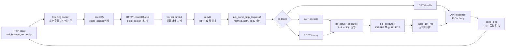
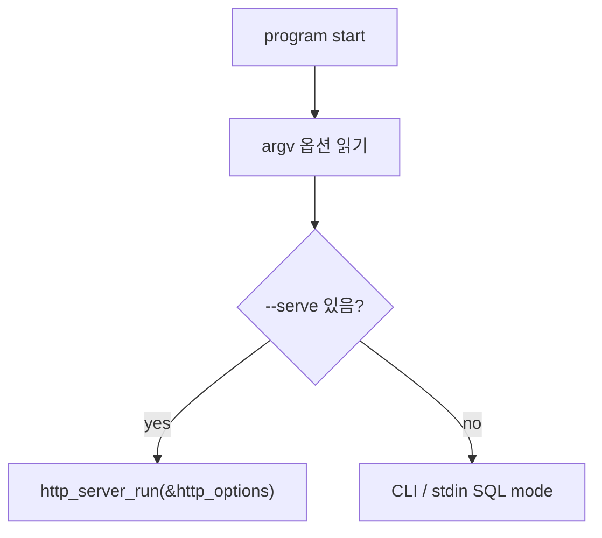
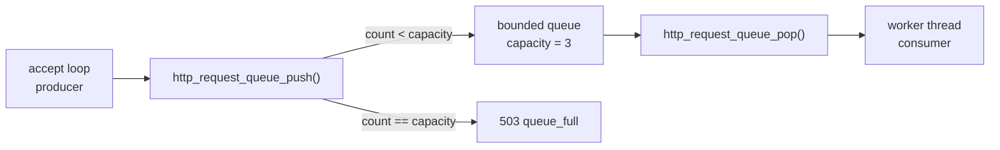
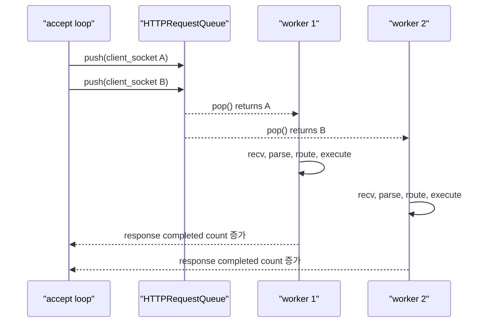
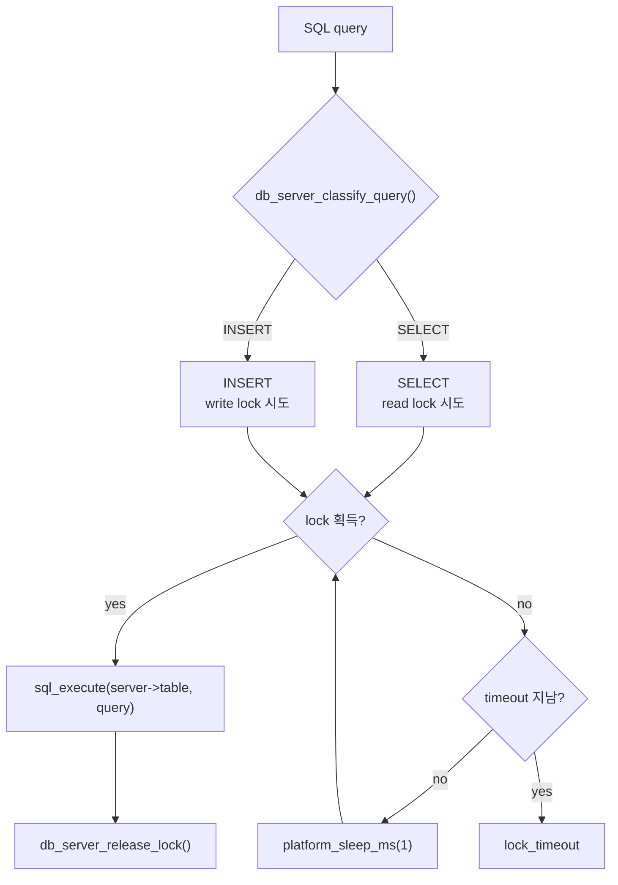
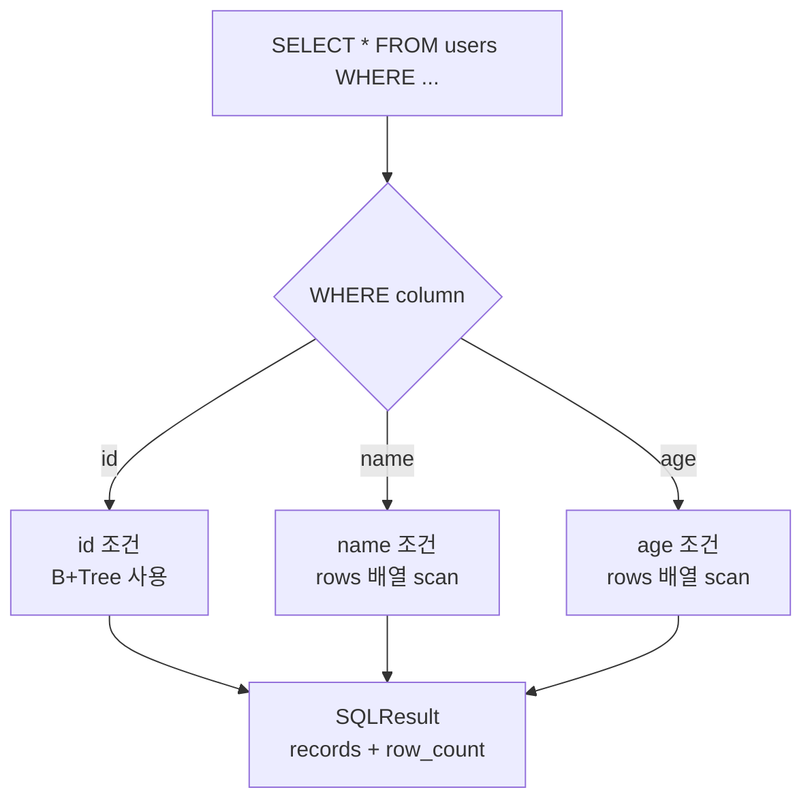
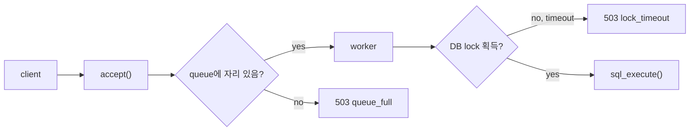
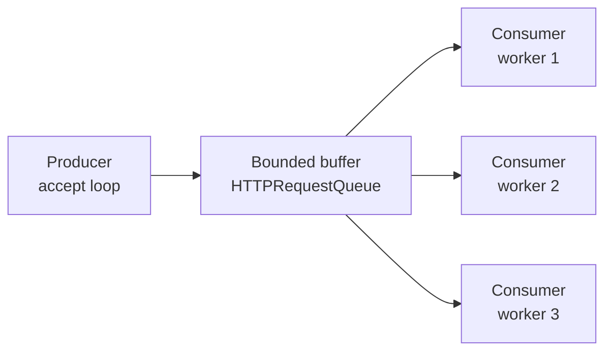
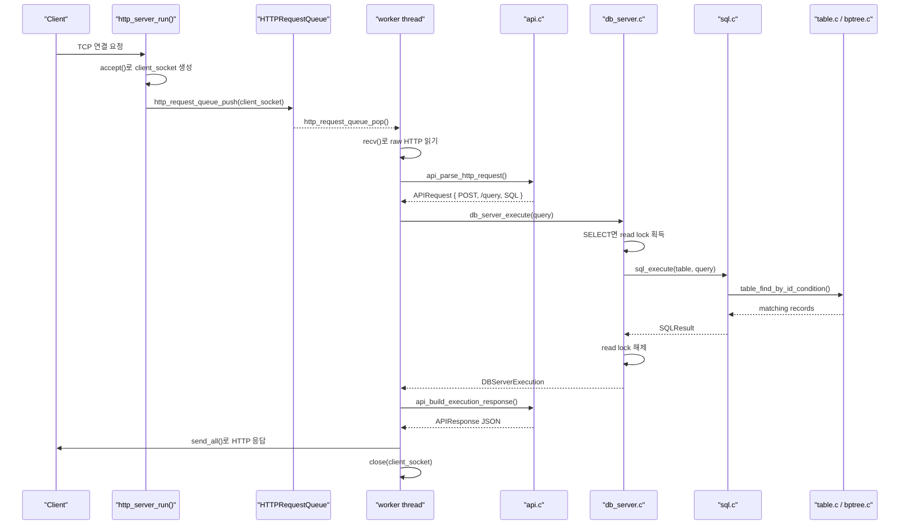
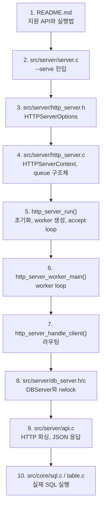

# HTTP API 서버, 요청 큐, worker thread, read/write lock 초심자 가이드

이 문서는 현재 코드베이스를 C 언어와 CS 초심자의 눈높이에 맞춰 해석한 설명서다.

중심 키워드는 네 가지다.

- HTTP API 서버
- 요청 큐
- worker thread
- read/write lock

한 줄로 요약하면, 이 프로젝트는 **HTTP로 들어온 SQL 요청을 줄 세운 뒤 worker thread가 처리하고, 공유 테이블은 read/write lock으로 보호하는 미니 DB API 서버**다.

## 1. 먼저 전체 그림부터 보기

현재 프로젝트는 크게 세 층으로 나눌 수 있다.

```text
src/core/      SQL 파싱, SQL 실행, Table, B+Tree
src/server/    HTTP 서버, 요청 큐, worker thread, lock, JSON 응답
src/cli/       기존 터미널 REPL 진입점
```

서버 모드에서 요청 하나가 처리되는 흐름은 아래와 같다.



중요한 점이 하나 있다.

`HTTPRequestQueue`라는 이름 때문에 "파싱된 HTTP 요청 객체가 큐에 들어간다"고 생각하기 쉽지만, 실제로 큐에 들어가는 것은 `client_socket`이다. worker thread가 나중에 이 소켓을 꺼내서 `recv()`로 HTTP 요청을 읽는다.

## 2. 파일별 역할 지도

처음부터 `http_server.c`를 정독하면 어렵다. 아래처럼 역할을 나누어 보면 훨씬 쉽다.

| 파일 | 초심자용 역할 설명 | 핵심 함수/구조체 |
|---|---|---|
| `src/server/server.c` | 프로그램 시작점. CLI 모드인지 HTTP 서버 모드인지 고른다. | `main()`, `--serve`, `http_server_run()` |
| `src/server/http_server.h` | HTTP 서버 설정값의 모양을 정의한다. | `HTTPServerOptions` |
| `src/server/http_server.c` | 소켓, 요청 큐, worker thread, 응답 전송을 담당한다. | `HTTPRequestQueue`, `HTTPServerContext`, `http_server_run()` |
| `src/server/api.h` | HTTP 요청/응답 구조체를 정의한다. | `APIRequest`, `APIResponse` |
| `src/server/api.c` | HTTP 문자열을 파싱하고 JSON 응답을 만든다. | `api_parse_http_request()`, `api_render_http_response()` |
| `src/server/db_server.h` | 공유 DB 서버 상태의 모양을 정의한다. | `DBServer`, `DBServerMetrics`, `DBServerExecution` |
| `src/server/db_server.c` | SQL 실행 전후로 lock과 metrics를 관리한다. | `db_server_execute()` |
| `src/server/platform.h/c` | Windows와 POSIX의 thread/lock API 차이를 감춘다. | `PlatformMutex`, `PlatformCond`, `PlatformRWLock`, `PlatformThread` |
| `src/core/sql.c` | SQL 문자열을 파싱하고 실행한다. | `sql_execute()` |
| `src/core/table.c` | `users` 테이블에 row를 넣고 찾는다. | `table_insert()`, `table_find_by_id_condition()` |

## 3. 실행 시작점: `--serve`를 만나면 서버가 된다

HTTP 서버는 `src/server/server.c`의 `main()`에서 시작한다.

초심자 관점에서는 아래 코드 흐름만 먼저 보면 된다.

```c
/* src/server/server.c */

int main(int argc, char **argv) {
    HTTPServerOptions http_options;
    int serve_mode = 0;

    http_server_options_default(&http_options);

    /* argv를 돌면서 --serve, --port, --workers, --queue 같은 옵션을 읽는다. */
    for (index = 1; index < argc; index++) {
        if (strcmp(argv[index], "--serve") == 0) {
            serve_mode = 1;
            continue;
        }

        /* --workers 4 처럼 worker 개수를 설정한다. */
        /* --queue 16 처럼 queue 크기를 설정한다. */
    }

    if (serve_mode) {
        return http_server_run(&http_options);
    }

    /* --serve가 아니면 CLI SQL 하네스 모드로 동작한다. */
}
```

즉, `./build/bin/server --serve --port 8080 --workers 4 --queue 16`처럼 실행하면 서버 모드로 들어간다.



## 4. HTTP 서버 설정값: `HTTPServerOptions`

`src/server/http_server.h`에는 HTTP 서버를 켤 때 필요한 설정값이 모여 있다.

```c
typedef struct HTTPServerOptions {
    unsigned short port;                  /* 서버가 열 포트 번호 */
    size_t worker_count;                  /* worker thread 개수 */
    size_t queue_capacity;                /* 요청 큐에 쌓을 수 있는 최대 소켓 수 */
    unsigned int lock_timeout_ms;         /* DB lock을 기다릴 최대 시간 */
    unsigned int simulate_read_delay_ms;  /* 테스트용 SELECT 지연 */
    unsigned int simulate_write_delay_ms; /* 테스트용 INSERT 지연 */
    unsigned int max_requests;            /* 테스트용 최대 응답 수 */
} HTTPServerOptions;
```

기본값은 `http_server_options_default()`에서 정한다.

| 필드 | 기본값 | 의미 |
|---|---:|---|
| `port` | `8080` | 서버가 열 TCP 포트 |
| `worker_count` | `4` | 동시에 일할 worker thread 수 |
| `queue_capacity` | `16` | worker가 바쁠 때 대기시킬 연결 수 |
| `lock_timeout_ms` | `1000` | DB lock을 최대 1초 기다림 |
| `simulate_read_delay_ms` | `0` | 테스트용 read 지연 없음 |
| `simulate_write_delay_ms` | `0` | 테스트용 write 지연 없음 |
| `max_requests` | `0` | 요청 수로 자동 종료하지 않음 |

## 5. HTTP 서버의 공유 상태: `HTTPServerContext`

`http_server_run()`이 실행되면 서버 전체가 함께 쓰는 상태가 만들어진다.

```c
typedef struct HTTPServerContext {
    DBServer db_server;              /* 공유 Table, rwlock, metrics */
    HTTPServerOptions options;       /* port, workers, queue 크기 등 */
    HTTPRequestQueue queue;          /* accept된 client_socket 대기열 */
    PlatformThread *workers;         /* worker thread 배열 */
    PlatformMutex state_mutex;       /* completed_responses 보호용 mutex */
    unsigned long long completed_responses;
} HTTPServerContext;
```

이 구조체는 "서버 운영 본부"처럼 생각하면 된다.

- `db_server`: 실제 SQL이 접근할 공유 DB
- `queue`: 처리 대기 중인 `client_socket` 줄
- `workers`: 줄에서 소켓을 꺼내 일하는 thread들
- `state_mutex`: 서버 종료 조건 같은 작은 공유 상태를 보호하는 lock

## 6. 소켓: 서버의 문과 클라이언트별 통로

HTTP 서버에서는 소켓이 두 종류로 등장한다.

| 이름 | 역할 | 비유 |
|---|---|---|
| `listen_socket` | 새 클라이언트 연결을 기다리는 서버용 소켓 | 가게 입구 |
| `client_socket` | 클라이언트 한 명과 실제로 대화하는 소켓 | 손님별 대화 창구 |

`http_server_create_listen_socket()`은 `listen_socket`을 만든다.

```c
static HTTPSocket http_server_create_listen_socket(unsigned short port) {
    HTTPSocket listen_socket;
    struct sockaddr_in address;

    listen_socket = socket(AF_INET, SOCK_STREAM, 0);

    /* 포트 재사용 옵션. 서버 재시작 때 포트가 덜 막히게 한다. */
    setsockopt(listen_socket, SOL_SOCKET, SO_REUSEADDR, ...);

    /* 이 서버가 어떤 주소와 포트에서 기다릴지 설정한다. */
    address.sin_family = AF_INET;
    address.sin_addr.s_addr = htonl(INADDR_ANY);
    address.sin_port = htons(port);

    bind(listen_socket, (struct sockaddr *)&address, sizeof(address));

    /* 이제 이 소켓은 새 연결을 기다리는 listening socket이 된다. */
    listen(listen_socket, 16);

    return listen_socket;
}
```

그 다음 `http_server_run()`의 accept loop가 새 연결을 받는다.

```c
while (!http_server_should_stop()) {
    int ready = http_server_socket_wait_for_read(listen_socket, 200);

    if (ready > 0) {
        HTTPSocket client_socket = accept(listen_socket, NULL, NULL);

        if (!http_request_queue_push(&context.queue, client_socket)) {
            /* 큐가 꽉 차면 worker에게 넘기지 못하고 바로 503을 보낸다. */
            db_server_record_queue_full(&context.db_server);
            http_server_send_error_and_count(
                &context,
                client_socket,
                503,
                "queue_full",
                "Worker queue is full"
            );
            http_server_socket_close(client_socket);
        }
    }
}
```

여기서 `accept()`가 만든 `client_socket`이 큐에 들어간다.

## 7. 요청 큐: bounded queue

요청 큐의 실제 구조는 아래와 같다.

```c
typedef struct HTTPRequestQueue {
    HTTPSocket *items;       /* client_socket 배열 */
    size_t head;             /* 다음에 꺼낼 위치 */
    size_t tail;             /* 다음에 넣을 위치 */
    size_t count;            /* 현재 큐에 들어 있는 개수 */
    size_t capacity;         /* 최대 저장 가능 개수 */
    int shutting_down;       /* 종료 중인지 표시 */
    PlatformMutex mutex;     /* 큐 상태 보호용 lock */
    PlatformCond cond;       /* worker를 깨우는 condition variable */
} HTTPRequestQueue;
```

이 큐는 "bounded queue"다. bounded는 "크기가 제한된"이라는 뜻이다.

예를 들어 `--queue 3`이라면 최대 3개의 `client_socket`만 기다릴 수 있다.



### 7.1. 큐에 넣기: `http_request_queue_push()`

```c
static int http_request_queue_push(HTTPRequestQueue *queue, HTTPSocket client_socket) {
    int pushed = 0;

    platform_mutex_lock(&queue->mutex);

    if (!queue->shutting_down && queue->count < queue->capacity) {
        queue->items[queue->tail] = client_socket;
        queue->tail = (queue->tail + 1U) % queue->capacity;
        queue->count++;
        pushed = 1;

        /* 잠자던 worker 하나를 깨운다. */
        platform_cond_signal(&queue->cond);
    }

    platform_mutex_unlock(&queue->mutex);
    return pushed;
}
```

초심자가 주목할 부분은 세 가지다.

- `mutex`를 잡고 `head`, `tail`, `count`를 바꾼다.
- `tail = (tail + 1) % capacity`라서 배열 끝에 도달하면 다시 0으로 돌아간다.
- 새 일이 들어오면 `platform_cond_signal()`로 worker를 깨운다.

### 7.2. 큐에서 꺼내기: `http_request_queue_pop()`

```c
static HTTPSocket http_request_queue_pop(HTTPRequestQueue *queue) {
    HTTPSocket client_socket = HTTP_INVALID_SOCKET;

    platform_mutex_lock(&queue->mutex);

    while (queue->count == 0 && !queue->shutting_down) {
        /* 큐가 비어 있으면 worker는 여기서 잠든다. */
        platform_cond_wait(&queue->cond, &queue->mutex);
    }

    if (queue->count > 0) {
        client_socket = queue->items[queue->head];
        queue->head = (queue->head + 1U) % queue->capacity;
        queue->count--;
    }

    platform_mutex_unlock(&queue->mutex);
    return client_socket;
}
```

`while`로 기다리는 이유도 중요하다. condition variable은 "깨어났다"와 "정말 일이 있다"가 항상 같은 뜻은 아니다. 그래서 깨어난 뒤에도 `queue->count == 0`인지 다시 확인한다.

## 8. worker thread: 큐에서 일을 꺼내는 실행 흐름

worker thread는 `http_server_run()`에서 여러 개 만들어진다.

```c
for (worker_index = 0; worker_index < effective_options.worker_count; worker_index++) {
    platform_thread_create(
        &context.workers[worker_index],
        http_server_worker_main,
        &context
    );
}
```

모든 worker는 같은 함수에서 시작한다.

```c
static void *http_server_worker_main(void *raw_context) {
    HTTPServerContext *context = (HTTPServerContext *)raw_context;

    while (1) {
        HTTPSocket client_socket = http_request_queue_pop(&context->queue);

        if (client_socket == HTTP_INVALID_SOCKET) {
            if (http_server_should_stop() || context->queue.shutting_down) {
                break;
            }
            continue;
        }

        http_server_handle_client(context, client_socket);
        http_server_socket_close(client_socket);
    }

    return NULL;
}
```

worker가 하는 일은 단순하게 말하면 아래 순서다.

1. 큐에서 `client_socket`을 꺼낸다.
2. `http_server_handle_client()`로 요청을 처리한다.
3. 응답을 보낸 뒤 `client_socket`을 닫는다.
4. 다시 큐에서 다음 일을 기다린다.



## 9. worker가 실제 요청을 처리하는 곳

`http_server_handle_client()`는 worker가 꺼낸 `client_socket` 하나를 처리한다.

핵심 흐름은 아래처럼 읽으면 된다.

```c
static void http_server_handle_client(HTTPServerContext *context, HTTPSocket client_socket) {
    APIRequest request;
    APIResponse response;
    DBServerExecution execution;
    char request_buffer[HTTP_SERVER_REQUEST_BUFFER_SIZE];

    /* 1. socket에서 raw HTTP 요청을 읽는다. */
    http_server_read_request(client_socket, request_buffer, sizeof(request_buffer), ...);

    /* 2. raw HTTP 문자열을 APIRequest 구조체로 바꾼다. */
    api_parse_http_request(request_buffer, &request, ...);

    /* 3. path와 method에 따라 라우팅한다. */
    if (request.method == API_METHOD_GET && strcmp(request.path, "/health") == 0) {
        api_build_health_response(&response);
        http_server_send_response(client_socket, &response);
        return;
    }

    if (request.method == API_METHOD_GET && strcmp(request.path, "/metrics") == 0) {
        db_server_get_metrics(&context->db_server, &metrics);
        api_build_metrics_response(&metrics, &response);
        http_server_send_response(client_socket, &response);
        return;
    }

    if (request.method == API_METHOD_POST && strcmp(request.path, "/query") == 0) {
        db_server_execute(&context->db_server, request.query, &execution);
        api_build_execution_response(&execution, &response);
        http_server_send_response(client_socket, &response);
        return;
    }
}
```

초심자용으로 말하면, `http_server_handle_client()`는 아래 세 질문에 답한다.

- 요청을 읽을 수 있는가?
- 이 요청은 `/health`, `/metrics`, `/query` 중 무엇인가?
- 그 결과를 어떤 JSON HTTP 응답으로 보낼 것인가?

## 10. API 계층: HTTP 문자열과 C 구조체 사이의 번역기

HTTP 요청은 원래 그냥 문자열이다.

예를 들어 `POST /query` 요청은 대략 이렇게 들어온다.

```http
POST /query HTTP/1.1
Host: 127.0.0.1:8080
Content-Type: application/json
Content-Length: 55

{"query":"INSERT INTO users VALUES ('Alice', 20);"}
```

`api_parse_http_request()`는 이 문자열을 `APIRequest`로 바꾼다.

```c
typedef struct APIRequest {
    APIRequestMethod method; /* GET, POST, UNKNOWN */
    char path[64];           /* /health, /metrics, /query */
    char query[1024];        /* POST /query의 SQL 문자열 */
    size_t content_length;   /* HTTP body 길이 */
} APIRequest;
```

응답은 `APIResponse`로 표현한다.

```c
typedef struct APIResponse {
    int status_code;          /* 200, 400, 404, 503 등 */
    const char *content_type; /* application/json; charset=utf-8 */
    char *body;               /* JSON 문자열. heap에 할당될 수 있음 */
} APIResponse;
```

그리고 `api_render_http_response()`가 실제 HTTP 응답 문자열을 만든다.

```http
HTTP/1.1 200 OK
Content-Type: application/json; charset=utf-8
Content-Length: 45
Connection: close

{"ok":true,"status":"healthy"}
```

## 11. DBServer: 공유 테이블을 안전하게 감싸는 문

서버에서는 여러 worker가 동시에 `POST /query`를 처리할 수 있다.

그러면 모든 worker가 같은 `users` 테이블을 건드리게 된다. 이때 아무 보호 없이 동시에 접근하면 문제가 생길 수 있다.

예를 들어 두 worker가 동시에 `INSERT`를 하면:

- 둘 다 같은 `next_id`를 읽을 수 있다.
- 한 worker가 `rows` 배열을 늘리는 중에 다른 worker가 읽을 수 있다.
- B+Tree가 split되는 중간 상태를 다른 thread가 볼 수 있다.

이 문제를 막기 위해 `DBServer`가 있다.

```c
typedef struct DBServer {
    Table *table;                /* 실제 users 테이블 */
    PlatformRWLock db_lock;      /* SELECT/INSERT 보호용 read/write lock */
    PlatformMutex metrics_mutex; /* metrics 숫자 보호용 mutex */
    DBServerConfig config;       /* timeout, 테스트 지연 */
    DBServerMetrics metrics;     /* 요청 수, 에러 수 등 */
} DBServer;
```

핵심 설계는 이것이다.

> `src/core/`는 lock을 모른다. `src/server/db_server.c`가 SQL 실행 입구에서만 lock을 잡는다.

이 설계 덕분에 SQL 엔진은 단순하게 유지되고, 서버 동시성 정책은 `db_server_execute()`에 모인다.

## 12. read/write lock: 읽기는 같이, 쓰기는 혼자

read/write lock은 mutex보다 조금 더 똑똑한 lock이다.

| 상황 | 허용 여부 | 이유 |
|---|---|---|
| `SELECT` + `SELECT` | 동시에 가능 | 둘 다 읽기만 하므로 데이터 구조를 바꾸지 않는다. |
| `SELECT` + `INSERT` | 동시에 불가 | 읽는 중에 쓰기가 구조를 바꾸면 중간 상태를 볼 수 있다. |
| `INSERT` + `INSERT` | 동시에 불가 | 둘 다 `rows`, `next_id`, B+Tree를 바꾼다. |

이 프로젝트에서는 `SELECT`를 read, `INSERT`를 write로 분류한다.

```c
static DBServerQueryKind db_server_classify_query(const char *query) {
    const char *cursor = query;

    db_server_skip_spaces(&cursor);
    if (db_server_match_keyword(&cursor, "SELECT")) {
        return DB_SERVER_QUERY_KIND_READ;
    }

    cursor = query;
    db_server_skip_spaces(&cursor);
    if (db_server_match_keyword(&cursor, "INSERT")) {
        return DB_SERVER_QUERY_KIND_WRITE;
    }

    return DB_SERVER_QUERY_KIND_NONE;
}
```

그 다음 SQL 종류에 맞는 lock을 시도한다.

```c
static int db_server_try_acquire_lock(DBServer *server, DBServerQueryKind query_kind) {
    unsigned long long start_time = platform_now_millis();

    while (1) {
        if (query_kind == DB_SERVER_QUERY_KIND_WRITE) {
            if (platform_rwlock_try_write_lock(&server->db_lock)) {
                return 1;
            }
        } else {
            if (platform_rwlock_try_read_lock(&server->db_lock)) {
                return 1;
            }
        }

        if (server->config.lock_timeout_ms > 0 &&
            platform_now_millis() - start_time >= server->config.lock_timeout_ms) {
            return 0;
        }

        platform_sleep_ms(1);
    }
}
```

이 함수는 "당장 lock을 못 잡으면 1ms 쉬고 다시 시도"한다. 너무 오래 기다리면 실패로 처리한다.



## 13. `db_server_execute()` 전체 흐름

`db_server_execute()`는 서버에서 SQL을 실행하는 정문이다.

```c
int db_server_execute(DBServer *server, const char *query, DBServerExecution *execution) {
    DBServerQueryKind query_kind;

    db_server_zero_execution(execution);

    /* 1. SELECT인지 INSERT인지 분류한다. */
    query_kind = db_server_classify_query(query);

    /* 2. metrics를 먼저 올린다. */
    db_server_metrics_query_started(server, query_kind);

    /* 3. read lock 또는 write lock을 잡는다. */
    if (!db_server_try_acquire_lock(server, query_kind)) {
        execution->server_status = DB_SERVER_EXEC_STATUS_LOCK_TIMEOUT;
        snprintf(execution->message, sizeof(execution->message), "Lock wait timeout exceeded");
        db_server_metrics_query_finished(server, execution);
        return 1;
    }

    /* 4. 테스트용 지연이 있으면 lock을 잡은 상태에서 잠깐 쉰다. */
    db_server_apply_simulated_delay(server, query_kind);

    /* 5. 실제 SQL 엔진을 호출한다. */
    execution->result = sql_execute(server->table, query);

    /* 6. lock을 해제하고 metrics를 마무리한다. */
    db_server_release_lock(server, query_kind);
    db_server_metrics_query_finished(server, execution);
    return 1;
}
```

초심자가 반드시 기억할 점:

- `sql_execute()` 자체는 thread-safe하게 lock을 잡지 않는다.
- `db_server_execute()`가 lock을 잡은 뒤 `sql_execute()`를 호출한다.
- 그래서 HTTP 서버에서는 `db_server_execute()`를 거쳐야 안전하다.

## 14. SQL 엔진과 Table은 어떤 일을 하나

서버 동시성만 보면 `src/core/`가 멀게 느껴질 수 있지만, 실제 데이터 처리는 여기에 있다.

### 14.1. INSERT

`INSERT INTO users VALUES ('Alice', 20);`가 들어오면 `sql_execute_insert()`가 문자열을 파싱한 뒤 `table_insert()`를 부른다.

```c
Record *table_insert(Table *table, const char *name, int age) {
    Record *record;

    table_ensure_capacity(table);

    record = (Record *)calloc(1, sizeof(Record));

    record->id = table->next_id++;
    strncpy(record->name, name, RECORD_NAME_SIZE - 1);
    record->age = age;

    table->rows[table->size] = record;

    /* id로 빠르게 찾기 위해 B+Tree에도 넣는다. */
    bptree_insert(table->pk_index, record->id, record);

    table->size++;
    return record;
}
```

이 함수는 `rows`, `next_id`, `pk_index`, `size`를 바꾼다. 그래서 write lock이 필요하다.

### 14.2. SELECT

`SELECT * FROM users WHERE id = 1;` 같은 요청은 `sql_execute_select()`에서 파싱한 뒤 `table_find_by_id_condition()`으로 간다.

```c
if (strcasecmp(column, "id") == 0) {
    sql_parse_int(&cursor, &int_value);

    table_find_by_id_condition(
        table,
        comparison,
        int_value,
        &result.records,
        &result.row_count
    );
}
```

`id` 조건은 B+Tree를 사용한다.

`name`, `age` 조건은 배열을 처음부터 끝까지 훑는 linear scan을 사용한다.



## 15. `queue_full`과 `lock_timeout`은 다르다

둘 다 HTTP `503`으로 내려올 수 있어서 헷갈리기 쉽다. 하지만 병목 위치가 다르다.

| 오류 | 발생 위치 | 쉬운 설명 |
|---|---|---|
| `queue_full` | `accept()` 직후, worker에게 넘기기 전 | "대기줄이 꽉 차서 줄도 못 섰다." |
| `lock_timeout` | worker가 `/query`를 처리하며 DB lock을 기다릴 때 | "일꾼은 잡혔지만 DB 문 앞에서 너무 오래 기다렸다." |



## 16. metrics: 서버가 스스로 세는 숫자

`DBServerMetrics`는 서버가 처리한 요청 수와 오류 수를 저장한다.

```c
typedef struct DBServerMetrics {
    unsigned long long total_requests;
    unsigned long long total_health_requests;
    unsigned long long total_metrics_requests;
    unsigned long long total_query_requests;
    unsigned long long total_select_requests;
    unsigned long long total_insert_requests;
    unsigned long long total_errors;
    unsigned long long total_queue_full;
    unsigned long long total_lock_timeouts;
    unsigned long long active_query_requests;
} DBServerMetrics;
```

metrics도 여러 worker가 동시에 바꿀 수 있다. 그래서 `metrics_mutex`로 보호한다.

```c
void db_server_record_health_request(DBServer *server) {
    platform_mutex_lock(&server->metrics_mutex);
    server->metrics.total_requests++;
    server->metrics.total_health_requests++;
    platform_mutex_unlock(&server->metrics_mutex);
}
```

여기서는 read/write lock이 아니라 일반 mutex를 쓴다. 단순 숫자 몇 개를 바꿀 때는 "한 번에 한 thread만"이면 충분하기 때문이다.

## 17. `platform.h/c`: OS 차이를 숨기는 얇은 포장지

POSIX 계열에서는 `pthread_mutex_t`, `pthread_cond_t`, `pthread_rwlock_t`, `pthread_t`를 사용한다.

Windows에서는 `CRITICAL_SECTION`, `CONDITION_VARIABLE`, `HANDLE` 등을 사용한다.

이 차이를 코드 곳곳에 직접 쓰면 서버 코드가 지저분해진다. 그래서 `platform.h`가 공통 이름을 제공한다.

```c
#ifdef _WIN32
typedef CRITICAL_SECTION PlatformMutex;
typedef CONDITION_VARIABLE PlatformCond;
typedef struct PlatformRWLock {
    PlatformMutex mutex;
    unsigned long readers;
    int writer;
} PlatformRWLock;
typedef HANDLE PlatformThread;
#else
typedef pthread_mutex_t PlatformMutex;
typedef pthread_cond_t PlatformCond;
typedef pthread_rwlock_t PlatformRWLock;
typedef pthread_t PlatformThread;
#endif
```

서버 코드는 `pthread_create()`인지 `_beginthreadex()`인지 몰라도 된다.

```c
platform_thread_create(&context.workers[i], http_server_worker_main, &context);
platform_mutex_lock(&queue->mutex);
platform_cond_wait(&queue->cond, &queue->mutex);
platform_rwlock_try_read_lock(&server->db_lock);
```

초심자용 표현으로는, `platform.c`는 "운영체제별 다른 명령어를 같은 이름으로 부르게 해주는 번역층"이다.

## 18. producer-consumer 관점으로 다시 보기

요청 큐와 worker thread는 대표적인 producer-consumer 구조다.

| 역할 | 이 코드에서 누구인가 | 하는 일 |
|---|---|---|
| Producer | accept loop | 새 `client_socket`을 만들어 큐에 넣는다. |
| Buffer | `HTTPRequestQueue` | worker가 처리하기 전까지 소켓을 보관한다. |
| Consumer | worker thread | 큐에서 소켓을 꺼내 HTTP 요청을 처리한다. |



이 구조의 장점:

- `accept()`는 빠르게 새 연결을 받아 큐에 넣고 돌아올 수 있다.
- worker 수를 늘리면 동시에 처리할 수 있는 요청 수가 늘어난다.
- queue 크기를 제한해서 서버가 무한히 메모리를 쓰지 않게 한다.

이 구조의 단점:

- worker가 모두 바쁘고 큐가 꽉 차면 `queue_full`이 난다.
- worker 수를 무작정 늘려도 DB write lock 때문에 `INSERT`는 결국 한 번에 하나만 실행된다.

## 19. 전체 요청 시퀀스: `POST /query`

아래는 `POST /query` 하나가 들어와 `SELECT`를 실행하는 흐름이다.



## 20. 초심자가 헷갈리기 쉬운 포인트

### 20.1. `HTTPRequestQueue`는 완성된 요청 큐가 아니다

이 큐에는 `APIRequest`가 아니라 `HTTPSocket`이 들어간다.

즉, HTTP 요청을 읽고 파싱하는 일은 worker가 큐에서 소켓을 꺼낸 뒤에 한다.

### 20.2. `src/core/`는 lock을 직접 잡지 않는다

`table_insert()`나 `sql_execute()` 안에는 `platform_rwlock_*` 호출이 없다.

서버에서는 반드시 `db_server_execute()`를 통해 들어가야 lock 보호를 받는다.

### 20.3. JSON 응답 생성은 DB lock 밖에서 일어난다

`db_server_execute()`는 SQL 실행이 끝나면 lock을 해제한다. 그 뒤 `api_build_execution_response()`가 JSON 문자열을 만든다.

현재는 `UPDATE`나 `DELETE`가 없고, `Record` 내용이 삽입 후 바뀌지 않기 때문에 설명하기에는 괜찮다. 나중에 row 수정/삭제 기능이 생기면 결과 객체가 가리키는 `Record *`의 생명주기를 더 조심해야 한다.

### 20.4. `usedIndex`는 실제 실행 추적이 아니라 추정에 가깝다

`db_server_guess_uses_index()`는 SQL 문자열에서 `SELECT ... WHERE id ...` 형태를 보고 `usedIndex`를 추정한다.

따라서 문서에서는 "실제 런타임 프로파일러가 인덱스 사용을 측정한다"라고 말하면 안 된다. 이 프로젝트의 현재 SQL 실행 규칙상 `id` 조건은 B+Tree 경로로 가기 때문에 그 사실을 응답에 표시하는 정도로 이해하면 된다.

### 20.5. read/write lock은 공정성을 자동 보장한다는 뜻이 아니다

POSIX에서는 `pthread_rwlock_t`를 사용하고, Windows 쪽은 직접 만든 간단한 wrapper를 사용한다.

그러므로 "항상 모든 reader/writer가 공평한 순서로 실행된다"라고 설명하면 부정확할 수 있다. 이 프로젝트에서 핵심은 공정성보다 "읽기 여러 개는 허용, 쓰기는 단독 실행"이라는 보호 규칙이다.

## 21. 코드 읽기 추천 순서

처음 읽는다면 아래 순서를 추천한다.



## 22. 발표나 코드 리뷰에서 쓰기 좋은 설명

아래 문장은 현재 코드베이스를 짧게 설명할 때 쓸 수 있다.

> 이 서버는 `accept()`로 새 TCP 연결을 받은 뒤, 그 `client_socket`을 bounded queue에 넣습니다. worker thread들은 큐에서 소켓을 꺼내 HTTP 요청을 읽고, `/query`라면 `db_server_execute()`를 통해 SQL을 실행합니다. 공유 `Table`은 `DBServer` 안의 read/write lock으로 보호해서 `SELECT`는 여러 개가 동시에 가능하고, `INSERT`는 단독으로 실행되게 합니다.

조금 더 초심자 친화적으로는 이렇게 말할 수 있다.

> 손님이 오면 입구 직원이 번호표를 뽑아 대기줄에 넣고, 여러 직원(worker)이 번호표를 하나씩 가져가 주문을 처리합니다. 주문이 DB를 읽는 일이면 여러 직원이 동시에 볼 수 있지만, DB에 새 데이터를 쓰는 일은 한 직원만 들어가게 문을 잠급니다.

## 23. 핵심 변수와 구조체 빠른 사전

| 이름 | 종류 | 위치 | 뜻 |
|---|---|---|---|
| `HTTPServerOptions` | struct | `http_server.h` | 서버 실행 옵션 |
| `HTTPServerContext` | struct | `http_server.c` | 서버 전체 공유 상태 |
| `HTTPRequestQueue` | struct | `http_server.c` | 대기 중인 `client_socket` 큐 |
| `HTTPSocket` | typedef | `http_server.c` | Windows/POSIX 소켓 타입 통합 이름 |
| `HTTP_INVALID_SOCKET` | macro | `http_server.c` | 잘못된 소켓 값 |
| `client_socket` | local variable | `http_server.c` | 클라이언트 한 명과 통신하는 소켓 |
| `listen_socket` | local variable | `http_server.c` | 새 연결을 기다리는 서버 소켓 |
| `workers` | field | `HTTPServerContext` | worker thread 배열 |
| `state_mutex` | field | `HTTPServerContext` | 완료 응답 수 보호용 mutex |
| `completed_responses` | field | `HTTPServerContext` | 처리 완료한 응답 수 |
| `DBServer` | struct | `db_server.h` | 공유 Table, lock, metrics 묶음 |
| `db_lock` | field | `DBServer` | SQL 실행 보호용 read/write lock |
| `metrics_mutex` | field | `DBServer` | metrics 보호용 mutex |
| `DBServerExecution` | struct | `db_server.h` | SQL 실행 결과와 서버 상태 |
| `DBServerMetrics` | struct | `db_server.h` | 요청 수, 에러 수 등 운영 지표 |
| `APIRequest` | struct | `api.h` | 파싱된 HTTP 요청 |
| `APIResponse` | struct | `api.h` | HTTP 응답으로 렌더링될 상태와 body |
| `SQLResult` | struct | `sql.h` | SQL 엔진 실행 결과 |
| `Table` | struct | `table.h` | in-memory `users` 테이블 |
| `Record` | struct | `table.h` | `users` row 하나 |

## 24. 마지막 체크포인트

이 문서를 읽고 아래 질문에 답할 수 있으면 전체 구조를 잘 잡은 것이다.

1. `--serve` 옵션은 어느 함수로 이어지는가?
2. `accept()`가 만든 것은 `listen_socket`인가, `client_socket`인가?
3. `HTTPRequestQueue`에는 HTTP 요청 본문이 들어가는가, 소켓이 들어가는가?
4. worker thread는 큐에서 무엇을 꺼내는가?
5. `/query` 요청은 어느 함수에서 DB lock을 잡는가?
6. `SELECT`와 `INSERT`는 각각 어떤 lock을 사용하는가?
7. `queue_full`과 `lock_timeout`은 어느 단계에서 발생하는가?
8. `src/core/`가 lock을 모르게 만든 이유는 무엇인가?

정답의 핵심은 아래 한 줄이다.

```text
accept loop는 client_socket을 큐에 넣고, worker는 소켓을 꺼내 HTTP를 처리하며, DBServer는 SQL 실행 전에 read/write lock으로 공유 Table을 보호한다.
```
