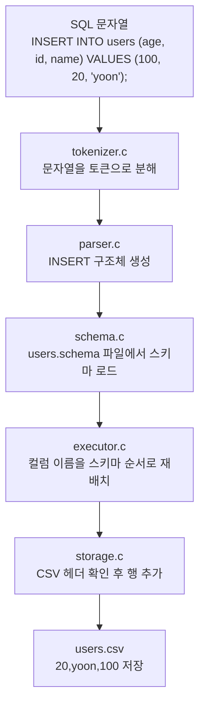
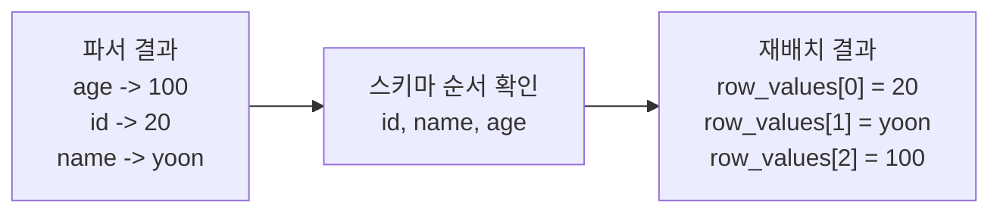
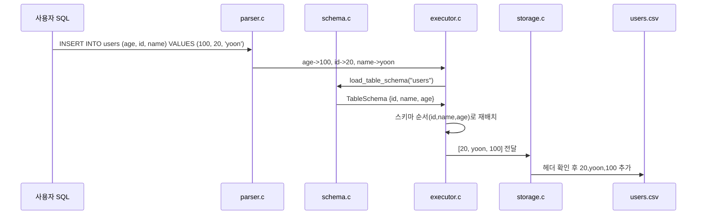

# INSERT 컬럼 순서가 스키마와 다를 때 어떻게 처리될까?

이 문서는 아래 SQL가 현재 코드베이스에서 어떻게 해석되고 처리되는지
초심자 기준으로 설명합니다.

```sql
INSERT INTO users (age, id, name) VALUES (100, 20, 'yoon');
```

핵심은 아주 단순합니다.

- 파서는 `age`, `id`, `name` 순서를 그대로 읽습니다.
- 실행기는 이 순서를 다시 스키마 순서로 맞춰 정렬합니다.
- 그래서 실제 CSV에 저장될 때는 `id,name,age` 순서로 들어갑니다.

예를 들어 스키마가 아래와 같다고 가정하겠습니다.

```text
id:int,name:string,age:int
```

그러면 위 SQL는 최종적으로 아래 한 줄로 저장됩니다.

```text
20,yoon,100
```

## 1. 전체 흐름



## 2. 파서가 하는 일

파서는 SQL를 읽을 때 컬럼 목록과 값 목록을 "쓴 순서 그대로" 저장합니다.

즉, 이 SQL:

```sql
INSERT INTO users (age, id, name) VALUES (100, 20, 'yoon');
```

는 파서 입장에서 대략 이렇게 읽힙니다.

```text
table_name = "users"
column_names[0] = "age"
column_names[1] = "id"
column_names[2] = "name"

values[0] = "100"
values[1] = "20"
values[2] = "yoon"
```

여기서 중요한 점은:

- 파서는 아직 CSV 저장 순서를 결정하지 않습니다.
- 파서는 단지 "몇 번째 컬럼 이름에 몇 번째 값이 대응하는가"만 유지합니다.

즉 이 단계의 의미는 아래와 같습니다.

```text
age  -> 100
id   -> 20
name -> yoon
```

관련 코드는 [parser.c](/Users/donghyunkim/Downloads/test_sql/week6-team5-sql/src/parser.c), 구조체 정의는 [sqlproc.h](/Users/donghyunkim/Downloads/test_sql/week6-team5-sql/include/sqlproc.h)에 있습니다.

## 3. 실행기가 하는 일

실행기에서는 먼저 `schema.c`의 `load_table_schema` 함수를 호출해 `users.schema` 파일을 읽습니다.
그런 다음 각 컬럼 이름이 스키마의 몇 번째 컬럼인지 찾습니다.

스키마:

```text
id:int,name:string,age:int
```

스키마 순서는 아래와 같습니다.

```text
0: id
1: name
2: age
```

그다음 실행기는 파서가 넘긴 쌍을 보고, 스키마 순서 배열에 다시 채워 넣습니다.



이 단계에서 내부적으로는 대략 이런 생각을 합니다.

1. `age`는 스키마의 2번 칸이네 -> `100`을 2번 위치에 넣기
2. `id`는 스키마의 0번 칸이네 -> `20`을 0번 위치에 넣기
3. `name`은 스키마의 1번 칸이네 -> `yoon`을 1번 위치에 넣기

그래서 최종 row 배열은:

```text
index 0 = 20
index 1 = yoon
index 2 = 100
```

가 됩니다.

이 역할을 하는 핵심 함수는 [executor.c](/Users/donghyunkim/Downloads/test_sql/week6-team5-sql/src/executor.c)의 `build_insert_row_values`입니다.

## 4. 스토리지가 하는 일

실행기가 스키마 순서로 정렬한 값을 만들면, 그 다음은 스토리지 계층이 처리합니다.

스토리지는 아래 일을 합니다.

- `users.csv` 경로를 만든다
- 파일이 이미 있으면: 첫 번째 줄(헤더)이 스키마와 일치하는지 검증한다
- 파일이 없으면: 새 파일을 만들고 스키마 기준 헤더를 기록한다
- 정렬된 한 줄을 CSV에 append 한다



핵심은 스토리지가 컬럼 이름 매칭을 다시 하지 않는다는 점입니다.

- 컬럼 이름 해석은 실행기의 책임입니다.
- 스토리지는 "이미 정렬된 한 줄"을 저장하는 책임에 집중합니다.

관련 코드는 [storage.c](/Users/donghyunkim/Downloads/test_sql/week6-team5-sql/src/storage.c)입니다.

## 5. 초심자가 헷갈리기 쉬운 포인트

### 5-1. SQL에 적은 컬럼 순서와 CSV 저장 순서는 다를 수 있습니다

아래 SQL의 컬럼 순서는:

```text
age, id, name
```

하지만 CSV 저장 순서는 스키마 기준이라:

```text
id, name, age
```

입니다.

그래도 값이 틀어지지 않는 이유는, 실행기가 컬럼 이름을 보고 정확한 위치로 옮기기 때문입니다.

### 5-2. 값은 "같은 위치의 컬럼 이름"과 짝을 이룹니다

이 SQL에서:

```sql
INSERT INTO users (age, id, name) VALUES (100, 20, 'yoon');
```

의 대응 관계는 다음과 같습니다.

```text
age  <-> 100
id   <-> 20
name <-> yoon
```

즉 값 `100`이 첫 번째라고 해서 무조건 `id`에 들어가는 것이 아닙니다.
첫 번째 컬럼 이름이 `age`였기 때문에 `100`은 `age` 값입니다.

### 5-3. 컬럼 수와 값 수는 같아야 합니다

예를 들어:

```sql
INSERT INTO users (age, id, name) VALUES (100, 20);
```

처럼 값이 하나 부족하면 파서 단계에서 실패합니다.

반대로 컬럼 이름은 3개인데 값이 4개여도 실패합니다.

### 5-4. 타입도 맞아야 합니다

스키마가:

```text
id:int,name:string,age:int
```

일 때 아래 SQL는 실패합니다.

```sql
INSERT INTO users (age, id, name) VALUES ('old', 20, 'yoon');
```

이유는 `age`가 `int`인데 `'old'`는 문자열이기 때문입니다.

## 6. 한 줄 요약

이 SQL:

```sql
INSERT INTO users (age, id, name) VALUES (100, 20, 'yoon');
```

는 현재 코드에서 이렇게 처리됩니다.

```text
1. 파서: age=100, id=20, name=yoon 으로 읽음
2. 실행기: 스키마 순서(id,name,age)로 재배치
3. 스토리지: 20,yoon,100 을 CSV에 저장
```

즉, "SQL에 적은 컬럼 순서"가 아니라 "스키마 순서"로 저장되지만,
컬럼 이름 매칭을 먼저 하기 때문에 의미는 정확하게 유지됩니다.
