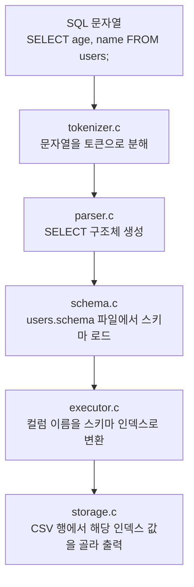
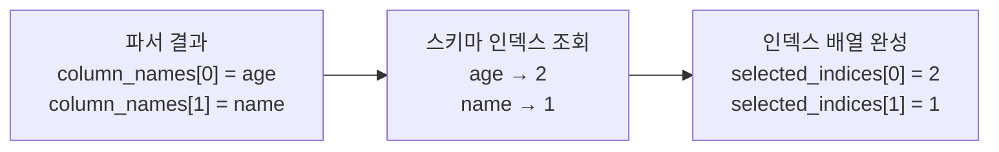
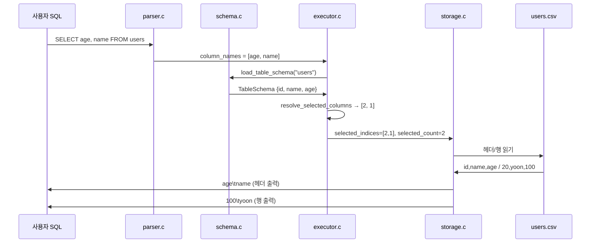

# SELECT 컬럼 순서가 스키마와 다를 때 어떻게 처리될까?

이 문서는 아래 SQL이 현재 코드베이스에서 어떻게 해석되고 처리되는지
초심자 기준으로 설명합니다.

```sql
SELECT age, name FROM users;
```

핵심은 아주 단순합니다.

- 파서는 `age`, `name` 순서를 그대로 읽습니다.
- 실행기는 각 컬럼 이름이 CSV의 몇 번째 칸인지를 스키마에서 찾습니다.
- 스토리지는 그 순서대로 값을 골라 출력합니다.
- 그래서 출력 순서는 **스키마 순서가 아니라 SQL에 적은 순서**가 됩니다.

예를 들어 스키마가 아래와 같고:

```text
id:int,name:string,age:int
```

CSV에 아래 행이 저장되어 있다고 가정하겠습니다.

```text
id,name,age        ← CSV 헤더 (스키마 순서)
20,yoon,100
```

그러면 위 SQL의 출력은 아래와 같습니다.

```text
age     name
100     yoon
```

INSERT와 달리 SELECT는 SQL에 적은 컬럼 순서 그대로 출력됩니다.

## 1. 전체 흐름



## 2. 파서가 하는 일

파서는 SQL을 읽을 때 컬럼 목록을 "쓴 순서 그대로" 저장합니다.

즉, 이 SQL:

```sql
SELECT age, name FROM users;
```

은 파서 입장에서 대략 이렇게 읽힙니다.

```text
table_name    = "users"
select_all    = 0
column_count  = 2
column_names[0] = "age"
column_names[1] = "name"
```

여기서 중요한 점은:

- 파서는 아직 CSV의 몇 번째 칸인지 알지 못합니다.
- 파서는 단지 "어떤 이름을, 어떤 순서로 원했는가"만 기록합니다.

`SELECT *` 를 쓰면 컬럼 목록 대신 `select_all = 1` 플래그 하나만 기록됩니다.
이때 "어떤 컬럼을 어떤 순서로"는 실행기가 스키마를 보고 결정합니다.

관련 코드는 [parser.c](/Users/donghyunkim/Downloads/test_sql/week6-team5-sql/src/parser.c), 구조체 정의는 [sqlproc.h](/Users/donghyunkim/Downloads/test_sql/week6-team5-sql/include/sqlproc.h)에 있습니다.

## 3. 실행기가 하는 일

실행기에서는 먼저 `schema.c`의 `load_table_schema` 함수를 호출해 `users.schema` 파일을 읽습니다.
그런 다음 `resolve_selected_columns` 함수가 파서가 넘긴 컬럼 이름 목록을 스키마 인덱스 배열로 변환합니다.

스키마:

```text
id:int,name:string,age:int
```

스키마 인덱스는 아래와 같습니다.

```text
0: id
1: name
2: age
```

이 상태에서 `SELECT age, name` 을 처리하면:



이 단계에서 내부적으로는 대략 이런 생각을 합니다.

1. `age`는 스키마의 2번 칸 → `selected_indices[0] = 2`
2. `name`은 스키마의 1번 칸 → `selected_indices[1] = 1`

결과적으로 스토리지에는 인덱스 배열 `[2, 1]`과 개수 `2`가 전달됩니다.

이 역할을 하는 핵심 함수는 [executor.c](/Users/donghyunkim/Downloads/test_sql/week6-team5-sql/src/executor.c)의 `resolve_selected_columns`입니다.

## 4. 스토리지가 하는 일

스토리지는 인덱스 배열을 받아 CSV 파일에서 그 위치의 값만 골라 출력합니다.



스토리지가 하는 일을 순서대로 나열하면 아래와 같습니다.

- `users.csv` 경로를 만든다
- 파일이 이미 있으면: 첫 번째 줄(헤더)이 스키마와 일치하는지 검증한다
- 파일이 없으면: 헤더만 출력하고 종료한다 (저장된 행이 없으므로)
- 헤더 줄을 `selected_indices` 순서로 출력한다
- 각 데이터 행을 읽으면서 `selected_indices` 위치의 값만 골라 출력한다

핵심은 스토리지가 컬럼 이름 해석을 하지 않는다는 점입니다.

- 어떤 컬럼을 어떤 순서로 출력할지는 실행기의 책임입니다.
- 스토리지는 "주어진 인덱스 순서로 값을 골라 출력"하는 책임에만 집중합니다.

관련 코드는 [storage.c](/Users/donghyunkim/Downloads/test_sql/week6-team5-sql/src/storage.c)의 `storage_print_rows`입니다.

## 5. 초심자가 헷갈리기 쉬운 포인트

### 5-1. 출력 순서는 SQL에 적은 순서입니다

INSERT는 스키마 순서로 저장하지만, SELECT는 **SQL에 적은 순서대로 출력**합니다.

스키마가 `id, name, age` 순서여도:

```sql
SELECT age, name FROM users;
```

를 실행하면 출력은 아래처럼 `age`가 먼저 나옵니다.

```text
age     name
100     yoon
```

이유는 실행기가 `selected_indices = [2, 1]`을 만들고, 스토리지가 이 순서 그대로 출력하기 때문입니다.

### 5-2. SELECT *는 스키마 순서로 출력됩니다

`SELECT *` 를 쓰면 `resolve_selected_columns`가 스키마 인덱스를 순서대로 채웁니다.

```text
selected_indices = [0, 1, 2]  ← id, name, age 순서
```

그래서 출력도 스키마와 같은 순서가 됩니다.

```sql
SELECT * FROM users;
```

```text
id      name    age
20      yoon    100
```

### 5-3. 스키마에 없는 컬럼을 지정하면 실패합니다

아래 SQL은 `email` 이라는 컬럼이 스키마에 없으므로 실행기 단계에서 실패합니다.

```sql
SELECT email FROM users;
```

`resolve_selected_columns` 안의 `find_schema_column`이 인덱스를 찾지 못해 -1을 반환하고,
실행기는 "SELECT 대상 컬럼이 스키마에 없습니다." 오류를 냅니다.

### 5-4. 데이터 파일이 없어도 헤더는 출력됩니다

아직 INSERT를 한 번도 하지 않아 `users.csv` 파일 자체가 없는 상태에서 SELECT를 실행하면:

- 스토리지가 파일 없음을 확인하고 헤더만 출력한 뒤 종료합니다.
- 오류가 아닙니다.

```sql
SELECT age, name FROM users;
```

```text
age     name
```

행은 없지만 컬럼 이름은 출력됩니다.

## 6. INSERT와 SELECT 비교

| 항목 | INSERT | SELECT |
|---|---|---|
| 컬럼 순서를 결정하는 것 | 스키마 순서 | SQL에 적은 순서 |
| 핵심 함수 | `build_insert_row_values` | `resolve_selected_columns` |
| 스토리지의 역할 | 정렬된 한 줄을 CSV에 저장 | 지정된 인덱스 값을 골라 출력 |
| SELECT * 해당 없음 | — | 스키마 순서 전체 출력 |

## 7. 한 줄 요약

이 SQL:

```sql
SELECT age, name FROM users;
```

은 현재 코드에서 이렇게 처리됩니다.

```text
1. 파서:    column_names = [age, name] 으로 읽음
2. 실행기:  스키마에서 age→2, name→1 을 찾아 selected_indices = [2, 1] 생성
3. 스토리지: 각 행에서 index 2(age), index 1(name) 순서로 골라 출력
```

즉, "스키마 순서"가 아니라 "SQL에 적은 컬럼 순서"로 출력되지만,
스키마 인덱스를 먼저 찾기 때문에 어떤 값이 어느 컬럼인지는 정확하게 유지됩니다.
