# `storage.c` / `executor.c` 구조 설명

> C언어 초심자를 위한 두 모듈의 역할 분리와 함수 흐름 안내

---

## 1. 두 파일의 역할 분리

SQL 처리기는 "무엇을 실행할지"와 "어떻게 파일에 저장할지"를 서로 다른 파일에 나눠 구현합니다.

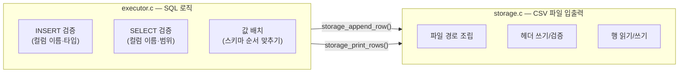

- **`executor.c`**: SQL 문장 구조체를 받아 타입·이름 검증 후 스토리지에 요청
- **`storage.c`**: 파일 경로, 헤더, CSV 행 입출력만 담당

이렇게 나누면 저장 방식이 바뀌어도 executor.c를 고칠 필요가 없습니다.

---

## 2. 핵심 구조체 관계

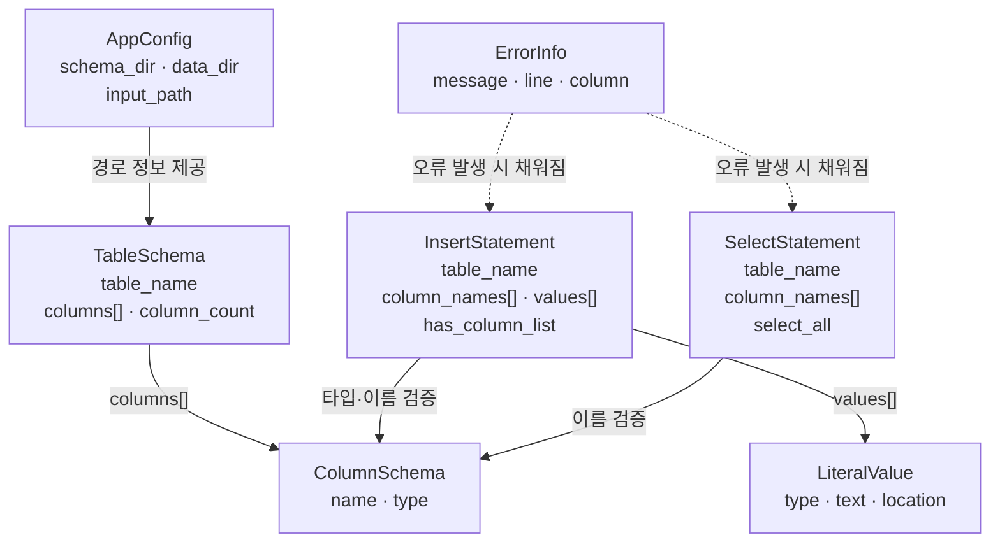

| 구조체 | 역할 |
|---|---|
| `AppConfig` | 실행에 필요한 디렉터리 경로 묶음 |
| `TableSchema` | 스키마 파일에서 읽은 컬럼 순서/타입 정보 |
| `ColumnSchema` | 컬럼 하나의 이름과 타입 (`int` / `string`) |
| `InsertStatement` | 파서가 만든 INSERT 문장 구조체 |
| `SelectStatement` | 파서가 만든 SELECT 문장 구조체 |
| `LiteralValue` | 숫자/문자열 리터럴과 그 위치 |
| `ErrorInfo` | 오류 메시지와 줄·열 위치 |

---

## 3. executor.c 함수 흐름

### 3-1. INSERT 전체 흐름

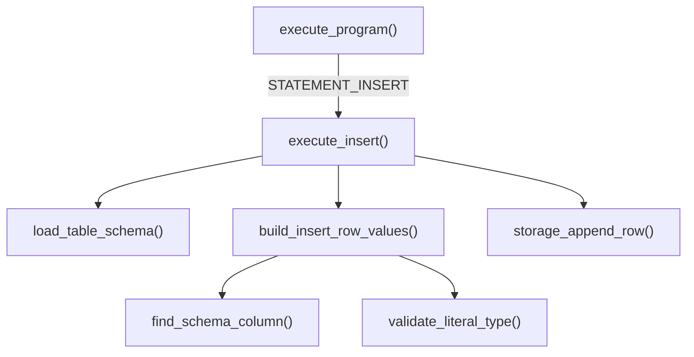

### 3-2. SELECT 전체 흐름

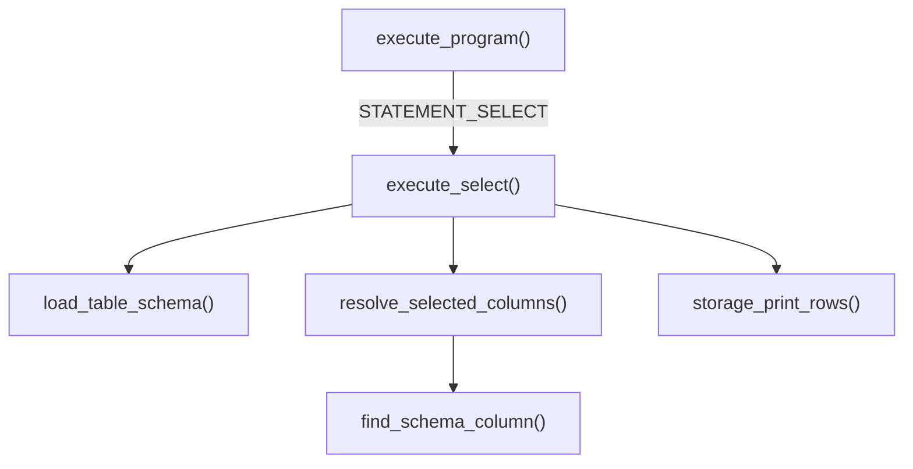

---

## 4. executor.c 함수별 설명

### `execute_program()`

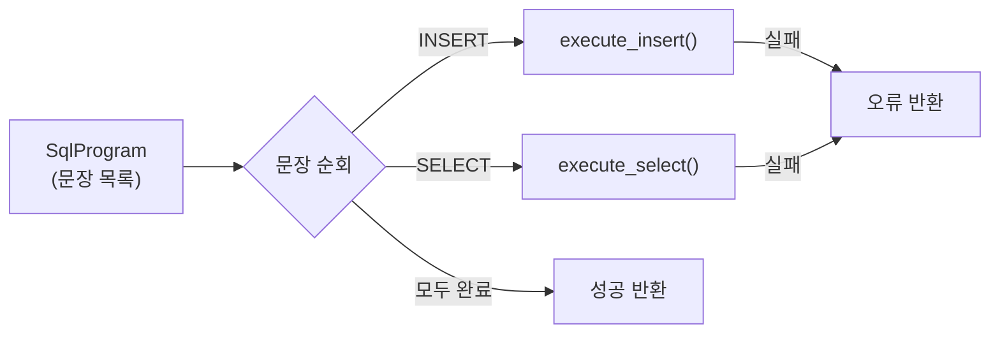

- SqlProgram 안에 있는 모든 SQL 문장을 앞에서부터 순서대로 실행합니다.
- 하나라도 실패하면 즉시 0을 반환합니다.

---

### `build_insert_row_values()`

INSERT 구조체의 값들을 스키마 순서에 맞는 배열로 재배치합니다.

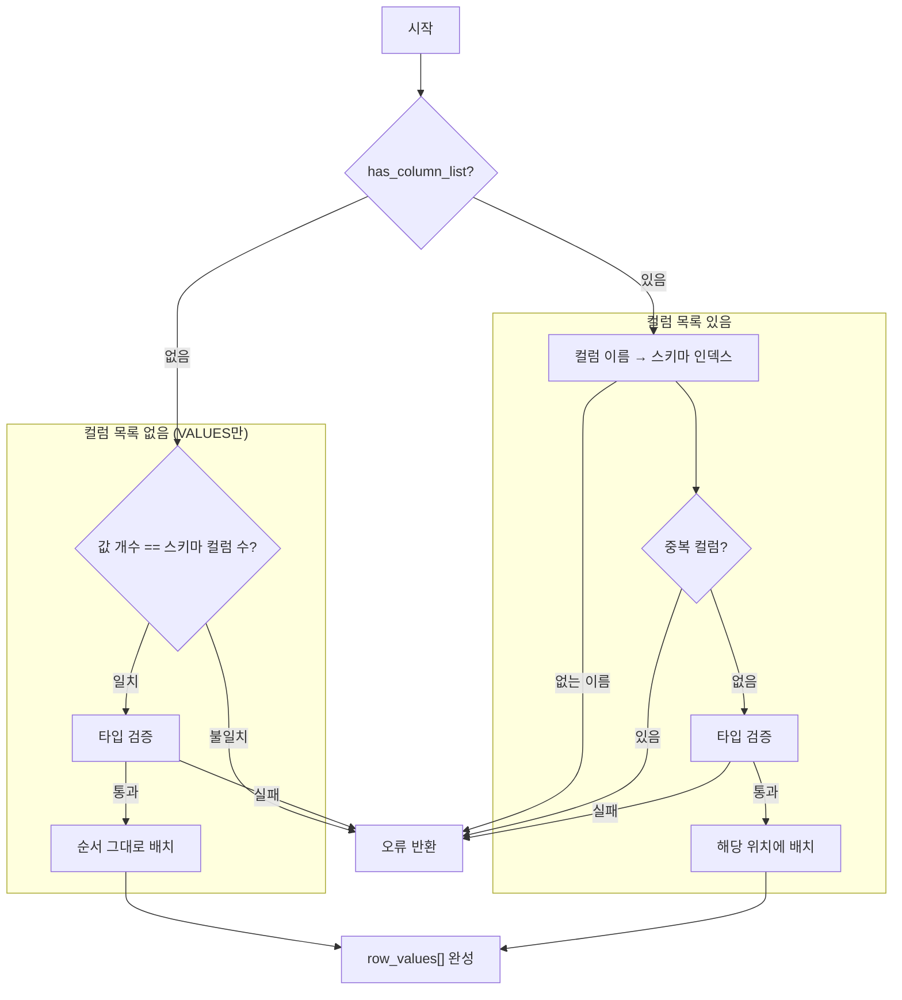

**왜 재배치가 필요한가?**

```sql
-- 스키마: id:int, name:string, age:int
INSERT INTO users (age, id, name) VALUES (20, 1, 'kim');
```

파서는 `(age, id, name)` 순서 그대로 저장합니다. 하지만 CSV에는 스키마 순서(`id,name,age`)로 써야 합니다. `build_insert_row_values()`가 이름으로 스키마 위치를 찾아 재배치합니다.

---

### `resolve_selected_columns()`

`SELECT *` 또는 `SELECT col1, col2`를 스키마 인덱스 배열로 변환합니다.

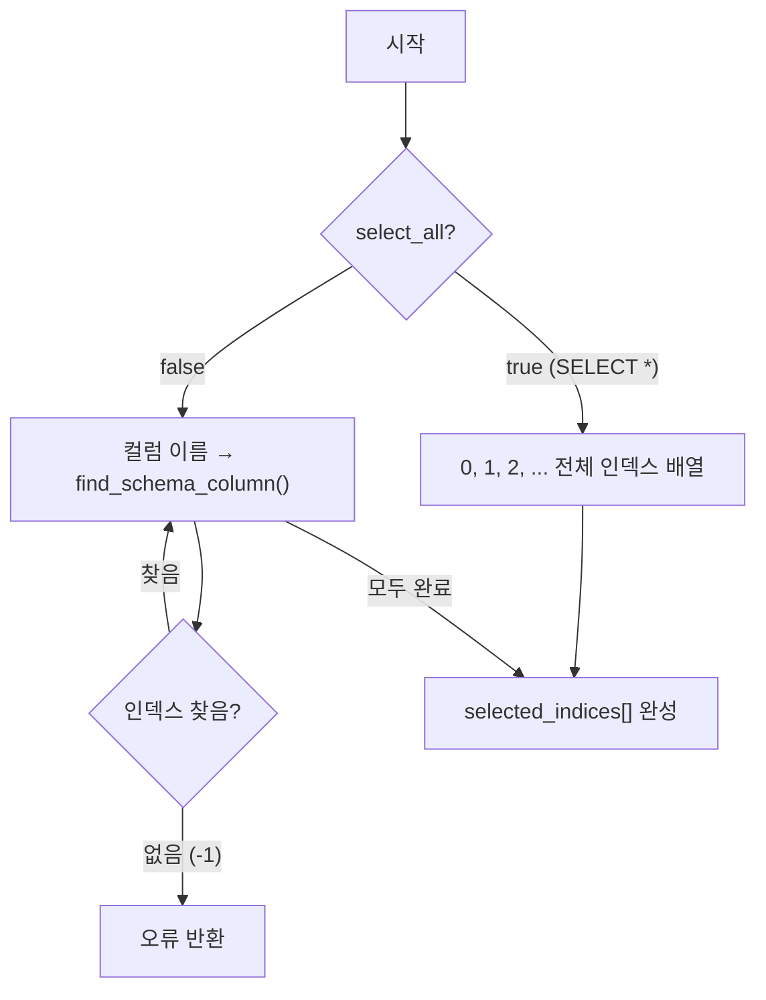

결과로 만들어진 `selected_indices[]`는 storage.c에 전달되어 CSV에서 해당 열만 출력하는 데 사용됩니다.

---

## 5. storage.c 함수 흐름

### 5-1. `storage_append_row()` (INSERT)

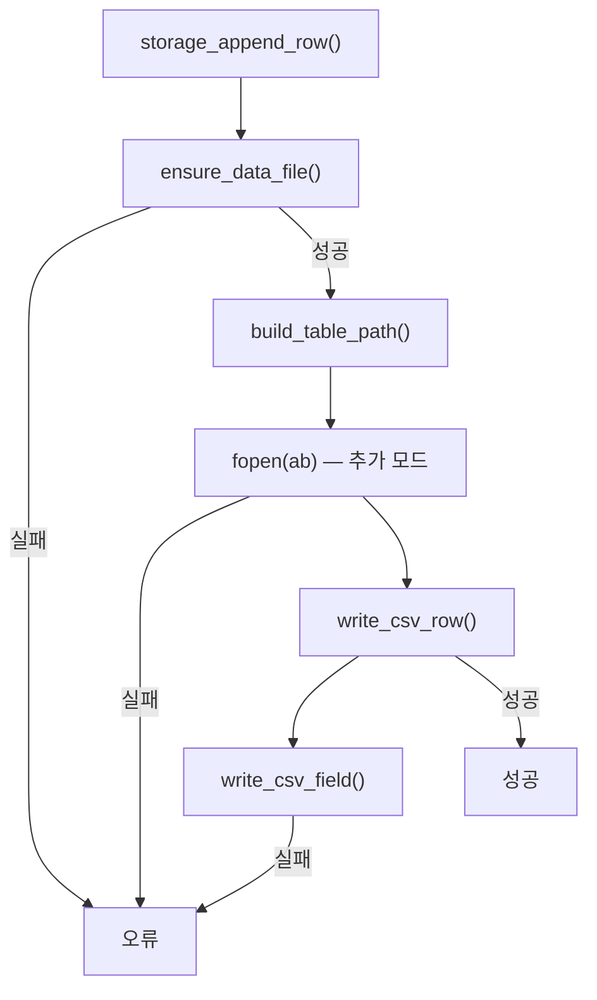

### 5-2. `storage_print_rows()` (SELECT)

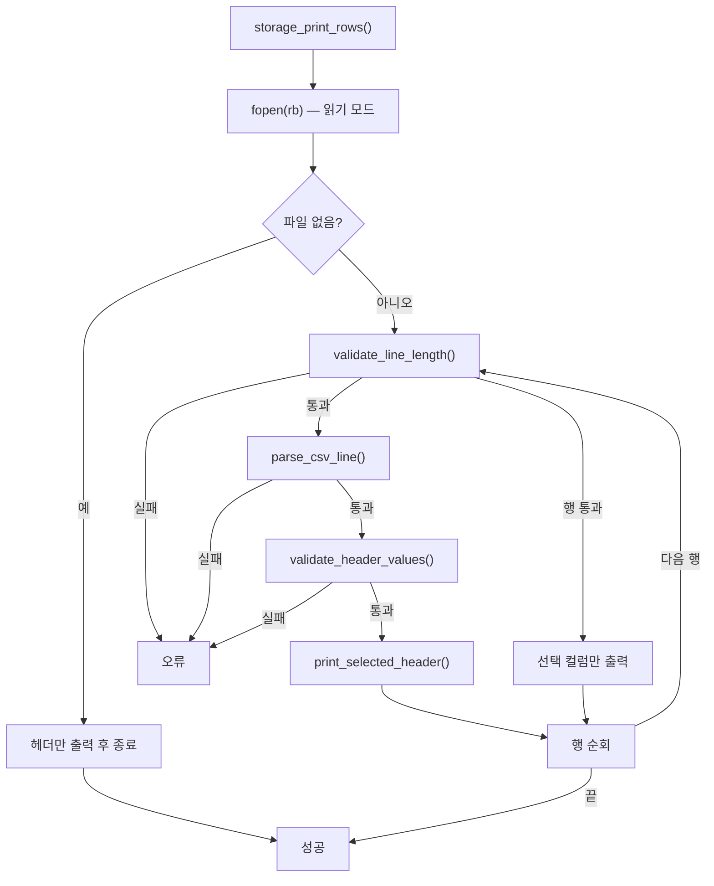

---

## 6. storage.c 함수별 설명

### `ensure_data_file()`

INSERT 전에 항상 호출됩니다. CSV 파일이 있는지 없는지에 따라 다르게 동작합니다.

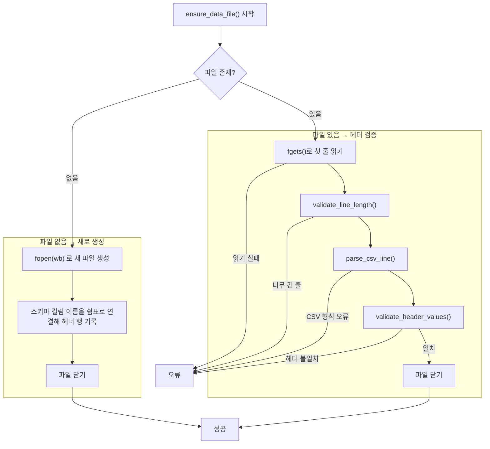

**왜 헤더를 검증하는가?**

스키마 파일을 바꾼 뒤 기존 CSV 파일을 그대로 사용하면 컬럼 구조가 달라집니다. 이를 미리 감지해 잘못된 데이터 입력을 막습니다.

---

### `validate_line_length()`

`fgets()`는 버퍼 크기만큼만 읽습니다. 줄이 버퍼보다 길면 뒷부분이 잘립니다. 이 함수는 그 상황을 감지합니다.

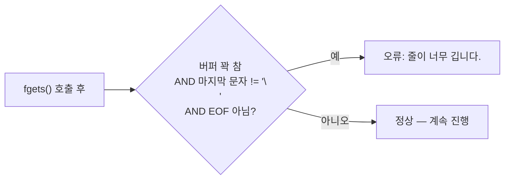

세 조건이 모두 참일 때만 오류입니다. EOF 직전 마지막 줄은 `\n`이 없어도 정상입니다.

---

### `parse_csv_line()`

CSV 한 줄을 컬럼 배열로 분해합니다. 큰따옴표 안의 쉼표는 구분자로 취급하지 않습니다.

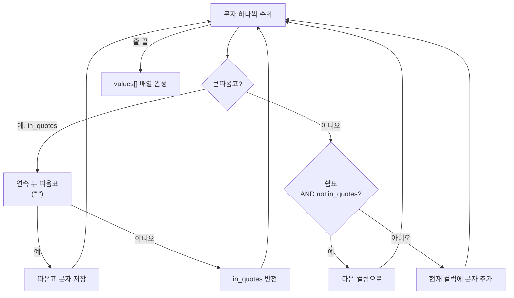

예시:

```
kim,"lee,park",30
```

→ `["kim", "lee,park", "30"]` (쉼표가 따옴표 안에 있으면 구분자 아님)

---

### `write_csv_field()`

CSV 필드 하나를 안전하게 파일에 씁니다. 쉼표·따옴표·개행이 포함된 경우 자동으로 큰따옴표로 감쌉니다.

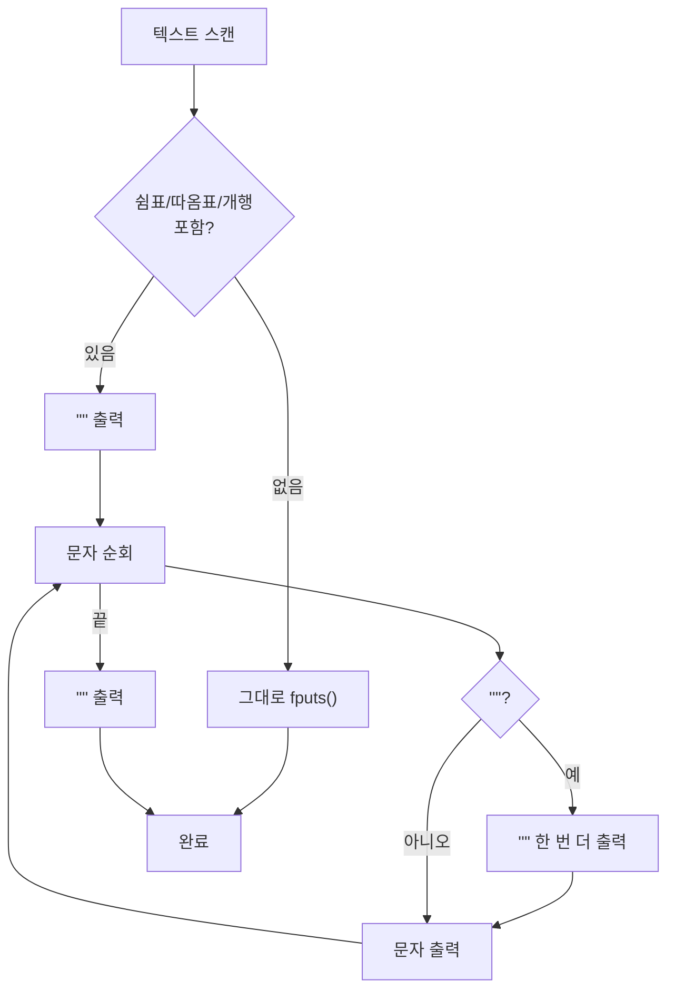

예시: `she said "hi"` → `"she said ""hi"""` (내부 따옴표는 두 번 씁니다)

---

### `validate_header_values()`

CSV 파일의 헤더 행이 현재 스키마와 일치하는지 두 단계로 확인합니다.

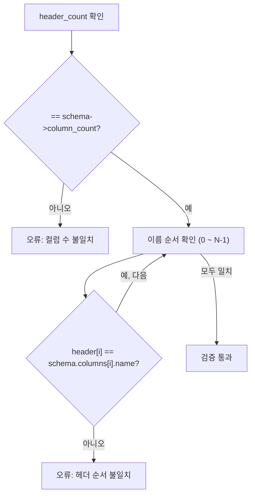

---

## 7. 두 모듈의 협력 요약

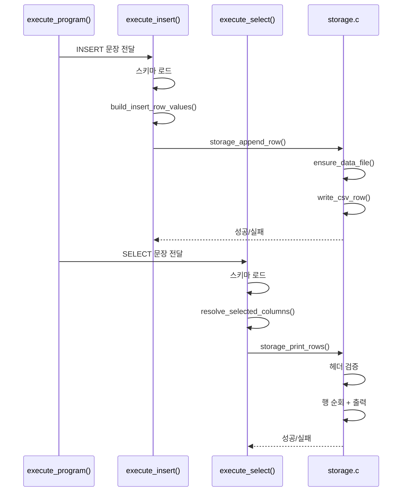

executor.c는 "무엇을"만 결정하고, storage.c는 "어떻게 파일에"만 집중합니다. 두 모듈이 `storage_append_row()` / `storage_print_rows()` 두 함수로만 연결되기 때문에, 한 쪽을 수정해도 다른 쪽에 영향이 최소화됩니다.
