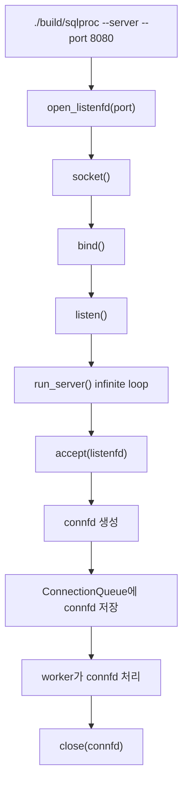
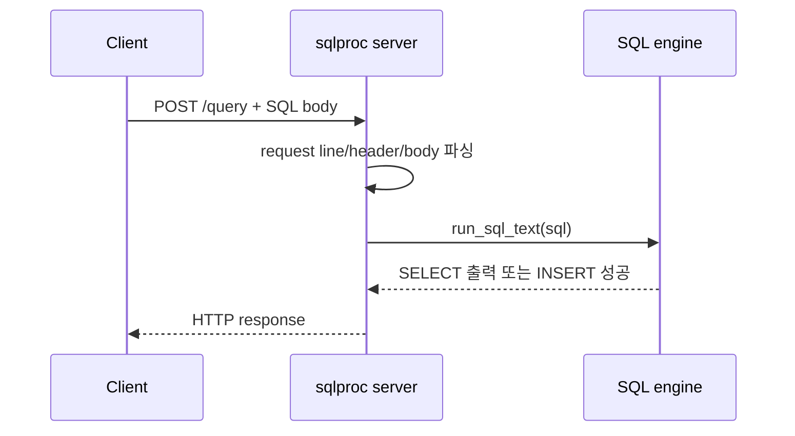

# HTTP API 서버와 소켓 흐름

`docs/wk08_수요코딩회_과제_요구사항.md`의 **외부 클라이언트에서 DBMS 기능 사용** 요구를 기준으로, 이 문서는 HTTP API 서버가 어떤 PDF 절을 바탕으로 구현됐는지 정리합니다.

## PDF에서 봐야 할 절

| PDF | 절 | 이 절의 내용 | 현재 코드 적용 |
| --- | --- | --- | --- |
| Chapter 11 | 11.1 The Client-Server Programming Model | 클라이언트가 요청을 보내고, 서버가 리소스를 조작한 뒤 응답하는 기본 거래 흐름 | `POST /query`가 SQL 엔진을 호출하고 결과를 응답 |
| Chapter 11 | 11.4 The Sockets Interface | `socket`, `bind`, `listen`, `accept`로 TCP 서버를 만드는 방법 | `src/server.c`의 `open_listenfd()`, `run_server()` |
| Chapter 11 | 11.4.4 `bind`, 11.4.5 `listen`, 11.4.6 `accept` | 서버 포트에 소켓을 묶고, 연결 대기 상태로 만들고, 요청마다 connected descriptor를 받는 흐름 | `accept()` 결과인 `connfd`를 queue에 넣음 |
| Chapter 11 | 11.4.8 `open_listenfd` | `getaddrinfo`로 주소 후보를 만들고 `socket`/`bind`가 성공할 때까지 시도한 뒤 `listen` 호출 | 프로젝트용 `open_listenfd()`로 재구현 |
| Chapter 11 | 11.5.3 HTTP Transactions | 요청 라인, 헤더, 빈 줄, body와 응답 상태 코드, 헤더, body 구조 | `handle_client()`, `send_text_response()` |
| Chapter 11 | 11.6 Tiny Web Server | listening socket을 열고 반복해서 연결을 받아 HTTP transaction을 처리하는 작은 웹 서버 구조 | Tiny의 `doit()` 역할을 `handle_client()`가 담당 |

## 구현 목표

- 서버 모드는 `--server --port <port>`로 켭니다.
- 외부 클라이언트는 TCP 연결을 열고 HTTP 요청을 보냅니다.
- `GET /health`는 서버 생존 확인용으로 `OK`를 돌려줍니다.
- `POST /query`는 요청 body에 담긴 SQL 문자열을 기존 SQL 엔진으로 실행합니다.
- 그 외 경로와 메서드는 HTTP 상태 코드로 오류를 돌려줍니다.

## 요청 처리 흐름

핵심은 **listening descriptor와 connected descriptor를 구분하는 것**입니다. listening descriptor는 서버가 계속 들고 있는 문이고, connected descriptor는 클라이언트 한 명과 통신하기 위해 `accept()`가 새로 만들어 준 통로입니다.

## 현재 서버가 지원하는 HTTP 표면

| 요청 | 성공 응답 | 설명 |
| --- | --- | --- |
| `GET /health` | `200 OK`, body `OK` | 서버가 연결을 받을 수 있는지 확인 |
| `POST /query` | `200 OK`, SQL 출력 또는 `OK` | SQL body 실행 |
| `GET /query` | `405 Method Not Allowed` | `/query`는 POST만 허용 |
| `POST /missing` | `404 Not Found` | 지원하지 않는 경로 |
| 빈 body 또는 잘못된 body | `400 Bad Request` 또는 `413 Payload Too Large` | SQL 요청 형식 보호 |

## 코드에서 따라가기

1. `src/app.c`의 `parse_arguments()`가 `--server`, `--port`, `--threads`, `--queue-size`를 읽어 `AppConfig`에 저장합니다.
2. `src/app.c`의 `run_program()`은 `config.server_mode`가 켜져 있으면 `run_server()`를 호출합니다.
3. `src/server.c`의 `open_listenfd()`는 서버 포트를 열고 listening socket을 만듭니다.
4. `src/server.c`의 `run_server()`는 `accept()`로 connected descriptor를 받고 queue에 넣습니다.
5. worker thread는 `handle_client()`에서 HTTP 요청을 읽고 endpoint별로 응답합니다.

## 클라이언트와 서버의 역할

## 초심자가 헷갈리기 쉬운 점

- `listenfd`는 서버 전체의 입구입니다. 각 클라이언트에게 직접 데이터를 주고받는 fd가 아닙니다.
- `connfd`는 클라이언트 요청 하나를 처리하는 통신 통로입니다.
- HTTP는 문자열 기반 프로토콜이므로 요청 라인과 헤더는 줄 단위로 읽습니다.
- SQL 자체는 HTTP body 안에 들어갑니다. 그래서 `/query?sql=...`처럼 URI에 넣지 않습니다.
- 현재 서버는 HTTP/1.0 스타일로 응답 후 연결을 닫습니다. persistent connection은 구현하지 않았습니다.

한 줄로 정리하면, **API 서버 기능은 Chapter 11의 client-server, sockets, HTTP transaction 흐름을 `src/server.c`에 옮긴 구현**입니다.
