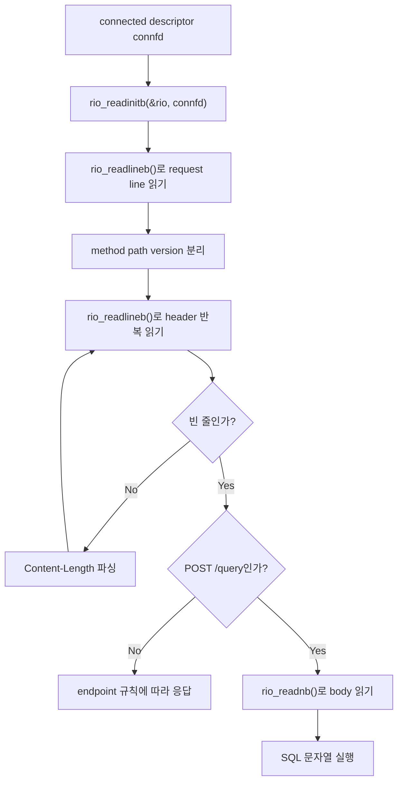
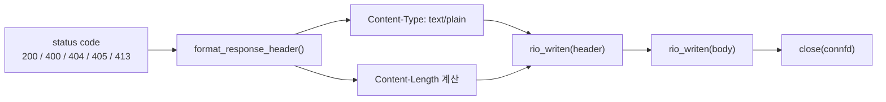

# Robust I/O와 HTTP Body 처리

`POST /query`가 안정적으로 동작하려면 네트워크 소켓에서 HTTP 요청을 정확히 읽고, 응답을 끝까지 써야 합니다. 이 문서는 그 부분이 PDF의 어느 절과 연결되는지 정리합니다.

## PDF에서 봐야 할 절

| PDF | 절 | 이 절의 내용 | 현재 코드 적용 |
| --- | --- | --- | --- |
| Chapter 10 | 10.1 Unix I/O | 네트워크 소켓도 파일처럼 descriptor로 읽고 쓴다는 모델 | `connfd`를 `read()`/`write()` 대상으로 사용 |
| Chapter 10 | 10.4 Reading and Writing Files | `read`/`write`는 요청한 바이트보다 적게 처리하는 short count가 생길 수 있음 | `rio_readn()`, `rio_writen()` 반복 처리 |
| Chapter 10 | 10.5 Robust Reading and Writing with the Rio Package | short count를 자동으로 보완하는 Rio 패키지 구조 | 프로젝트의 `Rio` 구조체와 `rio_*()` 함수 |
| Chapter 10 | 10.5.1 Rio Unbuffered Input and Output Functions | `rio_readn`, `rio_writen`은 원하는 byte 수를 처리할 때까지 반복 | HTTP response header/body 전송 |
| Chapter 10 | 10.5.2 Rio Buffered Input Functions | `rio_readlineb`는 텍스트 줄, `rio_readnb`는 정해진 byte 수를 읽음 | request line/header는 줄 단위, body는 `Content-Length`만큼 읽음 |
| Chapter 11 | 11.5.3 HTTP Transactions | HTTP 요청은 request line, headers, empty line, body로 구성됨 | `handle_client()`의 HTTP 파싱 |

## 왜 단순 `read()` 한 번으로 끝내면 안 되는가

네트워크에서는 `read(fd, buf, n)`을 호출해도 항상 n byte가 한 번에 들어온다고 보장할 수 없습니다. 커널 버퍼 상태, 네트워크 지연, 클라이언트 전송 방식에 따라 일부만 들어올 수 있습니다.

그래서 현재 구현은 다음 원칙을 사용합니다.

- 응답을 쓸 때는 `rio_writen()`으로 전체 byte가 나갈 때까지 반복합니다.
- 요청 라인과 헤더는 `rio_readlineb()`로 `\r\n`까지 읽습니다.
- SQL body는 `Content-Length` 값을 기준으로 `rio_readnb()`가 정확한 byte 수만큼 읽습니다.
- body가 너무 크면 남은 body를 버리고 `413 Payload Too Large`를 돌려줍니다.

## HTTP 요청을 읽는 흐름

## `Content-Length`가 중요한 이유

HTTP body는 줄 단위로 끝나는 데이터가 아닐 수 있습니다. SQL 문자열 안에는 줄바꿈이 들어갈 수도 있습니다. 따라서 서버는 body를 어디까지 읽을지 알아야 하고, 그 기준이 `Content-Length`입니다.

현재 구현은 다음 오류를 방어합니다.

| 상황 | 응답 |
| --- | --- |
| `Content-Length` 없음 | `400 Bad Request` |
| `Content-Length: abc` | `400 Bad Request` |
| `Content-Length: -1` | `400 Bad Request` |
| body 길이가 `SQLPROC_MAX_SQL_SIZE`보다 큼 | `413 Payload Too Large` |
| 실제로 읽힌 body가 선언 길이보다 짧음 | `400 Bad Request` |

## 응답을 쓰는 흐름

## 코드에서 따라가기

- `src/server.c`의 `Rio` 구조체는 내부 버퍼와 현재 읽기 위치를 저장합니다.
- `rio_read()`는 내부 버퍼가 비면 실제 `read()`를 호출합니다.
- `rio_readlineb()`는 HTTP request line과 header를 읽습니다.
- `rio_readnb()`는 SQL body를 정해진 byte 수만큼 읽습니다.
- `rio_writen()`은 header와 body가 중간에 끊기지 않도록 반복해서 씁니다.
- `parse_content_length()`는 body 길이 헤더를 숫자로 검증합니다.

## 초심자용 비유

`read()`는 택배 상자 전체가 아니라 상자 조각만 먼저 가져올 수 있는 함수라고 보면 됩니다. `rio_readnb()`는 조각을 계속 받아서 "상자 하나가 완성될 때까지" 기다리는 포장 담당자입니다.

한 줄로 정리하면, **Robust I/O는 네트워크에서 생기는 short count를 감안해 HTTP 요청과 응답을 끝까지 처리하는 안전장치**입니다.
