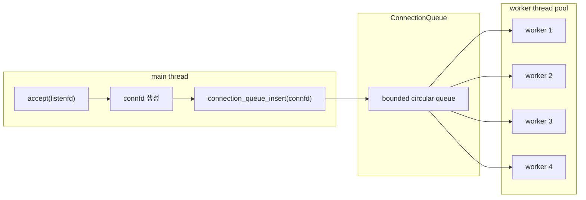
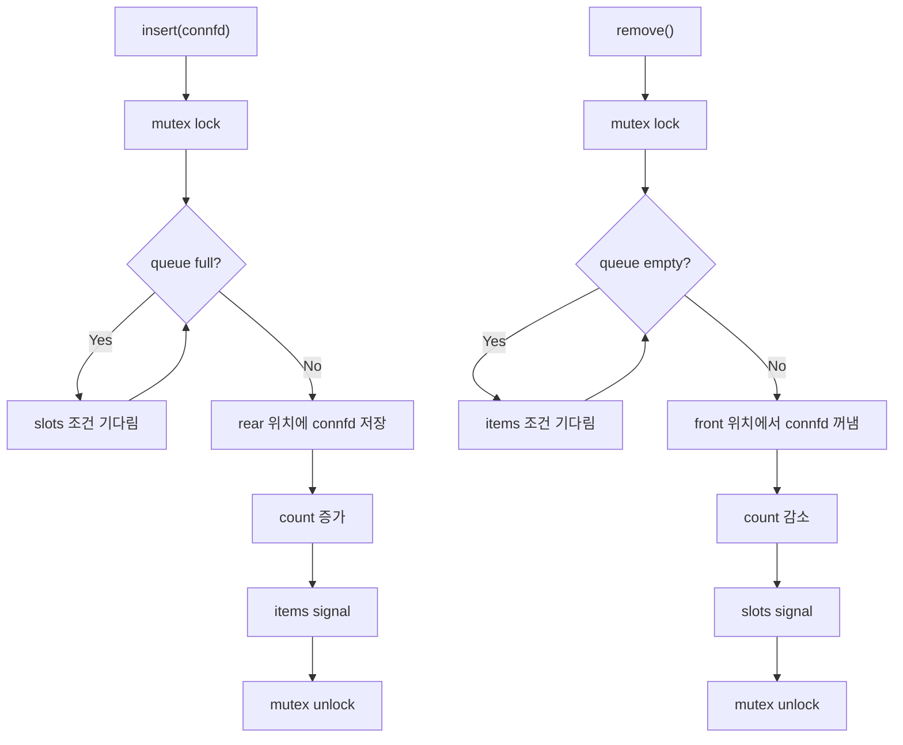
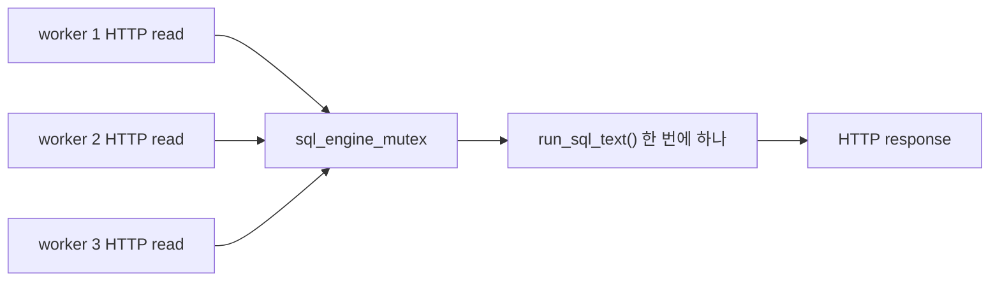

# Thread Pool과 Connection Queue

`docs/wk08_수요코딩회_과제_요구사항.md`의 **Thread Pool 구성과 SQL 요청 병렬 처리** 요구를 기준으로, 이 문서는 현재 구현의 동시성 구조를 설명합니다.

## PDF에서 봐야 할 절

| PDF | 절 | 이 절의 내용 | 현재 코드 적용 |
| --- | --- | --- | --- |
| Chapter 12 | 12.3 Concurrent Programming with Threads | thread는 같은 프로세스 안에서 실행되는 여러 제어 흐름이며 주소 공간을 공유함 | worker thread들이 같은 서버 프로세스 안에서 동작 |
| Chapter 12 | 12.3.2 Posix Threads | `pthread_create()`로 thread를 만들고 thread routine을 실행 | `run_server()`가 `worker_main()`을 worker로 생성 |
| Chapter 12 | 12.3.6 Detaching Threads | join하지 않을 thread는 detach해야 자원이 자동 회수됨 | `worker_main()`의 `pthread_detach(pthread_self())` |
| Chapter 12 | 12.5.4 Producer-Consumer Problem | producer와 consumer가 bounded buffer를 공유하며 full/empty 상태에 따라 기다림 | main thread는 producer, worker thread는 consumer |
| Chapter 12 | 12.5.5 Concurrent Server Based on Prethreading | 서버 시작 시 worker를 미리 만들고 connected descriptor를 queue로 전달 | `ConnectionQueue`, `run_server()`, `worker_main()` |
| Chapter 12 | 12.7.4 Races | thread 사이 실행 순서에 따라 correctness가 달라지는 race를 피해야 함 | queue 접근은 mutex와 condition variable로 보호 |

## 구현 목표

- 요청이 올 때마다 thread를 새로 만들지 않습니다.
- 서버 시작 시 worker thread를 미리 만들어 둡니다.
- main thread는 `accept()`로 받은 `connfd`를 queue에 넣기만 합니다.
- worker thread들은 queue에서 `connfd`를 꺼내 HTTP 요청을 처리합니다.
- queue가 가득 차면 main thread는 빈 칸이 생길 때까지 기다립니다.
- queue가 비어 있으면 worker thread는 새 연결이 들어올 때까지 기다립니다.

## 전체 구조



## `ConnectionQueue`가 들고 있는 값

| 필드 | 의미 |
| --- | --- |
| `buf` | `connfd`를 저장하는 int 배열 |
| `n` | queue 최대 크기 |
| `front` | 다음에 꺼낼 위치 |
| `rear` | 다음에 넣을 위치 |
| `count` | 현재 들어 있는 항목 수 |
| `mutex` | queue 내부 상태를 한 thread만 바꾸게 하는 잠금 |
| `slots` | 빈 칸이 생겼음을 알리는 condition variable |
| `items` | 새 항목이 생겼음을 알리는 condition variable |

## insert와 remove 흐름

CS:APP의 `sbuf` 예시는 semaphore를 사용합니다. 현재 구현은 macOS에서도 다루기 쉬운 `pthread_mutex_t`와 `pthread_cond_t`를 사용하지만, 의미는 같습니다.



## 왜 `while`로 조건을 다시 확인하는가

`pthread_cond_wait()`에서 깨어났다고 해서 조건이 반드시 만족됐다고 단정하면 위험합니다. 여러 worker가 동시에 깨어나거나, 운영체제가 spurious wakeup을 만들 수 있습니다.

그래서 현재 코드는 다음 형태를 씁니다.

```c
while (queue->count == 0) {
    pthread_cond_wait(&queue->items, &queue->mutex);
}
```

이 패턴은 초심자에게 중요합니다. condition variable은 "조건이 참이다"를 보장하는 도구가 아니라 "조건을 다시 확인해 보라"고 깨우는 도구에 가깝습니다.

## 병렬 처리의 정확한 의미

현재 서버에서 병렬인 부분과 직렬인 부분을 구분해야 합니다.

| 구간 | 처리 방식 | 이유 |
| --- | --- | --- |
| 클라이언트 연결 수락 | main thread가 반복 처리 | listening socket 입구 관리 |
| HTTP 요청 읽기/응답 쓰기 | 여러 worker가 병렬 처리 | 각 worker가 다른 `connfd`를 처리 |
| SQL 엔진 실행 | mutex로 직렬 처리 | 기존 SQL 엔진 공유 상태 보호 |



## 코드에서 따라가기

1. `run_server()`가 `connection_queue_init()`으로 queue를 만듭니다.
2. `run_server()`가 `pthread_create()`를 `thread_count`번 호출합니다.
3. 각 worker는 `worker_main()`에서 detach 후 무한 루프를 돕니다.
4. main thread는 `accept()`로 받은 `connfd`를 `connection_queue_insert()`에 넣습니다.
5. worker는 `connection_queue_remove()`로 `connfd`를 꺼낸 뒤 `handle_client()`를 호출합니다.
6. 처리가 끝나면 worker가 `close(connfd)`를 호출합니다.

한 줄로 정리하면, **thread pool은 연결 처리를 여러 worker에게 나눠 주기 위한 구조이고, bounded queue는 main thread와 worker thread 사이에서 connfd를 안전하게 주고받는 통로**입니다.
