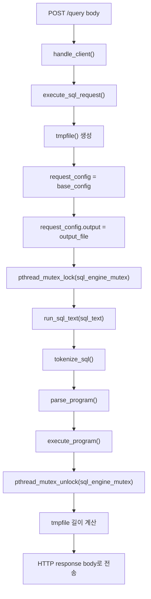
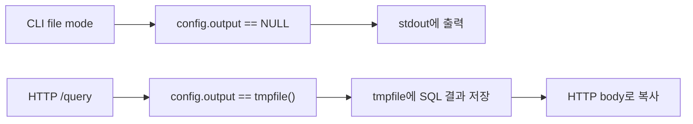
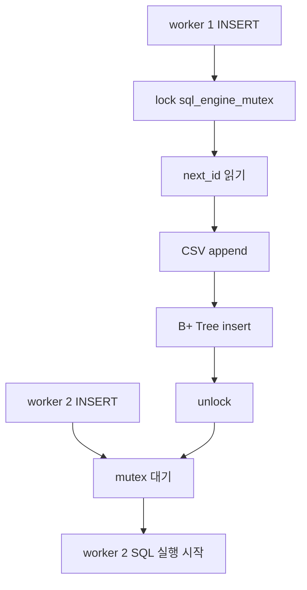

# SQL 엔진, B+ Tree, Mutex 연동

WK08 요구사항은 API 서버를 새로 만들되, **이전 차수의 SQL 처리기와 B+ Tree 인덱스를 그대로 활용**하라고 요구합니다. 이 문서는 HTTP 서버가 기존 DB 엔진과 어떻게 연결되는지 정리합니다.

## PDF에서 봐야 할 절

| PDF | 절 | 이 절의 내용 | 현재 코드 적용 |
| --- | --- | --- | --- |
| Chapter 11 | 11.1 Client-Server Programming Model | 서버는 클라이언트 요청을 해석하고 내부 리소스를 조작한 뒤 응답함 | `/query` 요청 body를 SQL 엔진으로 실행 |
| Chapter 11 | 11.5.4 Serving Dynamic Content | 서버가 요청에 따라 동적으로 결과를 생성하고 클라이언트에 돌려주는 구조 | SQL 실행 결과를 HTTP body로 반환 |
| Chapter 10 | 10.10 Standard I/O | `FILE *` stream은 C 표준 입출력의 추상화 | SQL 출력 대상을 `config.output`으로 바꿈 |
| Chapter 12 | 12.4 Shared Variables in Threaded Programs | thread들은 전역 변수와 heap을 공유하므로 공유 상태를 조심해야 함 | `table_states`, B+ Tree, CSV append 상태 공유 |
| Chapter 12 | 12.5.3 Mutual Exclusion | critical section을 mutex로 감싸 한 thread만 공유 상태에 접근하게 함 | `sql_engine_mutex`로 `run_sql_text()` 보호 |
| Chapter 12 | 12.7.1 Thread Safety, 12.7.4 Races | thread-safe하지 않은 함수나 공유 상태는 race를 만들 수 있음 | SQL 엔진 실행 구간 직렬화 |

참고로, 첨부된 Chapter 10, 11, 12 PDF는 I/O, 네트워크, 동시성을 다룹니다. B+ Tree 알고리즘 자체는 이 PDF들의 직접 설명 범위가 아니며, 이번 문서에서는 **기존 B+ Tree를 API 서버에서 재사용하는 연결 방식**을 중심으로 봅니다.

## 구현 목표

- HTTP body에 들어온 SQL 문자열을 기존 `run_sql_text()`에 넘깁니다.
- SQL 엔진은 기존처럼 tokenizer, parser, executor 순서로 동작합니다.
- `SELECT` 결과는 stdout이 아니라 요청별 임시 파일에 모읍니다.
- 임시 파일 길이를 계산해 HTTP `Content-Length`로 보냅니다.
- SQL 엔진 공유 상태는 `sql_engine_mutex`로 보호합니다.

## `/query`에서 SQL 엔진으로 이어지는 흐름

## 왜 `config.output`이 필요한가

기존 CLI 모드에서는 `SELECT` 결과가 stdout으로 바로 출력되어도 문제가 없습니다. 그러나 HTTP 서버에서는 worker thread가 클라이언트에게 응답 body를 만들어야 합니다. stdout에 찍으면 클라이언트가 결과를 받을 수 없습니다.

그래서 `AppConfig`에 `FILE *output`이 추가되어 있습니다.

## B+ Tree 인덱스는 어디서 그대로 쓰이는가

서버는 SQL 엔진을 새로 구현하지 않습니다. `/query` body를 `run_sql_text()`에 넘기면 기존 executor가 알아서 인덱스 경로를 선택합니다.

| SQL | 기존 엔진 동작 | HTTP 응답에 보이는 신호 |
| --- | --- | --- |
| `INSERT INTO users (name, age) VALUES ('kim', 20);` | 자동 PK 발급, CSV append, B+ Tree에 `id -> row offset` 등록 | body `OK` |
| `SELECT * FROM users WHERE id = 1;` | B+ Tree exact lookup 후 CSV offset으로 한 행 읽기 | `[INDEX] WHERE id = 1` |
| `SELECT * FROM users WHERE name = 'kim';` | PK가 아니므로 CSV 선형 탐색 | `[SCAN] WHERE name = kim` |
| `SELECT * FROM users WHERE id > 10;` | B+ Tree leaf range scan | `[INDEX-RANGE] ...` |

## 왜 SQL 실행 구간을 mutex로 잠그는가

thread pool 때문에 여러 worker가 동시에 `/query`를 처리할 수 있습니다. 하지만 기존 SQL 엔진에는 다음 공유 상태가 있습니다.

- `executor.c`의 전역 `table_states`
- 테이블별 `next_id`
- 메모리 B+ Tree 포인터
- CSV append 후 `id -> row offset`을 등록하는 순서

예를 들어 두 worker가 동시에 `INSERT`를 실행하면 같은 `next_id`를 읽거나, CSV에 쓴 row offset과 B+ Tree 등록 순서가 꼬일 수 있습니다. 그래서 현재 v1 구현은 SQL 엔진을 하나의 critical section으로 봅니다.

## 현재 선택의 장점과 한계

| 구분 | 내용 |
| --- | --- |
| 장점 | SQL 엔진을 크게 고치지 않고도 thread pool 서버와 안전하게 연결 |
| 장점 | PK 자동 발급, B+ Tree, CSV 저장의 무결성을 쉽게 지킴 |
| 한계 | SQL 실행 자체는 한 번에 하나만 수행되므로 DB 엔진 레벨 병렬성은 제한됨 |
| 개선 방향 | table별 mutex, readers-writers lock, read-only SELECT 병렬화 |

## 코드에서 따라가기

1. `src/server.c`의 `execute_sql_request()`가 요청별 `tmpfile()`을 만듭니다.
2. `request_config.output`에 그 파일을 넣습니다.
3. `sql_engine_mutex`를 잠근 상태에서 `run_sql_text()`를 호출합니다.
4. `src/app.c`의 `run_sql_text()`가 tokenizer, parser, executor를 순서대로 호출합니다.
5. `src/executor.c`와 `src/storage.c`는 `config.output`이 있으면 그 stream에 결과를 씁니다.
6. SQL 실행이 끝나면 `send_sql_success_response()`가 파일 길이를 계산해 HTTP 응답으로 보냅니다.

한 줄로 정리하면, **WK08 서버는 기존 SQL 엔진 앞에 HTTP 입구를 붙이고, thread 환경에서 깨질 수 있는 공유 상태는 하나의 mutex로 보호한 구현**입니다.
