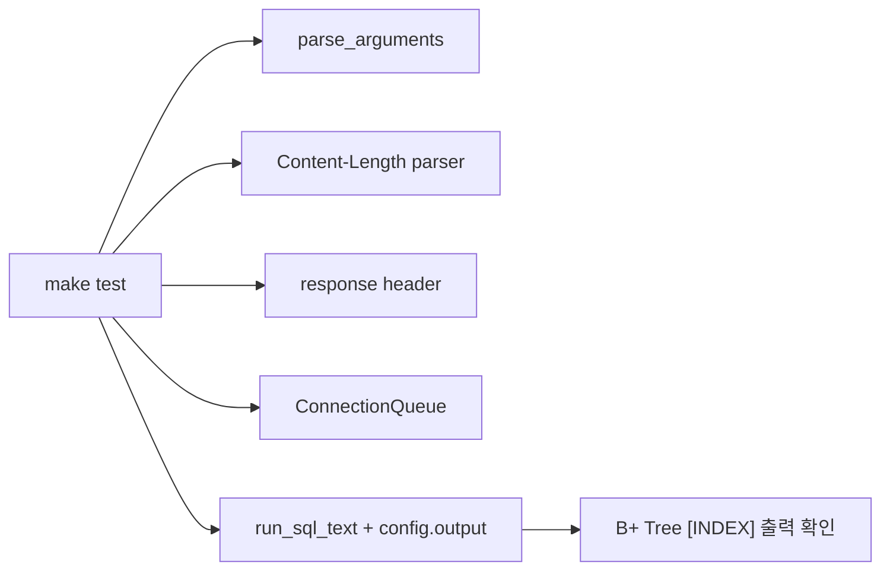
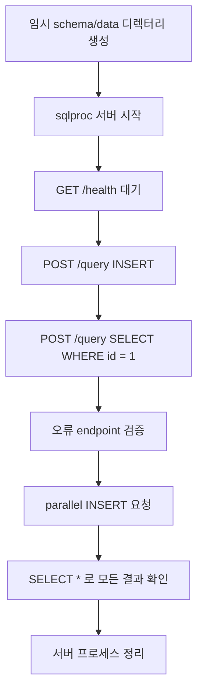

# API 서버 검증과 테스트 표면

WK08 요구사항의 품질 항목은 **단위 테스트**, **API 서버 기능 테스트**, **엣지 케이스 고려**입니다. 이 문서는 어떤 테스트가 어떤 기능을 검증하는지 정리합니다.

## PDF에서 봐야 할 절

| PDF | 절 | 이 절의 내용 | 현재 테스트 적용 |
| --- | --- | --- | --- |
| Chapter 11 | 11.5.3 HTTP Transactions | HTTP 요청/응답의 상태 코드, 헤더, body 구조 | `curl`, `nc`로 status code와 body 검증 |
| Chapter 11 | 11.6 Tiny Web Server | 서버가 요청을 읽고 오류 응답을 보내는 기본 구조 | `/health`, `/query`, 잘못된 경로/메서드 테스트 |
| Chapter 12 | 12.5.4 Producer-Consumer Problem | bounded buffer는 삽입/삭제 순서와 full/empty 대기 조건이 중요 | queue round trip 단위 테스트 |
| Chapter 12 | 12.7.1 Thread Safety | thread 환경에서는 공유 상태 접근이 안전해야 함 | 병렬 `curl` 요청 후 전체 데이터 조회 |
| Chapter 12 | 12.7.4 Races | 실행 순서에 따라 달라지는 race를 피해야 함 | 여러 INSERT 요청을 동시에 보내는 통합 테스트 |

## 테스트 종류

| 명령 | 검증 범위 |
| --- | --- |
| `make` | C99, pthread 포함 전체 빌드 |
| `make test` | 인자 파싱, HTTP helper, queue, SQL 엔진, B+ Tree 단위 성격 테스트 |
| `make api-test` | 실제 서버 실행 후 `curl`/`nc` 기반 API 통합 테스트 |
| `make bench` | 기존 B+ Tree 기반 조회 성능 흐름 확인 |

## 단위 성격 테스트

`tests/test_runner.c`는 `SQLPROC_TEST` 매크로를 켠 빌드에서 서버 내부 helper를 일부 노출해 검증합니다.

| 테스트 | 확인하는 것 |
| --- | --- |
| server argument parsing | `--server`, `--port`, `--threads`, `--queue-size` 정상/오류 |
| `Content-Length` parser | 숫자, 공백, 음수, 문자 섞임 거절 |
| response header builder | 상태 줄, `Content-Type`, `Content-Length` 생성 |
| connection queue round trip | queue에 넣은 `connfd`가 FIFO 순서로 나오는지 |
| `run_sql_text()` output | HTTP 서버처럼 stdout 대신 `config.output`에 결과를 쓸 수 있는지 |

## API 통합 테스트

`tests/api_server_test.sh`는 실제 `./build/sqlproc --server`를 백그라운드로 실행한 뒤 외부 클라이언트처럼 요청합니다.

## 통합 테스트가 확인하는 시나리오

| 시나리오 | 기대 결과 |
| --- | --- |
| `GET /health` | body가 정확히 `OK` |
| `POST /query` INSERT | body가 `OK` |
| `SELECT * FROM users WHERE id = 1` | `[INDEX]` 로그와 row 출력 |
| 여러 SQL 문장 body | INSERT 후 SELECT 결과가 같은 응답에 포함 |
| 없는 경로 | `404` |
| 잘못된 메서드 | `405` |
| 빈 body | `400` |
| `Content-Length` 없음 | `400` |
| `Content-Length`가 숫자가 아님 | `400` |
| 너무 큰 body | `413` |
| SQL 실행 오류 | `400`과 `오류:` 메시지 |
| 병렬 INSERT | 모든 이름이 최종 `SELECT *`에 존재 |

## 실패 신호를 읽는 법

- `health check failed`가 나오면 서버가 포트를 열지 못했거나 시작 전에 죽었을 가능성이 큽니다.
- `expected 404, got ...` 같은 메시지는 endpoint 분기나 status code 응답이 바뀐 경우입니다.
- `[INDEX]` grep이 실패하면 기존 B+ Tree 조회 경로가 HTTP 응답으로 전달되지 않은 것입니다.
- 병렬 INSERT 후 일부 이름이 없으면 queue, worker, SQL mutex, CSV append 중 하나를 의심해야 합니다.
- `Content-Length` 관련 실패는 `parse_content_length()` 또는 body 읽기 길이 계산을 확인해야 합니다.

## 발표나 리뷰 때 말할 수 있는 검증 요약

현재 테스트는 API 서버가 외부 요청을 받고, 기존 SQL 엔진을 호출하고, B+ Tree 인덱스 결과를 HTTP 응답으로 돌려주는 핵심 경로를 확인합니다. 특히 병렬 `curl` 요청은 thread pool 요구사항을 눈으로 확인하기 좋은 시나리오입니다.

## 남은 리스크

- 서버 종료는 graceful shutdown이 아니라 테스트 스크립트의 프로세스 종료로 처리합니다.
- `tmpfile()` 실패 같은 실제 500 경로는 header builder 단위 테스트 중심으로 확인되어 있습니다.
- SQL 엔진 실행은 mutex로 안전하게 직렬화했기 때문에, DB 내부 병렬 성능 검증은 아직 별도 범위입니다.

한 줄로 정리하면, **검증은 HTTP 형식, endpoint 분기, queue 기본 동작, SQL 엔진 연동, 병렬 요청 결과를 나누어 확인하는 구조**입니다.
