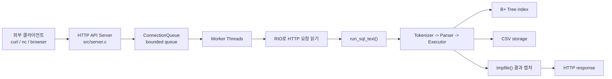

# WK08 API 서버 학습 문서

이번 WK08 요구사항은 기존 미니 SQL 처리기 위에 **외부 클라이언트가 접근할 수 있는 C 기반 API 서버**를 붙이는 것입니다.
아래 문서들은 구현 기능별로 PDF의 관련 절, 현재 코드 적용 위치, 초심자용 흐름도를 함께 정리합니다.

## 문서 목록

| 기능 | 문서 | 핵심 PDF 절 |
| --- | --- | --- |
| HTTP API 서버와 소켓 흐름 | [01-http-api-server.md](./01-http-api-server.md) | Chapter 11.1, 11.4, 11.5, 11.6 |
| Robust I/O와 HTTP body 처리 | [02-robust-io-http-body.md](./02-robust-io-http-body.md) | Chapter 10.5, Chapter 11.5.3 |
| Thread pool과 bounded queue | [03-thread-pool-connection-queue.md](./03-thread-pool-connection-queue.md) | Chapter 12.3, 12.5.4, 12.5.5 |
| SQL 엔진, B+ Tree, mutex 연동 | [04-sql-engine-integration.md](./04-sql-engine-integration.md) | Chapter 12.4, 12.5.3, 12.7 |
| API 서버 검증과 테스트 표면 | [05-api-server-verification.md](./05-api-server-verification.md) | Chapter 11.5.3, Chapter 12.7 |

## 전체 구조

## 요구사항과 구현 대응

| 요구사항 | 현재 구현 |
| --- | --- |
| 외부 클라이언트에서 DBMS 기능 사용 | `GET /health`, `POST /query` HTTP endpoint 제공 |
| Thread Pool 구성 | 서버 시작 시 `--threads` 개수만큼 worker thread 생성 |
| SQL 요청 병렬 처리 | main thread는 연결을 queue에 넣고 worker들이 꺼내 처리 |
| 기존 SQL 처리기 활용 | `run_sql_text()`를 서버 요청 처리 경로에서 그대로 호출 |
| B+ Tree 인덱스 활용 | `WHERE id = ?`는 기존 executor의 `[INDEX]` 경로 사용 |
| API 서버 기능 테스트 | `make api-test`에서 `curl`, `nc`, 병렬 요청, 오류 응답 검증 |

한 줄로 정리하면, **WK08 구현은 CS:APP의 소켓, HTTP, robust I/O, thread pool 개념을 기존 SQL 엔진 앞단에 붙인 작업**입니다.
