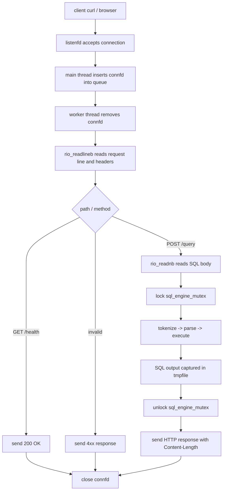

# WK08 API 서버 구현과 CS:APP PDF 개념 연결

## 요약

이번 구현은 기존 C99 기반 SQL 처리기와 B+ Tree 인덱스를 HTTP API 서버 뒤에 연결한다.
새로 들어간 기능은 낯선 라이브러리나 프레임워크보다 첨부된 CS:APP PDF의 개념을
직접 코드로 옮기는 방식으로 구성했다.

- Chapter 10: 네트워크 소켓에서 안전하게 읽고 쓰는 Robust I/O
- Chapter 11: socket, bind, listen, accept, HTTP 요청/응답
- Chapter 12: pthread, thread pool, 생산자-소비자 큐, mutex

v1 서버는 여러 클라이언트 연결을 thread pool로 병렬 처리한다. 다만 기존 SQL 엔진이
전역 `table_states`, 메모리 B+ Tree, CSV append 상태를 공유하므로 SQL 실행 구간은
하나의 mutex로 보호한다. 즉 네트워크 요청 처리는 병렬이고, DB 엔진 실행은 데이터
무결성을 위해 직렬화된다.

## 기능별 PDF 근거

| 구현 기능 | PDF 절 | 핵심 개념 | 코드 적용 위치 |
| --- | --- | --- | --- |
| listen socket 생성 | Chapter 11, 11.4.4 `bind`, 11.4.5 `listen`, 11.4.8 `open_listenfd` | 서버는 `socket`을 만들고 주소/포트에 `bind`한 뒤 `listen` 상태로 바꾼다. `getaddrinfo`를 쓰면 IPv4/IPv6 세부 구조를 직접 다루는 부담이 줄어든다. | `src/server.c`의 `open_listenfd()` |
| 클라이언트 연결 수락 | Chapter 11, 11.4.6 `accept` | listening descriptor는 서버가 계속 들고 있고, `accept`는 요청마다 새 connected descriptor를 만든다. worker는 이 connected descriptor로 클라이언트와 통신한다. | `src/server.c`의 `run_server()` |
| HTTP 요청/응답 처리 | Chapter 11, 11.5.3 HTTP Transactions, Figure 11.25, 11.6 Tiny Web Server | HTTP는 텍스트 기반 요청 라인, 헤더, body로 구성된다. 서버는 상태 코드와 header를 먼저 보내고 body를 뒤에 보낸다. | `src/server.c`의 `handle_client()`, `send_text_response()`, `send_file_response()` |
| 소켓 Robust I/O | Chapter 10, 10.5 Robust Reading and Writing, 10.5.1 `rio_readn`/`rio_writen`, 10.5.2 `rio_readlineb`/`rio_readnb`, G3 “Use the Rio functions for I/O on network sockets” | 네트워크 `read`/`write`는 short count가 생길 수 있으므로 원하는 바이트를 모두 처리할 때까지 반복해야 한다. header는 line 단위로, body는 `Content-Length` 바이트만큼 읽는다. | `src/server.c`의 `rio_*()` |
| thread pool | Chapter 12, 12.3 Posix Threads, 12.3.6 Detaching Threads, 12.3.8 Concurrent Server Based on Threads | 요청마다 새 thread를 만들면 비용과 관리 부담이 커진다. 미리 만든 worker thread들이 반복해서 연결을 처리하면 안정적이다. | `src/server.c`의 `worker_main()`, `run_server()` |
| bounded queue | Chapter 12, 12.5.4 Producer-Consumer, Figure 12.24 `sbuf_t`, Figure 12.25 Sbuf | main thread는 producer처럼 `connfd`를 큐에 넣고, worker thread는 consumer처럼 꺼낸다. CS:APP 예시는 semaphore를 쓰지만, 이 구현은 macOS에서도 동작하도록 같은 wait/signal 의미를 `pthread_mutex_t`와 `pthread_cond_t`로 표현했다. | `src/server.c`의 `ConnectionQueue` |
| prethreaded server | Chapter 12, 12.5.5 Concurrent Server Based on Prethreading, Figure 12.27, Figure 12.28 | 서버 시작 시 worker pool을 만들고, main thread는 `accept`한 descriptor를 bounded buffer에 넣는다. worker는 descriptor를 꺼내 서비스를 수행한다. | `src/server.c` 전체 서버 구조 |
| SQL 엔진 mutex 보호 | Chapter 12, 12.5.2 Semaphores, 12.5.3 Mutual Exclusion, 12.7.1 Thread Safety, 12.7.4 Races, 12.7.5 Deadlocks | 공유 상태를 동시에 수정하면 race가 생긴다. critical section을 mutex로 감싸면 한 번에 하나의 thread만 공유 상태에 접근한다. lock 순서를 단순화하면 deadlock 가능성도 낮아진다. | `src/server.c`의 `sql_engine_mutex` |
| 결과 캡처와 descriptor 관점 | Chapter 10 System-Level I/O, Chapter 10.5 `rio_writen` | SQL 엔진 결과는 `FILE *output`으로 받아 `tmpfile()`에 저장한다. 길이를 계산한 뒤 HTTP `Content-Length`에 넣고 `rio_writen`으로 body 전체를 전송한다. | `include/sqlproc.h`, `src/storage.c`, `src/executor.c`, `src/server.c` |

## 요청 처리 흐름

## 동시성 한계와 v2 개선점

v1은 과제 요구사항의 핵심인 thread pool과 API 서버 구조를 우선 구현한다. worker thread는
동시에 여러 클라이언트 연결을 읽고 응답할 수 있다. 하지만 SQL 실행 구간은 하나의
`sql_engine_mutex`로 보호한다.

이 선택의 이유는 현재 SQL 엔진이 아래 공유 상태를 갖기 때문이다.

- `executor.c`의 전역 `table_states`
- 테이블별 메모리 B+ Tree 포인터
- 자동 PK `next_id`
- CSV append와 `id -> row offset` 등록 순서

동시에 두 thread가 INSERT를 실행하면 같은 PK를 발급하거나 CSV append offset과 B+ Tree
등록 순서가 꼬일 수 있다. 그래서 v1에서는 “요청 처리는 병렬, DB 상태 변경은 안전하게
직렬”이라는 정책을 선택했다.

v2에서 개선할 수 있는 방향은 아래와 같다.

- read-only `SELECT`는 동시에 실행하고 `INSERT`만 단독 실행하도록 readers-writers lock 적용
- 테이블별 mutex로 서로 다른 테이블 요청은 병렬 실행
- SQL 결과를 `tmpfile()` 대신 메모리 버퍼나 streaming 응답으로 전송
- `POST /query` raw SQL 외에 JSON 응답 형식 추가
- graceful shutdown과 worker thread 정리 로직 추가
